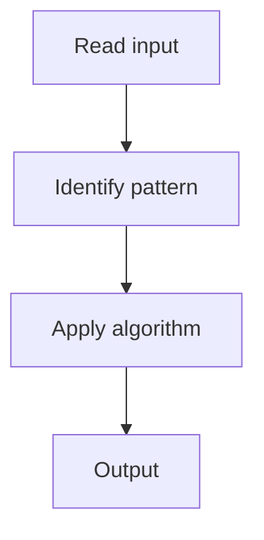

# 1. Valid Palindrome

## 1. Problem Description

Determine if a string is a palindrome, considering only alphanumeric characters and ignoring case.

## 2. Expected Input

String `s`.

## 3. Expected Output

Return `True` if it's a palindrome.

## 4. Constraints

1 <= s.length <= 2 * 10^5

## 5. Examples

| Input | Output |
|---|---|
| `A man, a plan, a canal: Panama` | `True` |

## 6. Intuition

Two pointers from both ends, skipping non-alphanumeric, comparing lowercased.

## 7. Thought Process



## 8. Brute-Force Approach

Reverse the cleaned string and compare.

## 9. Optimized Solution

```python
def isPalindrome(s):
    l, r = 0, len(s) - 1
    while l < r:
        while l < r and not s[l].isalnum():
            l += 1
        while l < r and not s[r].isalnum():
            r -= 1
        if s[l].lower() != s[r].lower():
            return False
        l += 1; r -= 1
    return True
```

## 10. Why the Optimized Solution Works

Two pointers converge, comparing characters. Non-alphanumeric characters are skipped.

## 11. Algorithm Used

Two pointers.

## 12. Data Structures Used

No extra space.

## 13. Time Complexity Analysis

O(n)

## 14. Space Complexity Analysis

O(1)

## 15. Step-by-Step Code Walkthrough

Two pointers from ends; skip non-alphanumeric; compare.

## 16. Dry Run with Example

Skipped.

## 17. Common Pitfalls

- Building a cleaned string first (O(n) space).

## 18. Edge Cases

| Empty string | True |

## 19. Alternative Approaches

Reverse and compare.

## 20. Related Problems

[[2. Two Sum II - Input Array Is Sorted]], [[5. Trapping Rain Water]]

## 21. Key Takeaways

Two pointers for palindrome check.
