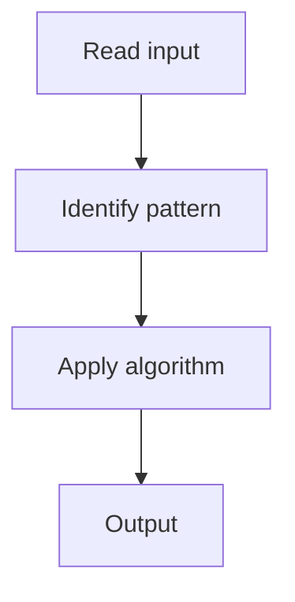

# 2. Two Sum II - Input Array Is Sorted

## 1. Problem Description

Find two numbers in a sorted array that sum to target. Return 1-indexed indices.

## 2. Expected Input

Sorted array `numbers` and integer `target`.

## 3. Expected Output

Return `[i, j]` (1-indexed).

## 4. Constraints

2 <= numbers.length <= 3 * 10^4

## 5. Examples

| Input | Output |
|---|---|
| `numbers=[2,7,11,15]`, `target=9` | `[1,2]` |

## 6. Intuition

Two pointers: left at start, right at end. If sum < target, move left up. If sum > target, move right down.

## 7. Thought Process



## 8. Brute-Force Approach

Hash map. `O(n)` space.

## 9. Optimized Solution

```python
def twoSum(numbers, target):
    l, r = 0, len(numbers) - 1
    while l < r:
        s = numbers[l] + numbers[r]
        if s == target:
            return [l + 1, r + 1]
        elif s < target:
            l += 1
        else:
            r -= 1
```

## 10. Why the Optimized Solution Works

The sorted property lets us use two pointers. If sum is too small, increase left; if too large, decrease right.

## 11. Algorithm Used

Two pointers.

## 12. Data Structures Used

No extra space.

## 13. Time Complexity Analysis

O(n)

## 14. Space Complexity Analysis

O(1)

## 15. Step-by-Step Code Walkthrough

Two pointers from ends; adjust based on sum vs target.

## 16. Dry Run with Example

Skipped.

## 17. Common Pitfalls

- 0-indexed output.

## 18. Edge Cases

| Exactly one solution | Guaranteed |

## 19. Alternative Approaches

Hash map.

## 20. Related Problems

[[3. Two Sum]], [[3. 3Sum]]

## 21. Key Takeaways

Two pointers on sorted array for two-sum.
