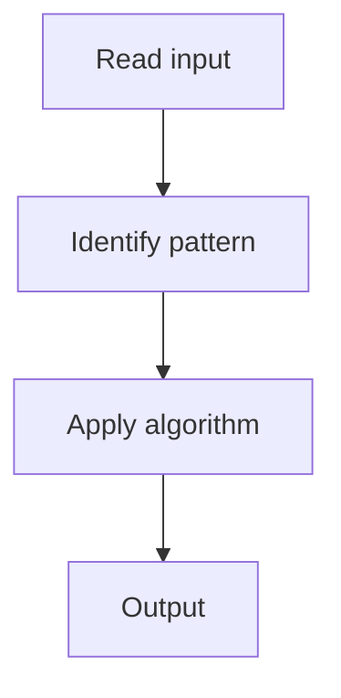

# 5. Trapping Rain Water

## 1. Problem Description

Compute how much water can be trapped between bars of given heights.

## 2. Expected Input

Array of heights.

## 3. Expected Output

Total units of trapped water.

## 4. Constraints

n >= 1

## 5. Examples

| Input | Output |
|---|---|
| `[0,1,0,2,1,0,1,3,2,1,2,1]` | `6` |

## 6. Intuition

Two pointers. Track left_max and right_max. Move the pointer with smaller max. Water at each position = min(left_max, right_max) - height.

## 7. Thought Process



## 8. Brute-Force Approach

For each position, compute left and right max arrays. `O(n)` space.

## 9. Optimized Solution

```python
def trap(height):
    if not height: return 0
    l, r = 0, len(height) - 1
    left_max, right_max = height[l], height[r]
    water = 0
    while l < r:
        if left_max < right_max:
            l += 1
            left_max = max(left_max, height[l])
            water += left_max - height[l]
        else:
            r -= 1
            right_max = max(right_max, height[r])
            water += right_max - height[r]
    return water
```

## 10. Why the Optimized Solution Works

Water trapped at a position depends on the min of max heights on both sides. Two pointers track these efficiently.

## 11. Algorithm Used

Two pointers with running max.

## 12. Data Structures Used

No extra space.

## 13. Time Complexity Analysis

O(n)

## 14. Space Complexity Analysis

O(1)

## 15. Step-by-Step Code Walkthrough

Move the pointer with smaller max; add trapped water.

## 16. Dry Run with Example

Skipped.

## 17. Common Pitfalls

- Precomputing left/right max arrays (O(n) space).

## 18. Edge Cases

| Empty array | 0 |

## 19. Alternative Approaches

DP with prefix/suffix max arrays.

## 20. Related Problems

[[4. Container With Most Water]], [[1. Valid Palindrome]]

## 21. Key Takeaways

Two pointers with running max for rain water trapping.
