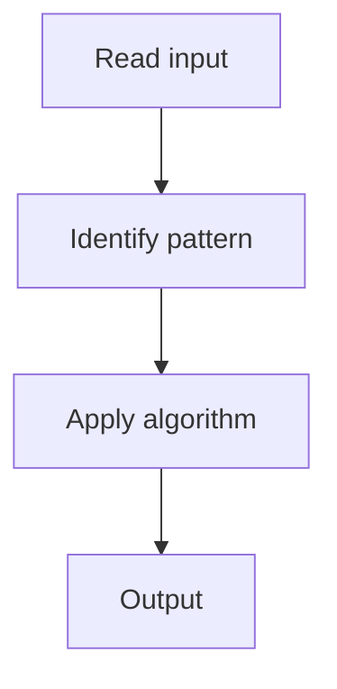

# 1. Valid Parentheses

## 1. Problem Description

Determine if a string of parentheses is valid (every opening has a matching closing in correct order).

## 2. Expected Input

String `s` of `(`, `)`, `{`, `}`, `[`, `]`.

## 3. Expected Output

Return `True` if valid.

## 4. Constraints

1 <= s.length <= 10^4

## 5. Examples

| Input | Output |
|---|---|
| `()` | `True` |
| `(]` | `False` |

## 6. Intuition

Use a stack. Push opening brackets. For closing, check if the top matches.

## 7. Thought Process



## 8. Brute-Force Approach

Count-based. Doesn't handle nesting.

## 9. Optimized Solution

```python
def isValid(s):
    stack = []
    pairs = {')': '(', ']': '[', '}': '{'}
    for c in s:
        if c in pairs:
            if not stack or stack.pop() != pairs[c]:
                return False
        else:
            stack.append(c)
    return not stack
```

## 10. Why the Optimized Solution Works

A stack naturally handles nested structures. Each closing must match the most recent unmatched opening.

## 11. Algorithm Used

Stack.

## 12. Data Structures Used

Stack.

## 13. Time Complexity Analysis

O(n)

## 14. Space Complexity Analysis

O(n)

## 15. Step-by-Step Code Walkthrough

Push openings; for closings, check top of stack matches.

## 16. Dry Run with Example

Skipped.

## 17. Common Pitfalls

- Forgetting to check empty stack at the end.

## 18. Edge Cases

| Empty string | True |

## 19. Alternative Approaches

None.

## 20. Related Problems

[[2. Min Stack]], [[3. Evaluate Reverse Polish Notation]]

## 21. Key Takeaways

Stack for matching parentheses.
