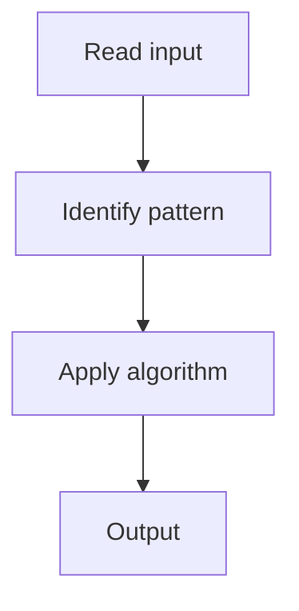

# 1. Binary Search

## 1. Problem Description

Find the index of `target` in a sorted array. Return -1 if not found.

## 2. Expected Input

Sorted array `nums` and integer `target`.

## 3. Expected Output

Index of target, or -1.

## 4. Constraints

1 <= nums.length <= 10^4

## 5. Examples

| Input | Output |
|---|---|
| `nums=[-1,0,3,5,9,12]`, `target=9` | `4` |

## 6. Intuition

Standard binary search.

## 7. Thought Process



## 8. Brute-Force Approach

Linear scan. `O(n)`.

## 9. Optimized Solution

```python
def search(nums, target):
    l, r = 0, len(nums) - 1
    while l <= r:
        mid = (l + r) // 2
        if nums[mid] == target:
            return mid
        elif nums[mid] < target:
            l = mid + 1
        else:
            r = mid - 1
    return -1
```

## 10. Why the Optimized Solution Works

Each comparison halves the search space.

## 11. Algorithm Used

Binary search.

## 12. Data Structures Used

No extra space.

## 13. Time Complexity Analysis

O(log n)

## 14. Space Complexity Analysis

O(1)

## 15. Step-by-Step Code Walkthrough

Standard binary search loop.

## 16. Dry Run with Example

Skipped.

## 17. Common Pitfalls

- Off-by-one in `l <= r` vs `l < r`.

## 18. Edge Cases

| Target not present | -1 |

## 19. Alternative Approaches

Recursive.

## 20. Related Problems

[[2. Search a 2D Matrix]], [[3. Koko Eating Bananas]]

## 21. Key Takeaways

Binary search template.
