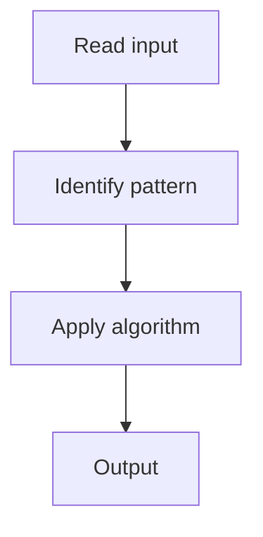

# 4. Find Minimum in Rotated Sorted Array

## 1. Problem Description

Find the minimum element in a rotated sorted array (no duplicates).

## 2. Expected Input

Rotated sorted array `nums`.

## 3. Expected Output

The minimum element.

## 4. Constraints

n >= 1

## 5. Examples

| Input | Output |
|---|---|
| `[3,4,5,1,2]` | `1` |

## 6. Intuition

Binary search. If `nums[mid] > nums[r]`, the minimum is in the right half. Else, it's in the left half (including mid).

## 7. Thought Process



## 8. Brute-Force Approach

Linear scan.

## 9. Optimized Solution

```python
def findMin(nums):
    l, r = 0, len(nums) - 1
    while l < r:
        mid = (l + r) // 2
        if nums[mid] > nums[r]:
            l = mid + 1
        else:
            r = mid
    return nums[l]
```

## 10. Why the Optimized Solution Works

Comparing mid with right tells us which half is sorted.

## 11. Algorithm Used

Binary search.

## 12. Data Structures Used

No extra space.

## 13. Time Complexity Analysis

O(log n)

## 14. Space Complexity Analysis

O(1)

## 15. Step-by-Step Code Walkthrough

Binary search comparing mid with right.

## 16. Dry Run with Example

Skipped.

## 17. Common Pitfalls

- Off-by-one.

## 18. Edge Cases

| Not rotated | nums[0] |

## 19. Alternative Approaches

Linear scan.

## 20. Related Problems

[[5. Search in Rotated Sorted Array]], [[1. Binary Search]]

## 21. Key Takeaways

Binary search on rotated arrays.
