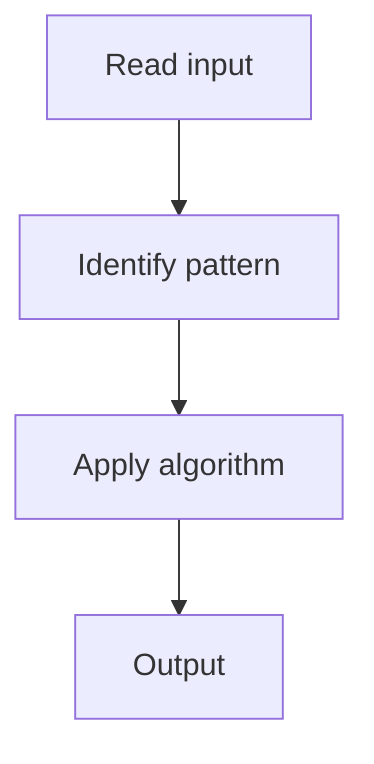

# 1. Best Time to Buy and Sell Stock

## 1. Problem Description

Find the maximum profit from one buy-sell transaction.

## 2. Expected Input

Array of prices.

## 3. Expected Output

Maximum profit, or 0 if no profit possible.

## 4. Constraints

n >= 1

## 5. Examples

| Input | Output |
|---|---|
| `[7,1,5,3,6,4]` | `5` |

## 6. Intuition

Track the minimum price seen so far. For each day, compute potential profit = price - min_price. Track max.

## 7. Thought Process



## 8. Brute-Force Approach

Try all pairs. `O(n^2)`.

## 9. Optimized Solution

```python
def maxProfit(prices):
    min_price = float('inf')
    max_profit = 0
    for p in prices:
        min_price = min(min_price, p)
        max_profit = max(max_profit, p - min_price)
    return max_profit
```

## 10. Why the Optimized Solution Works

The minimum price so far gives the best buy for any future sell.

## 11. Algorithm Used

Single pass with running min.

## 12. Data Structures Used

No extra space.

## 13. Time Complexity Analysis

O(n)

## 14. Space Complexity Analysis

O(1)

## 15. Step-by-Step Code Walkthrough

Track min price; compute profit; track max.

## 16. Dry Run with Example

Skipped.

## 17. Common Pitfalls

- Buying and selling on the same day.

## 18. Edge Cases

| Decreasing prices | 0 |

## 19. Alternative Approaches

DP.

## 20. Related Problems

[[2. Longest Substring Without Repeating Characters]], [[3. Best Time to Buy and Sell Stock with Cooldown]]

## 21. Key Takeaways

Running min for max profit.
