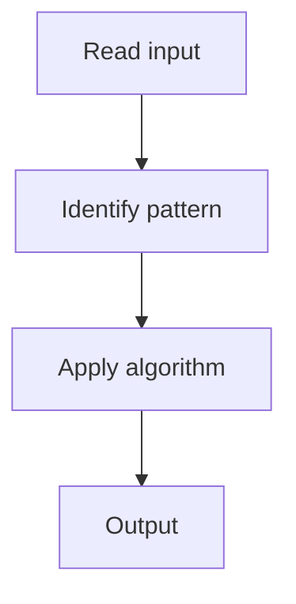

# 2. Longest Substring Without Repeating Characters

## 1. Problem Description

Find the length of the longest substring without repeating characters.

## 2. Expected Input

String `s`.

## 3. Expected Output

Length of the longest unique substring.

## 4. Constraints

0 <= s.length <= 5 * 10^4

## 5. Examples

| Input | Output |
|---|---|
| `abcabcbb` | `3` |

## 6. Intuition

Sliding window with a set. Extend right; if duplicate, shrink left until unique.

## 7. Thought Process



## 8. Brute-Force Approach

Check all substrings. `O(n^3)`.

## 9. Optimized Solution

```python
def lengthOfLongestSubstring(s):
    seen = set()
    left = 0
    best = 0
    for right in range(len(s)):
        while s[right] in seen:
            seen.remove(s[left])
            left += 1
        seen.add(s[right])
        best = max(best, right - left + 1)
    return best
```

## 10. Why the Optimized Solution Works

Sliding window maintains a unique-character substring. Shrink from left when a duplicate is found.

## 11. Algorithm Used

Sliding window with hash set.

## 12. Data Structures Used

Hash set.

## 13. Time Complexity Analysis

O(n)

## 14. Space Complexity Analysis

O(min(n, charset))

## 15. Step-by-Step Code Walkthrough

Extend right; shrink left on duplicate; track max.

## 16. Dry Run with Example

Skipped.

## 17. Common Pitfalls

- Using `left += 1` without removing from set.

## 18. Edge Cases

| Empty string | 0 |

## 19. Alternative Approaches

Hash map of last positions (jump left directly).

## 20. Related Problems

[[31. Playlist]], [[4. Longest Repeating Character Replacement]]

## 21. Key Takeaways

Sliding window with hash set for unique substring.
