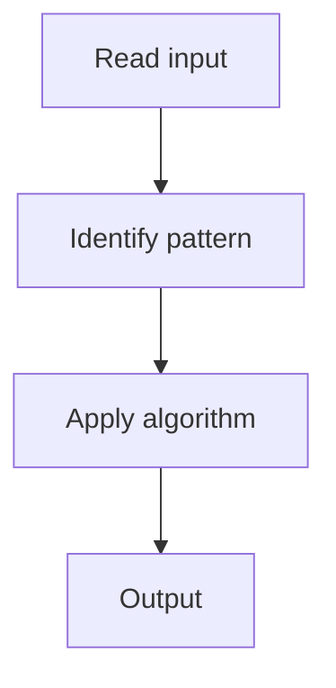

# 1. Reverse Linked List

## 1. Problem Description

Reverse a singly linked list.

## 2. Expected Input

Head of a linked list.

## 3. Expected Output

Head of the reversed list.

## 4. Constraints

0 <= n <= 5000

## 5. Examples

| Input | Output |
|---|---|
| `1 -> 2 -> 3 -> 4 -> 5` | `5 -> 4 -> 3 -> 2 -> 1` |

## 6. Intuition

Iterative: three pointers (prev, curr, next). Reverse the `next` link at each step.

## 7. Thought Process



## 8. Brute-Force Approach

Recursive.

## 9. Optimized Solution

```python
def reverseList(head):
    prev = None
    curr = head
    while curr:
        nxt = curr.next
        curr.next = prev
        prev = curr
        curr = nxt
    return prev
```

## 10. Why the Optimized Solution Works

At each step, we reverse the current node's next pointer to point to the previous node.

## 11. Algorithm Used

Iterative pointer manipulation.

## 12. Data Structures Used

Three pointers.

## 13. Time Complexity Analysis

O(n)

## 14. Space Complexity Analysis

O(1)

## 15. Step-by-Step Code Walkthrough

Save next, reverse link, advance prev and curr.

## 16. Dry Run with Example

Skipped.

## 17. Common Pitfalls

- Losing the rest of the list (save next first).

## 18. Edge Cases

| Empty list | None |

## 19. Alternative Approaches

Recursive.

## 20. Related Problems

[[2. Merge Two Sorted Lists]], [[11. Reverse Nodes in k-Group]]

## 21. Key Takeaways

Three-pointer linked list reversal.
