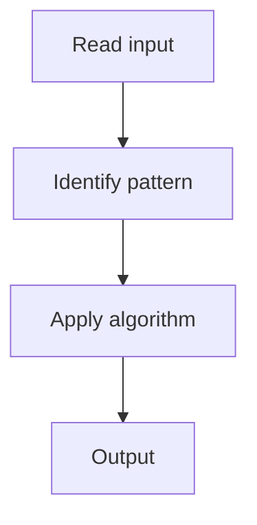

# 9. LRU Cache

## 1. Problem Description

Design an LRU (Least Recently Used) cache with `get` and `put` in `O(1)`.

## 2. Expected Input

Capacity and operations.

## 3. Expected Output

Values for get, nothing for put.

## 4. Constraints

1 <= capacity <= 3000

## 5. Examples

| Operations | Output |
|---|---|
| `LRUCache(2); put(1,1); put(2,2); get(1); put(3,3); get(2)` | `1, -1` |

## 6. Intuition

Hash map + doubly linked list. Map gives O(1) lookup; DLL gives O(1) removal/insertion at ends.

## 7. Thought Process



## 8. Brute-Force Approach

List with linear search. `O(n)`.

## 9. Optimized Solution

```python
class Node:
    def __init__(self, key=0, val=0):
        self.key = key
        self.val = val
        self.prev = self.next = None

class LRUCache:
    def __init__(self, capacity):
        self.cap = capacity
        self.cache = {}  # key -> Node
        self.head = Node()  # dummy
        self.tail = Node()  # dummy
        self.head.next = self.tail
        self.tail.prev = self.head
    
    def remove(self, node):
        node.prev.next = node.next
        node.next.prev = node.prev
    
    def add_to_front(self, node):
        node.next = self.head.next
        node.prev = self.head
        self.head.next.prev = node
        self.head.next = node
    
    def get(self, key):
        if key in self.cache:
            node = self.cache[key]
            self.remove(node)
            self.add_to_front(node)
            return node.val
        return -1
    
    def put(self, key, value):
        if key in self.cache:
            self.remove(self.cache[key])
        node = Node(key, value)
        self.cache[key] = node
        self.add_to_front(node)
        if len(self.cache) > self.cap:
            lru = self.tail.prev
            self.remove(lru)
            del self.cache[lru.key]
```

## 10. Why the Optimized Solution Works

Hash map for O(1) key lookup. Doubly linked list for O(1) reorder. Front = most recent, back = least recent.

## 11. Algorithm Used

Hash map + doubly linked list.

## 12. Data Structures Used

Hash map, DLL.

## 13. Time Complexity Analysis

O(1) per op

## 14. Space Complexity Analysis

O(capacity)

## 15. Step-by-Step Code Walkthrough

Map stores nodes; DLL maintains order. Remove and add to front on access.

## 16. Dry Run with Example

Skipped.

## 17. Common Pitfalls

- Using `OrderedDict` (works but defeats the purpose).

## 18. Edge Cases

| Capacity 1 | Single slot |

## 19. Alternative Approaches

`OrderedDict` (Python's built-in).

## 20. Related Problems

[[7. Add Two Numbers]], [[6. Copy List with Random Pointer]]

## 21. Key Takeaways

Hash map + DLL for O(1) LRU cache.
