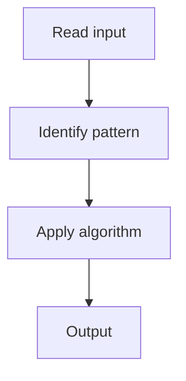

# 11. Validate Binary Search Tree

## 1. Problem Description

Determine if a binary tree is a valid BST.

## 2. Expected Input

Root of a binary tree.

## 3. Expected Output

Return `True` if valid BST.

## 4. Constraints

n >= 0

## 5. Examples

| Input | Output |
|---|---|
| `[2,1,3]` | `True` |
| `[5,1,4,null,null,3,6]` | `False` |

## 6. Intuition

DFS with min/max bounds. Each node must be in `(min, max)`. Update bounds recursively.

## 7. Thought Process



## 8. Brute-Force Approach

Inorder traversal should be sorted.

## 9. Optimized Solution

```python
def isValidBST(root):
    def validate(node, lo, hi):
        if not node:
            return True
        if not (lo < node.val < hi):
            return False
        return validate(node.left, lo, node.val) and validate(node.right, node.val, hi)
    return validate(root, float('-inf'), float('inf'))
```

## 10. Why the Optimized Solution Works

A BST requires left subtree < node < right subtree. Passing bounds ensures this.

## 11. Algorithm Used

DFS with bounds.

## 12. Data Structures Used

Recursion stack.

## 13. Time Complexity Analysis

O(n)

## 14. Space Complexity Analysis

O(h)

## 15. Step-by-Step Code Walkthrough

Pass (lo, hi) bounds; check node.val; recurse with updated bounds.

## 16. Dry Run with Example

Skipped.

## 17. Common Pitfalls

- Comparing only with immediate children (doesn't catch deep violations).

## 18. Edge Cases

| Single node | True |

## 19. Alternative Approaches

Inorder traversal + check sorted.

## 20. Related Problems

[[12. Kth Smallest Element in a BST]], [[7. Lowest Common Ancestor of a BST]]

## 21. Key Takeaways

DFS with bounds for BST validation.
