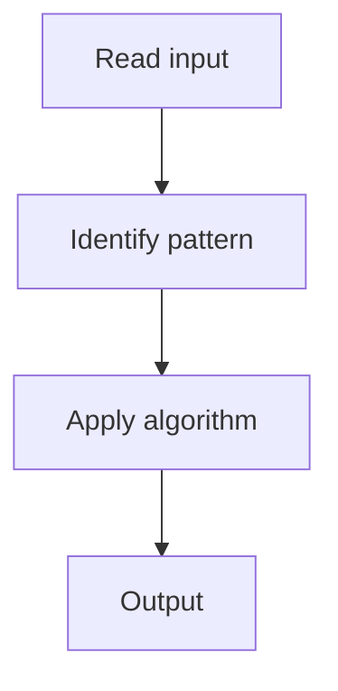

# 14. Binary Tree Maximum Path Sum

## 1. Problem Description

Find the maximum path sum in a binary tree (path can start and end anywhere).

## 2. Expected Input

Root of a binary tree.

## 3. Expected Output

Maximum path sum.

## 4. Constraints

n >= 1

## 5. Examples

| Input | Output |
|---|---|
| `[-10,9,20,null,null,15,7]` | `42` |

## 6. Intuition

DFS. For each node, the max path through it = node.val + max(0, left) + max(0, right). Track global max. Return node.val + max(left, right) for upward extension.

## 7. Thought Process



## 8. Brute-Force Approach

Check all paths. `O(n^2)`.

## 9. Optimized Solution

```python
def maxPathSum(root):
    max_sum = float('-inf')
    def dfs(node):
        nonlocal max_sum
        if not node:
            return 0
        left = max(0, dfs(node.left))
        right = max(0, dfs(node.right))
        max_sum = max(max_sum, node.val + left + right)
        return node.val + max(left, right)
    dfs(root)
    return max_sum
```

## 10. Why the Optimized Solution Works

The max path through a node is its value plus the positive contributions from both children. For the parent, only one child's path can extend upward.

## 11. Algorithm Used

DFS with global max.

## 12. Data Structures Used

Recursion stack.

## 13. Time Complexity Analysis

O(n)

## 14. Space Complexity Analysis

O(h)

## 15. Step-by-Step Code Walkthrough

DFS returning max gain; update global max with node + left + right.

## 16. Dry Run with Example

Skipped.

## 17. Common Pitfalls

- Including negative child sums (use max(0, ...)).

## 18. Edge Cases

| All negative | Max single node |

## 19. Alternative Approaches

None.

## 20. Related Problems

[[3. Diameter of Binary Tree]], [[2. Maximum Depth of Binary Tree]]

## 21. Key Takeaways

DFS with max(0, child) for max path sum.
