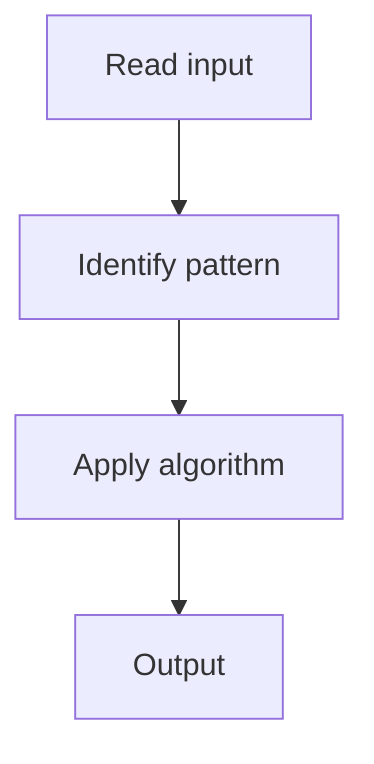

# 2. Maximum Depth of Binary Tree

## 1. Problem Description

Find the maximum depth of a binary tree.

## 2. Expected Input

Root of a binary tree.

## 3. Expected Output

Maximum depth.

## 4. Constraints

n >= 0

## 5. Examples

| Input | Output |
|---|---|
| `[3,9,20,null,null,15,7]` | `3` |

## 6. Intuition

Recursive DFS: `1 + max(depth(left), depth(right))`.

## 7. Thought Process



## 8. Brute-Force Approach

BFS level by level.

## 9. Optimized Solution

```python
def maxDepth(root):
    if not root:
        return 0
    return 1 + max(maxDepth(root.left), maxDepth(root.right))
```

## 10. Why the Optimized Solution Works

The depth is 1 (current) plus the max of the children's depths.

## 11. Algorithm Used

Recursive DFS.

## 12. Data Structures Used

Recursion stack.

## 13. Time Complexity Analysis

O(n)

## 14. Space Complexity Analysis

O(h)

## 15. Step-by-Step Code Walkthrough

Base case: null -> 0. Recursive: 1 + max of children.

## 16. Dry Run with Example

Skipped.

## 17. Common Pitfalls

- Returning 0 for the root (should be 1).

## 18. Edge Cases

| Empty tree | 0 |

## 19. Alternative Approaches

BFS.

## 20. Related Problems

[[1. Invert Binary Tree]], [[3. Diameter of Binary Tree]]

## 21. Key Takeaways

Recursive DFS for tree depth.
