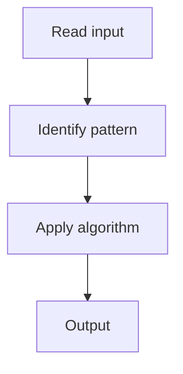

# 3. Diameter of Binary Tree

## 1. Problem Description

Find the diameter (longest path between any two nodes) of a binary tree.

## 2. Expected Input

Root of a binary tree.

## 3. Expected Output

Diameter (number of edges).

## 4. Constraints

n >= 1

## 5. Examples

| Input | Output |
|---|---|
| `[1,2,3,4,5]` | `3` |

## 6. Intuition

DFS. For each node, the diameter through it = left_depth + right_depth. Track max.

## 7. Thought Process



## 8. Brute-Force Approach

Check all pairs. `O(n^2)`.

## 9. Optimized Solution

```python
def diameterOfBinaryTree(root):
    diameter = 0
    def depth(node):
        nonlocal diameter
        if not node:
            return 0
        l = depth(node.left)
        r = depth(node.right)
        diameter = max(diameter, l + r)
        return 1 + max(l, r)
    depth(root)
    return diameter
```

## 10. Why the Optimized Solution Works

The longest path may not pass through the root. At each node, compute the longest path through it (left + right depths).

## 11. Algorithm Used

DFS with global max.

## 12. Data Structures Used

Recursion stack.

## 13. Time Complexity Analysis

O(n)

## 14. Space Complexity Analysis

O(h)

## 15. Step-by-Step Code Walkthrough

DFS returning depth; update global max with left + right.

## 16. Dry Run with Example

Skipped.

## 17. Common Pitfalls

- Returning diameter instead of depth from recursion.

## 18. Edge Cases

| Single node | 0 |

## 19. Alternative Approaches

Two-pass DFS.

## 20. Related Problems

[[2. Maximum Depth of Binary Tree]], [[14. Binary Tree Maximum Path Sum]]

## 21. Key Takeaways

DFS with global max for diameter.
