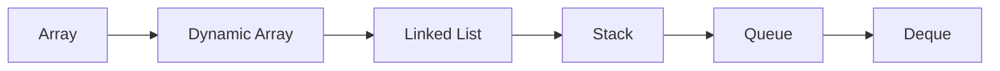

# 1. Linear Structures

## 1. Concept Overview

Linear data structures arrange elements in a sequential order. Each element has a unique position, and traversal follows a single path from one end to the other. The fundamental linear structures are: **Array**, **Dynamic Array**, **Linked List**, **Stack**, **Queue**, **Deque**, and **Circular Buffer**.

## 2. Why It Matters

Linear structures are the foundation of all data organization. They model real-world sequences (lines, lists, histories) and provide the building blocks for more complex structures (trees, graphs). Understanding their trade-offs is essential for choosing the right structure for any given problem.

## 3. Formal Definition

A linear data structure is a collection of elements arranged in a sequential order, where each element (except the first) has a unique predecessor, and each element (except the last) has a unique successor. Access, insertion, and deletion operations have well-defined positions (front, back, middle).

## 4. Visual Mental Model



## 5. Naive Formulation

A fixed-size array supports O(1) access by index but O(n) insertion/deletion in the middle. Linked lists support O(1) insertion/deletion at known positions but O(n) access. Stacks and queues are restricted-access versions of these.

## 6. Optimized Formulation

**Dynamic arrays** (Python `list`, C++ `vector`) amortize the cost of growth by doubling capacity when full, giving O(1) amortized append. **Hash-based structures** provide O(1) average access. **Circular buffers** reuse a fixed array for queue operations.

## 7. Step-by-Step Derivation

1. Start with a fixed array: O(1) access, O(n) insertion.
2. Allow resizing: dynamic array, O(1) amortized append.
3. Allow arbitrary position insertion: linked list, O(1) at known node.
4. Restrict access patterns: stack (LIFO), queue (FIFO), deque (both).

## 8. Reference Implementation

```python
# Array
arr = [1, 2, 3, 4, 5]
arr.append(6)  # O(1) amortized
arr.pop()       # O(1)
arr[2]          # O(1) access

# Linked List
class Node:
    def __init__(self, val):
        self.val = val
        self.next = None

# Stack
stack = []
stack.append(1)  # push
stack.pop()       # pop

# Queue (use deque)
from collections import deque
q = deque()
q.append(1)    # enqueue
q.popleft()    # dequeue
```

## 9. Complexity Analysis

| Resource | Complexity | Reason |
|---|---|---|
| Time | O(n) for traversal, O(1) for end operations | 1. O(1) access, O(n) search, O(n) middle insert/delete |
| Space | O(n) storage | 2. O(1) amortized append, O(1) front/back for deque |

## 10. Worked Examples

### 10.1 Stack for Parentheses
Use a stack to check valid parentheses: push opening, pop on closing.

### 10.2 Queue for BFS
BFS uses a queue to process nodes level by level.

### 10.3 Deque for Sliding Window Max
A monotonic deque maintains the maximum in a sliding window.

## 11. Variants and Extensions

- **Circular buffer**: fixed-size queue that wraps around.
- **Doubly linked list**: O(1) deletion at any node.
- **Skip list**: linked list with fast-path pointers for O(log n) search.

## 12. Common Mistakes

- Using a Python `list` as a queue (O(n) pop from front). Use `deque`.
- Forgetting that array insertion is O(n) due to shifting.
- Not handling empty structure edge cases.

## 13. Connection to Other Topics

[[2. Associative Containers]] - hash-based structures.
[[3. Priority Structures]] - heaps.
[[11. Searching]] - binary search on arrays.

## 14. Practice Problems

- [[1. Contains Duplicate]] - hash set usage.
- [[1. Valid Parentheses]] - stack usage.
- [[1. Reverse Linked List]] - linked list manipulation.

## 15. Key Takeaways

- Linear structures have specific access patterns (LIFO, FIFO, random).
- Choose based on needed operations.
- `deque` is the right queue in Python.
- Arrays are the most cache-friendly structure.
