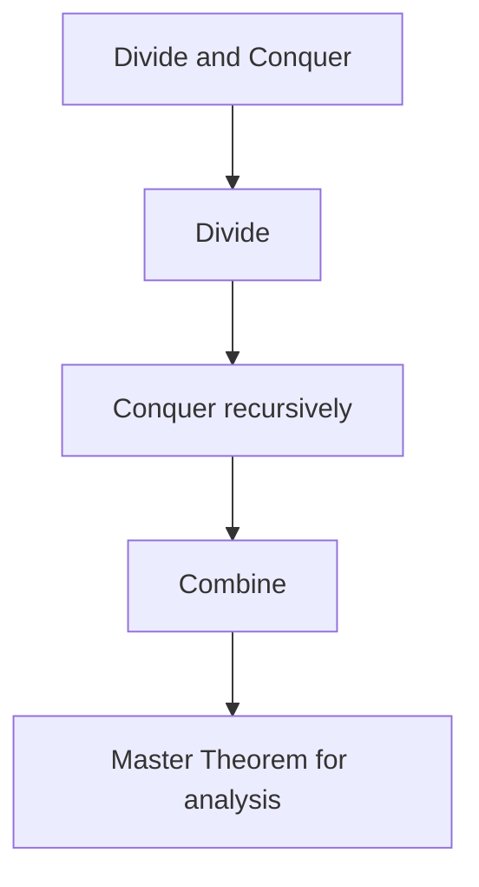

# 14. Divide and Conquer

## 1. Concept Overview

Divide and conquer breaks a problem into smaller subproblems, solves them recursively, and combines the results. The main algorithms are: **Merge Sort**, **Closest Pair**, and **Karatsuba Multiplication**.

## 2. Why It Matters

Divide and conquer is a powerful paradigm that enables O(n log n) algorithms for sorting, polynomial multiplication, and geometric problems.

## 3. Formal Definition

A divide-and-conquer algorithm: (1) divides the problem into smaller subproblems, (2) conquers each recursively, (3) combines the results. The Master Theorem analyzes the recurrence: `T(n) = a * T(n/b) + f(n)`.

## 4. Visual Mental Model



## 5. Naive Formulation

Brute force: O(n^2) or worse.

## 6. Optimized Formulation

Divide into halves, recurse, merge results. Often O(n log n).

## 7. Step-by-Step Derivation

1. Divide: split the input into smaller parts (often halves).
2. Conquer: recursively solve each part.
3. Combine: merge the solutions.
4. Analyze with the Master Theorem.

## 8. Reference Implementation

```python
# Merge Sort (classic D&C)
def merge_sort(arr):
    if len(arr) <= 1:
        return arr
    mid = len(arr) // 2
    left = merge_sort(arr[:mid])
    right = merge_sort(arr[mid:])
    return merge(left, right)

# Closest Pair of Points
def closest_pair(points):
    points.sort()
    # Divide: split into left and right halves
    # Conquer: find closest in each half
    # Combine: check pairs across the split
    pass

# Master Theorem: T(n) = a*T(n/b) + f(n)
# Case 1: f(n) = O(n^(log_b(a) - eps)) -> T(n) = O(n^log_b(a))
# Case 2: f(n) = O(n^log_b(a)) -> T(n) = O(n^log_b(a) * log n)
# Case 3: f(n) = Omega(n^(log_b(a) + eps)) -> T(n) = O(f(n))
```

## 9. Complexity Analysis

| Resource | Complexity | Reason |
|---|---|---|
| Time | Usually O(n log n) | Master Theorem: T(n) = a*T(n/b) + f(n). |
| Space | O(n) for merge sort, O(log n) recursion | Recursion stack + merge buffer. |

## 10. Worked Examples

### 10.1 Merge Sort
Split, sort each half, merge. O(n log n).

### 10.2 Closest Pair
Divide plane, find closest in each half, check strip near the split. O(n log n).

### 10.3 Maximum Subarray
Divide, find max in left, right, and crossing. O(n log n) (Kadane is better).

## 11. Variants and Extensions

- **Strassen's matrix multiplication**: O(n^2.807).
- **Fast Fourier Transform**: O(n log n) polynomial multiplication.
- **Convex hull**: divide and conquer variant.

## 12. Common Mistakes

- Not combining results correctly.
- Wrong base case.
- Forgetting the crossing case (closest pair, max subarray).

## 13. Connection to Other Topics

[[12. Sorting]] - merge sort.
[[15. Backtracking]] - related but explores all choices.
[[16. Dynamic Programming]] - related but memoizes.

## 14. Practice Problems

- [[44. Maximum Subarray Sum]] - D&C possible.
- [[13. 1-D Dynamic Programming/1. Climbing Stairs]] - simpler problem.

## 15. Key Takeaways

- Divide: split input into smaller parts.
- Conquer: recurse on each part.
- Combine: merge results.
- Master Theorem for complexity analysis.
- Common: merge sort, closest pair, FFT.
