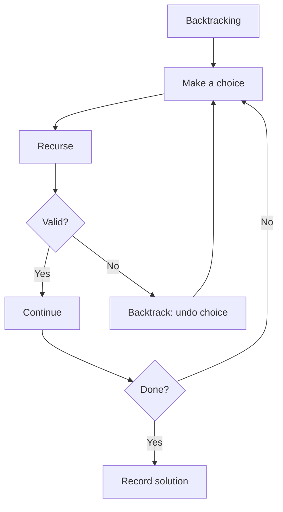

# 15. Backtracking

## 1. Concept Overview

Backtracking systematically explores all possible solutions by building candidates incrementally and abandoning a candidate ('backtracking') as soon as it's determined to be infeasible. The main types are: **N-Queens**, **Sudoku**, **Permutations**, and **Combinations**.

## 2. Why It Matters

Backtracking is the standard approach for constraint satisfaction problems, puzzles, and generating all subsets/permutations. With pruning, it can solve problems that are otherwise infeasible.

## 3. Formal Definition

Backtracking is a depth-first search of the solution space. At each step, we make a choice, recurse, and undo the choice ('backtrack') to try alternatives. Pruning cuts off branches that can't lead to a valid solution.

## 4. Visual Mental Model



## 5. Naive Formulation

Try all possibilities without pruning: exponential.

## 6. Optimized Formulation

DFS with pruning. At each step, try all valid choices, recurse, backtrack.

## 7. Step-by-Step Derivation

1. Define the state (what choices have been made).
2. Define the choices at each state.
3. Define the validity check.
4. Recurse: try a choice, recurse, undo.

## 8. Reference Implementation

```python
# N-Queens
def solve_n_queens(n):
    result = []
    board = [['.' for _ in range(n)] for _ in range(n)]
    cols = set()
    diag1 = set()  # r + c
    diag2 = set()  # r - c
    
    def backtrack(row):
        if row == n:
            result.append([''.join(r) for r in board])
            return
        for c in range(n):
            if c in cols or row + c in diag1 or row - c in diag2:
                continue
            cols.add(c); diag1.add(row + c); diag2.add(row - c)
            board[row][c] = 'Q'
            backtrack(row + 1)
            board[row][c] = '.'
            cols.discard(c); diag1.discard(row + c); diag2.discard(row - c)
    
    backtrack(0)
    return result

# Subsets
def subsets(nums):
    result = []
    def backtrack(start, current):
        result.append(current[:])
        for i in range(start, len(nums)):
            current.append(nums[i])
            backtrack(i + 1, current)
            current.pop()
    backtrack(0, [])
    return result
```

## 9. Complexity Analysis

| Resource | Complexity | Reason |
|---|---|---|
| Time | Exponential, but pruned | Each problem is exponential, but pruning helps. |
| Space | O(n) recursion stack | Recursion stack. |

## 10. Worked Examples

### 10.1 N-Queens
Place queens row by row, prune attacked columns/diagonals.

### 10.2 Sudoku
Fill empty cells, check validity, backtrack on conflict.

### 10.3 Permutations
Swap elements, recurse, backtrack.

## 11. Variants and Extensions

- **Branch and bound**: prune using bounds on the optimal solution.
- **Constraint propagation**: infer forced choices (e.g., Sudoku solving).
- **Symmetry breaking**: avoid exploring symmetric branches.

## 12. Common Mistakes

- Forgetting to undo choices (backtrack).
- Not pruning aggressively enough.
- Using O(n) data structures when O(1) sets would work.

## 13. Connection to Other Topics

[[14. Divide and Conquer]] - related paradigm.
[[8. Backtracking]] - advanced topic.

## 14. Practice Problems

- [[10. N-Queens]] - classic.
- [[1. Subsets]] - subset generation.
- [[13. Chessboard and Queens]] - CSES variant.

## 15. Key Takeaways

- Backtracking = DFS of solution space with pruning.
- Template: choose, recurse, un-choose.
- Pruning is essential for performance.
- Used for: N-Queens, Sudoku, permutations, combinations.
- Constraint sets speed up validity checks.
