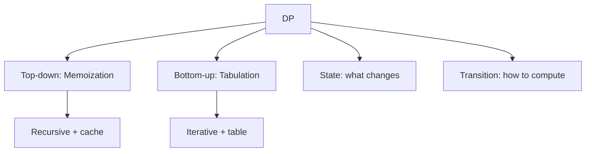

# 16. Dynamic Programming

## 1. Concept Overview

Dynamic Programming (DP) solves problems by breaking them into overlapping subproblems and storing results. The main types are: **Memoization** (top-down), **Tabulation** (bottom-up), **Knapsack**, **LIS**, **Matrix DP**, **Digit DP**, **Tree DP**, **Bitmask DP**, and **DP Optimization**.

## 2. Why It Matters

DP is the most powerful technique for optimization problems with optimal substructure and overlapping subproblems. It appears in countless interview and competitive programming problems.

## 3. Formal Definition

DP solves problems with: (1) **optimal substructure** (optimal solution can be constructed from optimal solutions of subproblems), (2) **overlapping subproblems** (subproblems are reused). Memoization stores results top-down; tabulation fills a table bottom-up.

## 4. Visual Mental Model



## 5. Naive Formulation

Recursion without memoization: exponential.

## 6. Optimized Formulation

Identify the state, define the recurrence, choose memoization or tabulation, optimize space.

## 7. Step-by-Step Derivation

1. Define the state (what variables describe a subproblem).
2. Define the recurrence (how to compute a state from smaller states).
3. Determine base cases.
4. Choose memoization (top-down) or tabulation (bottom-up).
5. Optimize space if possible (e.g., 1D instead of 2D).

## 8. Reference Implementation

```python
# Fibonacci (memoization)
from functools import lru_cache

@lru_cache(maxsize=None)
def fib(n):
    if n <= 1:
        return n
    return fib(n - 1) + fib(n - 2)

# Fibonacci (tabulation)
def fib_tab(n):
    if n <= 1:
        return n
    dp = [0] * (n + 1)
    dp[1] = 1
    for i in range(2, n + 1):
        dp[i] = dp[i - 1] + dp[i - 2]
    return dp[n]

# Fibonacci (space-optimized)
def fib_opt(n):
    if n <= 1:
        return n
    a, b = 0, 1
    for _ in range(2, n + 1):
        a, b = b, a + b
    return b
```

## 9. Complexity Analysis

| Resource | Complexity | Reason |
|---|---|---|
| Time | Varies: O(n) to O(n^2) | Number of states * work per state. |
| Space | Varies | DP table size. |

## 10. Worked Examples

### 10.1 Knapsack
`dp[i][w]` = max value using first i items with weight limit w.

### 10.2 LIS
`dp[i]` = length of LIS ending at index i. Or patience sorting O(n log n).

### 10.3 Edit Distance
`dp[i][j]` = edit distance between s[:i] and t[:j].

## 11. Variants and Extensions

- **Convex hull trick**: optimize certain DP transitions.
- **Divide and conquer optimization**: for specific recurrence shapes.
- **Knuth optimization**: for interval DP.
- **Alien's trick (Lagrangian relaxation)**: for constrained optimization.

## 12. Common Mistakes

- Wrong state definition.
- Forgetting base cases.
- Wrong loop order (must fill smaller states first).
- Not optimizing space when possible.

## 13. Connection to Other Topics

[[1. What is Dynamic Programming]] - DP roadmap.
[[13. 1-D Dynamic Programming]] - NeetCode.
[[15. Backtracking]] - related but explores all.

## 14. Practice Problems

- [[65. Dice Combinations]] - 1D DP.
- [[66. Minimizing Coins]] - coin change.
- [[71. Edit Distance]] - 2D DP.

## 15. Key Takeaways

- DP = overlapping subproblems + optimal substructure.
- Memoization (top-down) vs tabulation (bottom-up).
- Define state, recurrence, base cases.
- Optimize space: often 1D instead of 2D.
- Patterns: knapsack, LIS, edit distance, grid DP.
