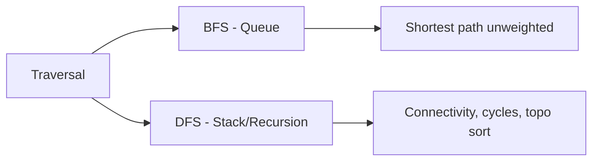

# 17. Traversal

## 1. Concept Overview

Graph traversal visits all nodes in a graph. The main algorithms are: **DFS (Depth-First Search)**, **BFS (Breadth-First Search)**, and **Iterative DFS**.

## 2. Why It Matters

Traversal is the foundation of graph algorithms: connectivity, shortest paths, cycle detection, topological sorting, and more. BFS finds shortest paths in unweighted graphs; DFS is used for connectivity, cycle detection, and topological sorting.

## 3. Formal Definition

BFS uses a queue, visiting nodes level by level (closest first). DFS uses a stack (or recursion), visiting as deep as possible before backtracking. Both visit every reachable node exactly once when combined with a visited set.

## 4. Visual Mental Model



## 5. Naive Formulation

Random visitation: doesn't guarantee coverage or shortest paths.

## 6. Optimized Formulation

BFS: queue ensures FIFO order, giving shortest paths. DFS: stack ensures LIFO order, going deep first.

## 7. Step-by-Step Derivation

1. Pick a starting node.
2. BFS: enqueue, mark visited, process, enqueue unvisited neighbors.
3. DFS: push to stack (or recurse), mark visited, process, push unvisited neighbors.

## 8. Reference Implementation

```python
from collections import deque

# BFS
def bfs(adj, start):
    visited = set([start])
    q = deque([start])
    while q:
        u = q.popleft()
        for v in adj[u]:
            if v not in visited:
                visited.add(v)
                q.append(v)
    return visited

# DFS (recursive)
def dfs(adj, start, visited=None):
    if visited is None:
        visited = set()
    visited.add(start)
    for v in adj[start]:
        if v not in visited:
            dfs(adj, v, visited)
    return visited

# DFS (iterative)
def dfs_iterative(adj, start):
    visited = set()
    stack = [start]
    while stack:
        u = stack.pop()
        if u in visited:
            continue
        visited.add(u)
        for v in adj[u]:
            if v not in visited:
                stack.append(v)
    return visited
```

## 9. Complexity Analysis

| Resource | Complexity | Reason |
|---|---|---|
| Time | O(V + E) | Each vertex and edge visited once. |
| Space | O(V) | Visited set + queue/stack. |

## 10. Worked Examples

### 10.1 Shortest Path (BFS)
BFS from source; the first time we reach a node is the shortest distance.

### 10.2 Connected Components
Run BFS/DFS from each unvisited node; count the number of starts.

### 10.3 Cycle Detection (DFS)
Track recursion stack; if we revisit a node in the current stack, there's a cycle.

## 11. Variants and Extensions

- **Bidirectional BFS**: meet in the middle for faster shortest paths.
- **A***: BFS with a heuristic for faster targeted search.
- **Iterative deepening DFS**: combine BFS completeness with DFS memory efficiency.

## 12. Common Mistakes

- Using DFS for shortest paths (only BFS gives shortest in unweighted).
- Stack overflow with recursive DFS on large graphs.
- Forgetting the visited set (infinite loops in cyclic graphs).

## 13. Connection to Other Topics

[[18. Connectivity]] - finding components.
[[19. Shortest Paths]] - Dijkstra, BFS.
[[15. Backtracking]] - DFS variant.

## 14. Practice Problems

- [[84. Counting Rooms]] - flood fill.
- [[92. Message Route]] - BFS shortest path.
- [[1. Number of Islands]] - BFS/DFS.

## 15. Key Takeaways

- BFS: shortest paths in unweighted graphs, level-order traversal.
- DFS: connectivity, cycles, topological sort.
- Always use a visited set for cyclic graphs.
- Use `deque` for BFS in Python.
