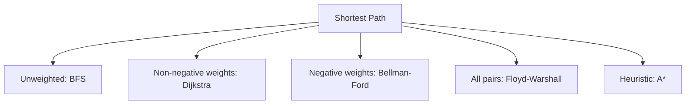

# 19. Shortest Paths

## 1. Concept Overview

Shortest path algorithms find the minimum-cost path between nodes. The main algorithms are: **BFS** (unweighted), **0-1 BFS** (0/1 weights), **Dijkstra** (non-negative weights), **Bellman-Ford** (negative weights), **Floyd-Warshall** (all pairs), **Johnson's**, and **A*** (heuristic).

## 2. Why It Matters

Shortest paths are essential for routing, network analysis, GPS navigation, and many optimization problems. Each algorithm has specific use cases based on graph properties (weighted/unweighted, negative weights, single-source/all-pairs).

## 3. Formal Definition

Given a weighted graph, find the path with minimum total weight from a source to a target (or to all nodes). Dijkstra's algorithm greedily extracts the closest unprocessed node. Bellman-Ford relaxes all edges V-1 times. Floyd-Warshall uses dynamic programming: `dist[i][j] = min(dist[i][j], dist[i][k] + dist[k][j])`.

## 4. Visual Mental Model



## 5. Naive Formulation

Try all paths: exponential.

## 6. Optimized Formulation

Dijkstra: min-heap for O((V+E) log V). Bellman-Ford: V-1 rounds of edge relaxation. Floyd-Warshall: triple nested loop over k, i, j.

## 7. Step-by-Step Derivation

1. BFS for unweighted: O(V + E).
2. Dijkstra for non-negative: O((V + E) log V) with a heap.
3. Bellman-Ford for general: O(V * E), detects negative cycles.
4. Floyd-Warshall for all-pairs: O(V^3).

## 8. Reference Implementation

```python
import heapq

# Dijkstra
def dijkstra(adj, start, n):
    dist = [float('inf')] * (n + 1)
    dist[start] = 0
    pq = [(0, start)]
    while pq:
        d, u = heapq.heappop(pq)
        if d > dist[u]:
            continue
        for v, w in adj[u]:
            if dist[v] > d + w:
                dist[v] = d + w
                heapq.heappush(pq, (dist[v], v))
    return dist

# Bellman-Ford
def bellman_ford(edges, n, start):
    dist = [float('inf')] * (n + 1)
    dist[start] = 0
    for _ in range(n - 1):
        for u, v, w in edges:
            if dist[u] + w < dist[v]:
                dist[v] = dist[u] + w
    # Check for negative cycle
    for u, v, w in edges:
        if dist[u] + w < dist[v]:
            return None  # negative cycle
    return dist
```

## 9. Complexity Analysis

| Resource | Complexity | Reason |
|---|---|---|
| Time | Dijkstra: O((V+E) log V) | Each vertex extracted once, each edge relaxed once. |
| Space | O(V) for Dijkstra | Distance array + heap. |

## 10. Worked Examples

### 10.1 GPS Routing
Dijkstra from current location to destination.

### 10.2 Currency Arbitrage
Bellman-Ford to detect negative cycles (which indicate arbitrage opportunities).

### 10.3 All-Pairs Distances
Floyd-Warshall for small graphs (V <= 500).

## 11. Variants and Extensions

- **A***: Dijkstra with a heuristic for faster targeted search.
- **Bidirectional Dijkstra**: search from both ends.
- **Contraction hierarchies**: precompute for very fast queries on road networks.

## 12. Common Mistakes

- Using Dijkstra with negative weights (use Bellman-Ford).
- Not skipping outdated heap entries in Dijkstra.
- Forgetting to check for negative cycles in Bellman-Ford.

## 13. Connection to Other Topics

[[17. Traversal]] - BFS is shortest path for unweighted.
[[18. Connectivity]] - shortest paths require connectivity.
[[20. Minimum Spanning Trees]] - related but different goal.

## 14. Practice Problems

- [[95. Shortest Routes I]] - Dijkstra.
- [[96. Shortest Routes II]] - Floyd-Warshall.
- [[97. High Score]] - Bellman-Ford.

## 15. Key Takeaways

- BFS: unweighted, O(V + E).
- Dijkstra: non-negative, O((V+E) log V).
- Bellman-Ford: general, detects negative cycles, O(V*E).
- Floyd-Warshall: all-pairs, O(V^3).
- Skip outdated heap entries in Dijkstra.
