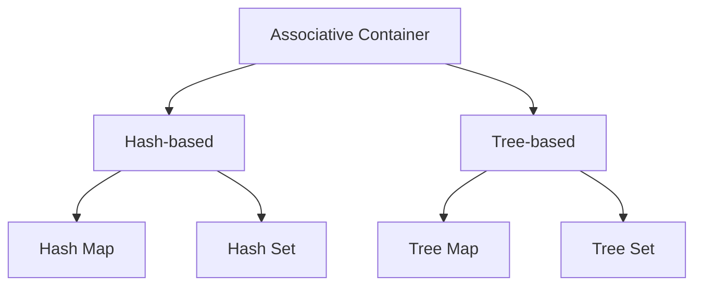

# 2. Associative Containers

## 1. Concept Overview

Associative containers store elements as key-value pairs (or just keys), allowing fast lookup by key. The main types are: **Hash Map**, **Hash Set**, **Tree Map**, **Tree Set**, **Ordered Map/Set**, **Multiset**, and **Multimap**.

## 2. Why It Matters

Associative containers enable O(1) or O(log n) lookup, which is critical for counting, deduplication, caching, and indexing. Most non-trivial algorithms use them.

## 3. Formal Definition

An associative container maps keys to values (or stores keys) and supports insertion, deletion, and lookup. Hash-based containers use a hash function for O(1) average operations. Tree-based containers use a balanced BST for O(log n) worst-case operations.

## 4. Visual Mental Model



## 5. Naive Formulation

A sorted list supports O(log n) lookup via binary search but O(n) insertion. Hash maps give O(1) average but no ordering.

## 6. Optimized Formulation

Hash maps use a hash function to map keys to buckets. Tree maps use a balanced BST (e.g., Red-Black Tree) to maintain sorted order.

## 7. Step-by-Step Derivation

1. Start with a sorted list: O(log n) search, O(n) insert.
2. Use a BST: O(log n) search and insert, but unbalanced degrades to O(n).
3. Use a balanced BST: guaranteed O(log n).
4. Use a hash table: O(1) average, but no ordering.

## 8. Reference Implementation

```python
# Hash Map / Set
freq = {}
freq['a'] = freq.get('a', 0) + 1

s = set()
s.add(1)
s.add(1)  # no effect
1 in s  # True

# Sorted map (Python 3.7+ preserves insertion order, but no sorted-by-key)
# Use SortedDict from sortedcontainers for true sorted map
from sortedcontainers import SortedDict
sd = SortedDict()
sd[3] = 'c'
sd[1] = 'a'
sd[2] = 'b'
list(sd.keys())  # [1, 2, 3]
```

## 9. Complexity Analysis

| Resource | Complexity | Reason |
|---|---|---|
| Time | Hash: O(1) average | Hash table with chaining or open addressing. |
| Space | Tree: O(log n) | Balanced BST (Red-Black, AVL). |

## 10. Worked Examples

### 10.1 Two Sum
Use a hash map to store seen values and their indices. For each element, check if `target - value` is in the map.

### 10.2 Frequency Counting
Use a hash map (or `Counter`) to count element frequencies.

### 10.3 Ordered Iteration
Use a tree map (`SortedDict`) when you need keys in sorted order.

## 11. Variants and Extensions

- **Multiset**: allows duplicate keys (use `Counter` or `defaultdict(list)`).
- **Multimap**: maps a key to multiple values (`defaultdict(list)`).
- **Bloom filter**: probabilistic set membership.

## 12. Common Mistakes

- Using a list when a set is needed (O(n) vs O(1) lookup).
- Assuming Python dicts are sorted by key (they're sorted by insertion order, not key value).
- Not handling hash collisions (rare in practice with Python's built-in hash).

## 13. Connection to Other Topics

[[1. Linear Structures]] - arrays as hash table backends.
[[4. Trees]] - BSTs as tree map backends.
[[10. Offline Structures]] - hash maps for offline processing.

## 14. Practice Problems

- [[3. Two Sum]] - hash map.
- [[4. Group Anagrams]] - hash map with sorted keys.
- [[36. Distinct Numbers]] - hash set.

## 15. Key Takeaways

- Hash maps: O(1) average, no ordering.
- Tree maps: O(log n), sorted by key.
- Choose based on whether you need ordering.
- `collections.Counter` for frequency counting.
- `sortedcontainers.SortedDict` for sorted maps in Python.
