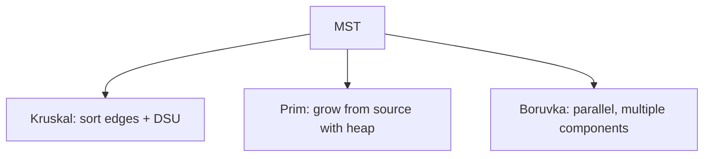

# 20. Minimum Spanning Trees

## 1. Concept Overview

A Minimum Spanning Tree (MST) is a subset of edges that connects all vertices with minimum total weight and no cycles. The main algorithms are: **Kruskal's**, **Prim's**, and **Boruvka's**.

## 2. Why It Matters

MSTs are used in network design (connecting cities with minimum cable), clustering (single-linkage), and approximation algorithms for NP-hard problems like TSP.

## 3. Formal Definition

Given a connected undirected weighted graph, find a spanning tree (a connected subgraph with V-1 edges and no cycles) with minimum total edge weight. Kruskal's: sort edges, add if no cycle (using DSU). Prim's: grow from a source, always adding the cheapest edge to a new vertex.

## 4. Visual Mental Model



## 5. Naive Formulation

Try all spanning trees: exponential.

## 6. Optimized Formulation

Kruskal: sort edges by weight, use DSU to skip edges that form cycles. Prim: min-heap of edges from the visited set, always extract the cheapest.

## 7. Step-by-Step Derivation

1. Sort all edges by weight.
2. Kruskal: for each edge, if it connects two different DSU components, add it.
3. Prim: start at any node, repeatedly add the cheapest edge to an unvisited node.
4. Both produce the same total weight (MST is unique if all edge weights are distinct).

## 8. Reference Implementation

```python
# Kruskal
def kruskal(n, edges):
    edges.sort(key=lambda e: e[2])
    dsu = DSU(n)  # see Disjoint Structures note
    mst_weight = 0
    for u, v, w in edges:
        if dsu.union(u, v):
            mst_weight += w
    return mst_weight

# Prim
import heapq
def prim(adj, n, start=1):
    visited = [False] * (n + 1)
    mst_weight = 0
    pq = [(0, start)]
    while pq:
        w, u = heapq.heappop(pq)
        if visited[u]:
            continue
        visited[u] = True
        mst_weight += w
        for v, w2 in adj[u]:
            if not visited[v]:
                heapq.heappush(pq, (w2, v))
    return mst_weight
```

## 9. Complexity Analysis

| Resource | Complexity | Reason |
|---|---|---|
| Time | O(E log E) for Kruskal, O(E log V) for Prim | Sorting dominates for Kruskal; heap operations for Prim. |
| Space | O(V + E) | DSU for Kruskal, visited + heap for Prim. |

## 10. Worked Examples

### 10.1 Network Design
Connect cities with minimum total cable length.

### 10.2 Clustering
Remove the k-1 most expensive edges from the MST to get k clusters.

### 10.3 TSP Approximation
Use MST + DFS for a 2-approximation of TSP.

## 11. Variants and Extensions

- **Steiner tree**: connect a subset of vertices (NP-hard).
- **Minimum spanning arborescence**: directed version.
- **Euclidean MST**: points in 2D space, solvable in O(n log n).

## 12. Common Mistakes

- Not checking for cycles in Kruskal (use DSU).
- Adding already-visited nodes in Prim (skip them).
- Assuming MST is unique when there are equal-weight edges.

## 13. Connection to Other Topics

[[8. Disjoint Structures]] - DSU for Kruskal.
[[19. Shortest Paths]] - similar algorithms (Prim vs Dijkstra).
[[17. Traversal]] - BFS/DFS for tree traversal.

## 14. Practice Problems

- [[98. Road Reparation]] - MST.
- [[99. Road Construction]] - DSU + MST.
- [[3. Min Cost to Connect All Points]] - Prim.

## 15. Key Takeaways

- MST connects all vertices with minimum weight, no cycles.
- Kruskal: sort + DSU. O(E log E).
- Prim: heap-based growth. O(E log V).
- MST is unique if all edge weights are distinct.
