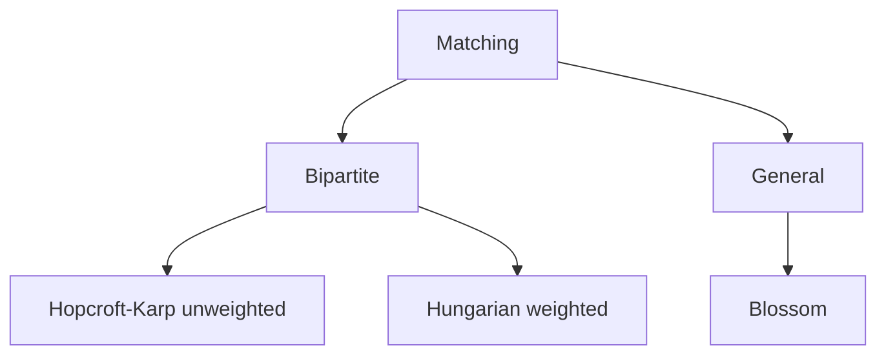

# 21. Matching

## 1. Concept Overview

Matching algorithms find sets of edges without common vertices. The main types are: **Hopcroft-Karp** (bipartite), **Hungarian Algorithm** (weighted bipartite), and **Blossom Algorithm** (general).

## 2. Why It Matters

Matching is used in assignment problems, job scheduling, and network flow. Bipartite matching is the most common and has efficient algorithms.

## 3. Formal Definition

A matching is a set of edges with no shared vertices. A maximum matching has the maximum number of edges. A perfect matching covers all vertices. Bipartite matching can be solved with max flow or specialized algorithms.

## 4. Visual Mental Model



## 5. Naive Formulation

Try all matchings: exponential.

## 6. Optimized Formulation

Hopcroft-Karp: BFS to find augmenting paths, DFS to augment. Hungarian: primal-dual method. Blossom: handles odd cycles.

## 7. Step-by-Step Derivation

1. Bipartite unweighted: Hopcroft-Karp, O(E * sqrt(V)).
2. Bipartite weighted: Hungarian, O(V^3).
3. General: Blossom, O(V^3).

## 8. Reference Implementation

```python
# Bipartite Matching (simplified, augmenting path)
def bipartite_match(adj, n_left, n_right):
    match_r = [-1] * n_right
    
    def bpm(u, seen):
        for v in adj[u]:
            if not seen[v]:
                seen[v] = True
                if match_r[v] == -1 or bpm(match_r[v], seen):
                    match_r[v] = u
                    return True
        return False
    
    result = 0
    for u in range(n_left):
        seen = [False] * n_right
        if bpm(u, seen):
            result += 1
    return result
```

## 9. Complexity Analysis

| Resource | Complexity | Reason |
|---|---|---|
| Time | Varies: O(E * sqrt(V)) to O(V^3) | Hopcroft-Karp: O(E * sqrt(V)). Hungarian: O(V^3). |
| Space | O(V) | Match arrays. |

## 10. Worked Examples

### 10.1 Job Assignment
Assign workers to jobs with minimum cost (Hungarian).

### 10.2 Stable Marriage
Each person prefers some partners over others.

### 10.3 Maximum Bipartite Matching
Find maximum matching in unweighted bipartite graph.

## 11. Variants and Extensions

- **Min-cost max-flow**: generalizes weighted matching.
- **Online matching**: vertices arrive dynamically.
- **Approximate matching**: for large graphs.

## 12. Common Mistakes

- Not handling augmenting paths correctly.
- Wrong graph construction for bipartite matching.

## 13. Connection to Other Topics

[[19. Shortest Paths]] - Hungarian uses shortest paths.
[[113. Download Speed]] - max flow for matching.
[[115. School Dance]] - bipartite matching.

## 14. Practice Problems

- [[115. School Dance]] - bipartite matching.
- [[113. Download Speed]] - max flow.

## 15. Key Takeaways

- Matching: edges without common vertices.
- Bipartite: Hopcroft-Karp O(E * sqrt(V)).
- Weighted bipartite: Hungarian O(V^3).
- General: Blossom O(V^3).
- Often reduced to max flow.
