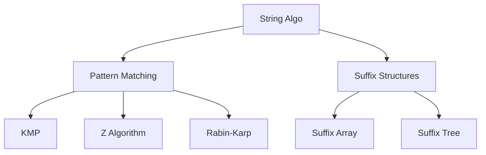

# 22. String Algorithms

## 1. Concept Overview

String algorithms process text efficiently. The main types are: **KMP**, **Z Algorithm**, **Rabin-Karp**, **Rolling Hash**, **Aho-Corasick**, **Suffix Array**, **Suffix Tree**, **Suffix Automaton**, and **Manacher's Algorithm**.

## 2. Why It Matters

String algorithms are essential for text search, bioinformatics, data compression, and natural language processing. They enable pattern matching in linear time.

## 3. Formal Definition

**KMP**: preprocess pattern to compute failure function, then single pass through text. **Z algorithm**: compute Z-array where Z[i] = longest substring starting at i that matches a prefix. **Rabin-Karp**: rolling hash for O(n+m) average pattern matching. **Suffix array**: sorted array of all suffixes.

## 4. Visual Mental Model



## 5. Naive Formulation

Naive pattern matching: O(n * m).

## 6. Optimized Formulation

KMP and Z: O(n + m) preprocessing and matching. Rabin-Karp: O(n + m) average with rolling hash.

## 7. Step-by-Step Derivation

1. Naive: check each position, O(n * m).
2. KMP: failure function skips redundant comparisons.
3. Z: Z-array helps find pattern occurrences.
4. Suffix array: sort suffixes, binary search for pattern.

## 8. Reference Implementation

```python
# KMP
def kmp_search(text, pattern):
    # Build failure function
    failure = [0] * len(pattern)
    j = 0
    for i in range(1, len(pattern)):
        while j > 0 and pattern[i] != pattern[j]:
            j = failure[j - 1]
        if pattern[i] == pattern[j]:
            j += 1
            failure[i] = j
    
    # Search
    j = 0
    matches = []
    for i in range(len(text)):
        while j > 0 and text[i] != pattern[j]:
            j = failure[j - 1]
        if text[i] == pattern[j]:
            j += 1
        if j == len(pattern):
            matches.append(i - j + 1)
            j = failure[j - 1]
    return matches

# Z Algorithm
def z_algorithm(s):
    n = len(s)
    z = [0] * n
    l = r = 0
    for i in range(1, n):
        if i <= r:
            z[i] = min(r - i + 1, z[i - l])
        while i + z[i] < n and s[z[i]] == s[i + z[i]]:
            z[i] += 1
        if i + z[i] - 1 > r:
            l, r = i, i + z[i] - 1
    return z
```

## 9. Complexity Analysis

| Resource | Complexity | Reason |
|---|---|---|
| Time | O(n + m) | Linear preprocessing + linear search. |
| Space | O(n) | Failure/Z arrays. |

## 10. Worked Examples

### 10.1 Pattern Matching
KMP or Z to find all occurrences of a pattern in text.

### 10.2 Longest Palindromic Substring
Manacher's algorithm, O(n).

### 10.3 Multiple Pattern Matching
Aho-Corasick builds a trie with failure links.

## 11. Variants and Extensions

- **Suffix automaton**: linear-time construction, supports many string queries.
- **Burrows-Wheeler transform**: for compression.
- **String hashing**: polynomial rolling hash.

## 12. Common Mistakes

- Wrong failure function construction.
- Off-by-one in Z algorithm.
- Hash collisions in Rabin-Karp (use double hashing).

## 13. Connection to Other Topics

[[11. String Algorithms]] - advanced topic.
[[1. Linear Structures]] - strings as arrays.

## 14. Practice Problems

- [[11. Creating Strings]] - permutations.
- [[71. Edit Distance]] - string DP.

## 15. Key Takeaways

- KMP: O(n + m) pattern matching with failure function.
- Z algorithm: Z-array for pattern matching and string analysis.
- Rabin-Karp: rolling hash, O(n + m) average.
- Suffix array/tree: for suffix-based queries.
- Manacher: O(n) longest palindromic substring.
