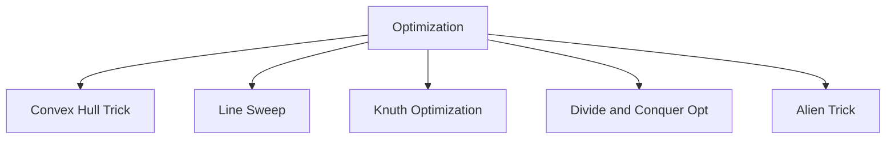

# 23. Optimization

## 1. Concept Overview

Optimization techniques for specialized problems: **Convex Hull Trick**, **Line Sweep**, **KD Tree**, **Knuth Optimization**, **Divide and Conquer Optimization**, and **Alien Trick**.

## 2. Why It Matters

These techniques optimize specific classes of DP or geometric problems, reducing time complexity by leveraging mathematical structure.

## 3. Formal Definition

**Convex hull trick**: optimize DP transitions of the form `dp[i] = min(dp[j] + a[i] * b[j])` when `b` is monotonic. **Line sweep**: process geometric events in order. **Knuth optimization**: for DP with quadrangle inequality. **Alien trick (Lagrangian relaxation)**: for constrained optimization.

## 4. Visual Mental Model



## 5. Naive Formulation

Standard DP: O(n^2) or worse.

## 6. Optimized Formulation

Each technique exploits specific structure to reduce complexity, often by a factor of n.

## 7. Step-by-Step Derivation

1. Identify the DP structure (e.g., monotonic slopes).
2. Apply the appropriate optimization.
3. Verify the optimization's conditions are met.

## 8. Reference Implementation

```python
# Convex Hull Trick (simplified)
# For dp[i] = min(dp[j] + m[j] * x[i] + c[j])
# where m is decreasing and x is increasing

class ConvexHullTrick:
    def __init__(self):
        self.lines = []  # (m, c)
    
    def add_line(self, m, c):
        while len(self.lines) >= 2:
            m1, c1 = self.lines[-2]
            m2, c2 = self.lines[-1]
            if (c - c2) * (m1 - m2) >= (c2 - c1) * (m2 - m):
                self.lines.pop()
            else:
                break
        self.lines.append((m, c))
    
    def query(self, x):
        # Binary search for the best line
        lo, hi = 0, len(self.lines) - 1
        while lo < hi:
            mid = (lo + hi) // 2
            m1, c1 = self.lines[mid]
            m2, c2 = self.lines[mid + 1]
            if m1 * x + c1 < m2 * x + c2:
                hi = mid
            else:
                lo = mid + 1
        m, c = self.lines[lo]
        return m * x + c
```

## 9. Complexity Analysis

| Resource | Complexity | Reason |
|---|---|---|
| Time | Varies, often O(n log n) instead of O(n^2) | Reduces O(n^2) DP to O(n log n) or O(n). |
| Space | O(n) | O(n) for the optimized structure. |

## 10. Worked Examples

### 10.1 Convex Hull Trick DP
Optimize DP with linear cost functions.

### 10.2 Line Sweep for Closest Pair
Sweep points, maintain candidates in a balanced BST.

### 10.3 Knuth Optimization for Interval DP
Optimize `dp[l][r] = min(dp[l][k] + dp[k+1][r])` when the optimal `k` is monotonic.

## 11. Variants and Extensions

- **Li Chao tree**: generalization of convex hull trick.
- **Slope trick**: for piecewise linear functions.
- **WQS binary search (Alien trick)**: for constrained optimization.

## 12. Common Mistakes

- Applying optimization without verifying conditions.
- Floating-point precision issues in geometric algorithms.

## 13. Connection to Other Topics

[[16. Dynamic Programming]] - these optimize DP.
[[5. Sweep Line]] - advanced topic.

## 14. Practice Problems

- [[1. Maximum Subarray]] - simple optimization.
- Various DP problems.

## 15. Key Takeaways

- Convex hull trick: optimize linear DP transitions.
- Knuth optimization: for interval DP with quadrangle inequality.
- Divide and conquer optimization: for monotonic opt points.
- Alien trick: for constrained optimization.
- Always verify conditions before applying.
