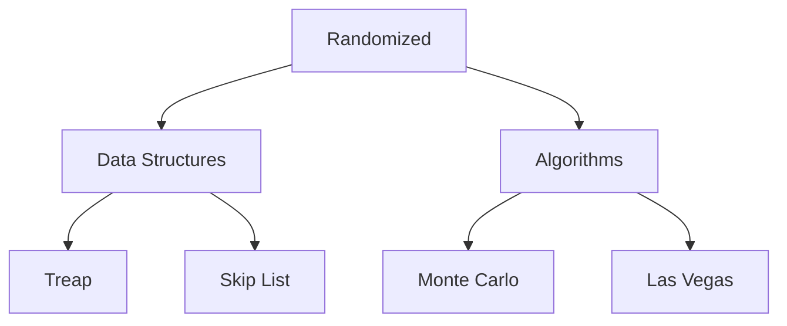

# 24. Randomized

## 1. Concept Overview

Randomized algorithms use randomness to achieve good expected performance. The main types are: **Treap**, **Randomized BST**, **Skip List**, **Monte Carlo**, and **Las Vegas**.

## 2. Why It Matters

Randomization can simplify algorithms and provide good expected performance even when worst-case is bad. Treaps and skip lists are easier to implement than balanced BSTs.

## 3. Formal Definition

**Treap**: BST with random priorities, behaves like a balanced BST in expectation. **Skip list**: layered linked lists with random heights. **Monte Carlo**: may give wrong answers with small probability. **Las Vegas**: always correct, random running time.

## 4. Visual Mental Model



## 5. Naive Formulation

Deterministic balanced BST: complex rotations.

## 6. Optimized Formulation

Random priorities/heights give expected O(log n) without explicit balancing.

## 7. Step-by-Step Derivation

1. Treap: assign random priorities, maintain heap property via rotations.
2. Skip list: random heights for fast lanes.
3. Monte Carlo: random sampling (e.g., Miller-Rabin primality).
4. Las Vegas: randomization with guaranteed correctness (e.g., randomized quicksort).

## 8. Reference Implementation

```python
import random

# Treap Node
class TreapNode:
    def __init__(self, key):
        self.key = key
        self.priority = random.random()
        self.left = self.right = None

# Randomized Quicksort (Las Vegas)
def quicksort(arr):
    if len(arr) <= 1:
        return arr
    pivot = random.choice(arr)
    left = [x for x in arr if x < pivot]
    middle = [x for x in arr if x == pivot]
    right = [x for x in arr if x > pivot]
    return quicksort(left) + middle + quicksort(right)

# Monte Carlo: estimate pi
def estimate_pi(n):
    count = 0
    for _ in range(n):
        x, y = random.random(), random.random()
        if x * x + y * y <= 1:
            count += 1
    return 4 * count / n
```

## 9. Complexity Analysis

| Resource | Complexity | Reason |
|---|---|---|
| Time | Expected O(log n) or O(n log n) | Randomization gives good expected performance. |
| Space | O(n) | Same as deterministic counterparts. |

## 10. Worked Examples

### 10.1 Randomized Quicksort
Random pivot avoids worst-case O(n^2).

### 10.2 Miller-Rabin Primality Test
Monte Carlo test with controllable error probability.

### 10.3 Treap for Balanced BST
Random priorities for expected balance.

## 11. Variants and Extensions

- **Bloom filter**: probabilistic set membership.
- **HyperLogLog**: cardinality estimation.
- **Reservoir sampling**: random sampling from a stream.

## 12. Common Mistakes

- Pseudorandom generator quality (use `secrets` for cryptographic).
- Treap priorities must be unique.
- Monte Carlo error probability must be controlled.

## 13. Connection to Other Topics

[[6. Miscellaneous Structures]] - skip lists.
[[10. Probability]] - advanced topic.

## 14. Practice Problems

- [[1. Subsets]] - deterministic.
- Various problems benefit from randomization.

## 15. Key Takeaways

- Treap: BST + heap with random priorities.
- Skip list: layered lists with random heights.
- Monte Carlo: may err with small probability.
- Las Vegas: always correct, random time.
- Randomization simplifies and improves expected performance.
