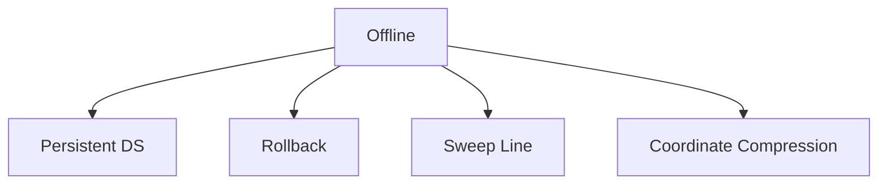

# 25. Offline Algorithms

## 1. Concept Overview

Offline algorithms process all queries together, reordering for efficiency. The main types are: **Persistent Data Structures**, **Rollback Techniques**, **Sweep Line**, and **Coordinate Compression**.

## 2. Why It Matters

Offline processing enables algorithms that would be infeasible online. Sorting queries, processing in a specific order, and using persistent structures are key techniques.

## 3. Formal Definition

**Persistent data structures**: access historical versions. **Rollback**: undo operations to reuse state. **Sweep line**: process events in sorted order. **Coordinate compression**: map large coordinates to small indices.

## 4. Visual Mental Model



## 5. Naive Formulation

Online: answer each query as it arrives.

## 6. Optimized Formulation

Sort or reorder queries, use persistent/rollback structures.

## 7. Step-by-Step Derivation

1. Coordinate compression: map values to 0..n-1.
2. Sweep line: create events, sort, process.
3. Persistent: build versions, query specific version.
4. Rollback: process operations, undo to a checkpoint.

## 8. Reference Implementation

```python
# Coordinate Compression
def compress(values):
    sorted_unique = sorted(set(values))
    mapping = {v: i for i, v in enumerate(sorted_unique)}
    return [mapping[v] for v in values], len(sorted_unique)

# Sweep Line (e.g., count overlapping intervals)
def count_overlap(intervals):
    events = []
    for start, end in intervals:
        events.append((start, 1))
        events.append((end, -1))
    events.sort()
    current = 0
    max_overlap = 0
    for time, delta in events:
        current += delta
        max_overlap = max(max_overlap, current)
    return max_overlap
```

## 9. Complexity Analysis

| Resource | Complexity | Reason |
|---|---|---|
| Time | Varies | Depends on the specific technique. |
| Space | Varies | Varies. |

## 10. Worked Examples

### 10.1 Coordinate Compression for Large Values
Map values up to 10^9 to 0..n-1 for use as array indices.

### 10.2 Sweep Line for Max Overlap
Create +1/-1 events, sort by time, sweep.

### 10.3 Persistent Segment Tree for k-th Smallest
Build a segment tree for each prefix, query by version difference.

## 11. Variants and Extensions

- **Persistent union-find**: with rollback.
- **CDQ divide and conquer**: for 3D partial order.
- **Offline 2D queries**: with sweep + BIT.

## 12. Common Mistakes

- Forgetting to sort events by time (with tie-breaking).
- Coordinate compression must be consistent across all uses.
- Persistent structures have high memory overhead.

## 13. Connection to Other Topics

[[10. Offline Structures]] - Mo's algorithm.
[[5. Sweep Line]] - advanced topic.

## 14. Practice Problems

- [[34. Restaurant Customers]] - sweep line.
- [[130. Distinct Values Queries]] - offline.

## 15. Key Takeaways

- Offline: reorder queries for efficiency.
- Coordinate compression: large values -> small indices.
- Sweep line: events sorted by time.
- Persistent: query historical versions.
- Rollback: undo operations to a checkpoint.
