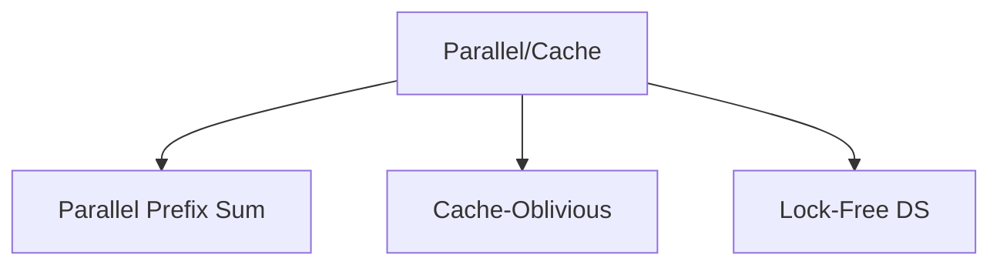

# 26. Parallel and Cache Friendly

## 1. Concept Overview

Parallel and cache-friendly algorithms optimize for multi-core processors and memory hierarchy. The main types are: **Parallel Prefix Sum**, **Cache-Oblivious Algorithms**, and **Lock-Free Data Structures**.

## 2. Why It Matters

Modern hardware has multiple cores and deep cache hierarchies. Algorithms that respect cache behavior and parallelize well can be 10-100x faster than naive implementations.

## 3. Formal Definition

**Parallel prefix sum**: compute prefix sums in O(log n) depth using O(n) work. **Cache-oblivious**: optimal cache behavior without knowing cache size. **Lock-free**: thread-safe without locks, using atomic operations.

## 4. Visual Mental Model



## 5. Naive Formulation

Single-threaded, cache-unaware algorithms.

## 6. Optimized Formulation

Divide work across cores, structure data for cache locality.

## 7. Step-by-Step Derivation

1. Parallel prefix sum: up-sweep to compute partial sums, down-sweep to distribute.
2. Cache-oblivious: recursive divide and conquer with appropriate base cases.
3. Lock-free: use compare-and-swap (CAS) for atomic updates.

## 8. Reference Implementation

```python
# Parallel Prefix Sum (simplified)
def parallel_prefix_sum(arr):
    n = len(arr)
    result = arr[:]
    # Up-sweep
    step = 1
    while step < n:
        for i in range(step - 1, n, 2 * step):
            result[i + step] = result[i] + result[i + step]
        step *= 2
    # Down-sweep
    step = n // 2
    while step > 0:
        for i in range(step - 1, n, 2 * step):
            if i + 2 * step < n:
                result[i + 2 * step - 1] += result[i + step - 1]
        step //= 2
    return result

# Lock-free example (conceptual)
# Uses atomic compare-and-swap operations
# Python doesn't have native lock-free, but here's the idea:
import threading
class LockFreeCounter:
    def __init__(self):
        self.value = 0
    def increment(self):
        while True:
            old = self.value
            new = old + 1
            # In real code: if compare_and_swap(self.value, old, new): break
```

## 9. Complexity Analysis

| Resource | Complexity | Reason |
|---|---|---|
| Time | O(n / p) for parallel, p processors | Parallel: O(log n) depth. Cache-oblivious: optimal cache misses. |
| Space | O(n) | O(n) plus thread overhead. |

## 10. Worked Examples

### 10.1 Parallel Reduction
Sum an array in parallel: divide, sum each half, combine.

### 10.2 Matrix Multiplication (Cache-Friendly)
Block decomposition for cache efficiency.

### 10.3 Lock-Free Queue
Use CAS for thread-safe enqueue/dequeue.

## 11. Variants and Extensions

- **SIMD**: single instruction, multiple data.
- **GPU algorithms**: massive parallelism.
- **NUMA-aware**: non-uniform memory access.

## 12. Common Mistakes

- Race conditions in parallel code.
- False sharing (cores' caches invalidate each other).
- Amdahl's law limits speedup by serial portion.

## 13. Connection to Other Topics

[[12. Sorting]] - parallel sorts.
[[14. Practical Concurrency]] - concurrency topic.

## 14. Practice Problems

- Various parallel implementations.

## 15. Key Takeaways

- Parallel prefix sum: O(log n) depth, O(n) work.
- Cache-oblivious: optimal without knowing cache size.
- Lock-free: thread-safe without locks, uses CAS.
- Amdahl's law: speedup limited by serial portion.
- Cache locality often matters more than parallelism.
