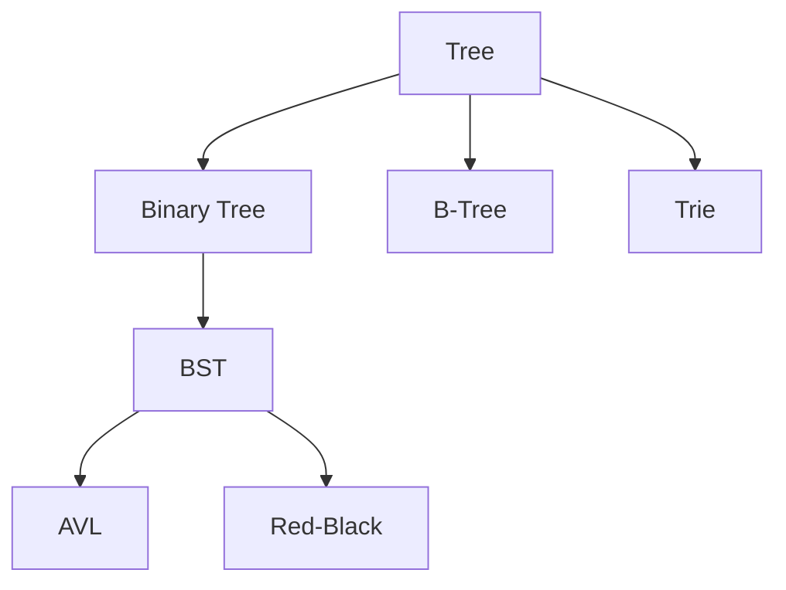

# 4. Trees

## 1. Concept Overview

Trees are hierarchical data structures with a root node and child nodes. The main types are: **Binary Tree**, **Binary Search Tree (BST)**, **AVL Tree**, **Red-Black Tree**, **B-Tree**, **B+ Tree**, **Trie**, **Patricia Trie**, and **Ternary Search Tree**.

## 2. Why It Matters

Trees enable hierarchical organization (file systems, HTML DOM), efficient search (BST, trie), and balanced performance guarantees (AVL, Red-Black). They are the backbone of databases (B+ trees) and string algorithms (tries).

## 3. Formal Definition

A tree is a connected acyclic graph with a designated root. Each node has zero or more children. A binary tree has at most 2 children per node. A BST satisfies: left subtree < node < right subtree. Balanced trees (AVL, Red-Black) maintain O(log n) height through rotations.

## 4. Visual Mental Model



## 5. Naive Formulation

An unbalanced BST can degenerate to a linked list (O(n) operations). Need balancing.

## 6. Optimized Formulation

AVL trees maintain balance by tracking height difference and rotating when > 1. Red-Black trees use color-based rules. B-trees allow multiple keys per node (good for disk I/O).

## 7. Step-by-Step Derivation

1. Binary tree: each node has 0-2 children.
2. BST: ordering property for O(log n) search.
3. Balanced BST: rotations to maintain O(log n) height.
4. B-tree: multi-way branching for disk efficiency.
5. Trie: prefix-based tree for strings.

## 8. Reference Implementation

```python
# Binary Tree Node
class TreeNode:
    def __init__(self, val=0, left=None, right=None):
        self.val = val
        self.left = left
        self.right = right

# BST Search
def search(root, target):
    if not root:
        return None
    if root.val == target:
        return root
    elif target < root.val:
        return search(root.left, target)
    else:
        return search(root.right, target)

# Trie
class TrieNode:
    def __init__(self):
        self.children = {}
        self.is_end = False

class Trie:
    def __init__(self):
        self.root = TrieNode()
    
    def insert(self, word):
        node = self.root
        for c in word:
            if c not in node.children:
                node.children[c] = TrieNode()
            node = node.children[c]
        node.is_end = True
```

## 9. Complexity Analysis

| Resource | Complexity | Reason |
|---|---|---|
| Time | O(log n) for balanced | BST search/insert/delete: O(log n) average, O(n) worst. |
| Space | O(n) | O(n) storage. |

## 10. Worked Examples

### 10.1 BST Search
Recursively compare and descend left or right.

### 10.2 Trie Insertion
Walk down the trie, creating nodes as needed. Mark the end of a word.

### 10.3 AVL Rotation
After insertion, check balance factor. Rotate if unbalanced.

## 11. Variants and Extensions

- **Splay tree**: self-adjusting, recently accessed nodes move to root.
- **Segment tree**: range queries on arrays.
- **Fenwick tree (BIT)**: prefix sum queries.

## 12. Common Mistakes

- Forgetting to handle the empty tree case.
- Not balancing a BST (degrades to O(n)).
- Confusing preorder, inorder, postorder traversals.

## 13. Connection to Other Topics

[[1. Linear Structures]] - linked lists as degenerate trees.
[[7. Range Query Structures]] - segment trees.
[[9. Tree Techniques]] - Euler tour, binary lifting.

## 14. Practice Problems

- [[2. Maximum Depth of Binary Tree]]
- [[11. Validate Binary Search Tree]]
- [[1. Implement Trie]]

## 15. Key Takeaways

- Trees model hierarchies.
- BSTs give O(log n) search when balanced.
- Tries are optimal for prefix matching.
- Balanced BSTs (AVL, Red-Black) guarantee O(log n).
- B-trees are optimized for disk I/O.
