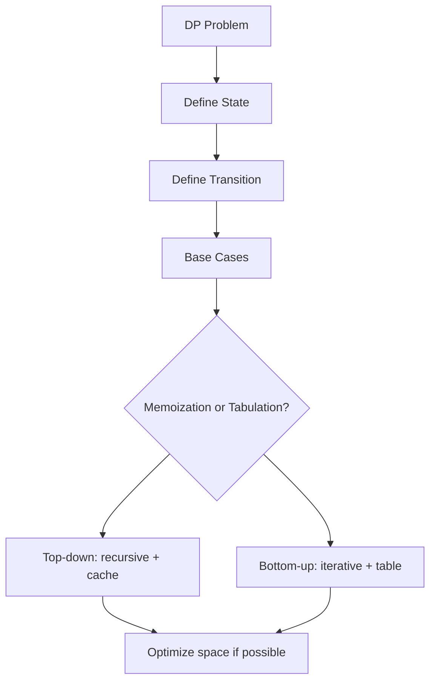

# 1. What is Dynamic Programming

## 1. Concept Overview

Dynamic Programming is a problem-solving technique that solves complex problems by breaking them into simpler overlapping subproblems. Key concepts: **Overlapping Subproblems**, **Optimal Substructure**, **State**, **Transition**, **Base Case**, **Memoization vs Tabulation**, **Top-down vs Bottom-up**, **State Compression**, and **Complexity Analysis**.

## 2. Why It Matters

DP is the most powerful technique for optimization problems. It appears in 30-40% of interview questions and is essential for competitive programming. Mastering DP transforms exponential problems into polynomial ones.

## 3. Formal Definition

DP applies when: (1) **Optimal substructure**: the optimal solution can be built from optimal solutions of subproblems, (2) **Overlapping subproblems**: subproblems are reused. The state encodes the subproblem; the transition defines how to compute it from smaller states; the base case is the smallest subproblem.

## 4. Visual Mental Model



## 5. Naive Formulation

Recursion without memoization: exponential time.

## 6. Optimized Formulation

Identify state, define recurrence, choose memoization (top-down) or tabulation (bottom-up).

## 7. Step-by-Step Derivation

1. Identify that the problem has optimal substructure and overlapping subproblems.
2. Define the state: what changes between subproblems?
3. Define the recurrence: how does the state depend on smaller states?
4. Determine base cases.
5. Choose memoization (top-down) or tabulation (bottom-up).
6. Optimize space if possible (e.g., 1D instead of 2D).

## 8. Reference Implementation

```python
# Top-down (memoization)
from functools import lru_cache

@lru_cache(maxsize=None)
def fib(n):
    if n <= 1:
        return n
    return fib(n - 1) + fib(n - 2)

# Bottom-up (tabulation)
def fib_tab(n):
    dp = [0] * (n + 1)
    dp[1] = 1
    for i in range(2, n + 1):
        dp[i] = dp[i - 1] + dp[i - 2]
    return dp[n]

# Space-optimized
def fib_opt(n):
    a, b = 0, 1
    for _ in range(n):
        a, b = b, a + b
    return a
```

## 9. Complexity Analysis

| Resource | Complexity | Reason |
|---|---|---|
| Time | O(states * work per state) | Number of states times work per state. |
| Space | O(states) | DP table size. |

## 10. Worked Examples

### 10.1 Fibonacci
State: `n`. Transition: `dp[n] = dp[n-1] + dp[n-2]`. Base: `dp[0] = 0, dp[1] = 1`.

### 10.2 Climbing Stairs
State: `n`. Transition: `dp[n] = dp[n-1] + dp[n-2]`.

### 10.3 Coin Change (min coins)
State: `amount`. Transition: `dp[a] = min(dp[a - c] + 1)`.

## 11. Variants and Extensions

- **Bitmask DP**: state includes a bitmask of used items.
- **Digit DP**: state includes digit position and constraints.
- **Tree DP**: state is a tree node.
- **Interval DP**: state is (l, r).

## 12. Common Mistakes

- Wrong state definition.
- Forgetting base cases.
- Wrong loop order (must fill smaller states first).
- Not optimizing space when possible.

## 13. Connection to Other Topics

[[2. How to Design DP]] - design framework.
[[3. 1D Dynamic Programming]] - 1D patterns.
[[16. Dynamic Programming]] - ADS reference.

## 14. Practice Problems

- [[65. Dice Combinations]] - basic 1D DP.
- [[66. Minimizing Coins]] - coin change.
- [[1. Climbing Stairs]] - Fibonacci variant.

## 15. Key Takeaways

- DP = optimal substructure + overlapping subproblems.
- State: encodes the subproblem.
- Transition: how to compute state from smaller states.
- Memoization (top-down) vs tabulation (bottom-up).
- Space optimization: often 1D instead of 2D.
- Always verify the recurrence before coding.
