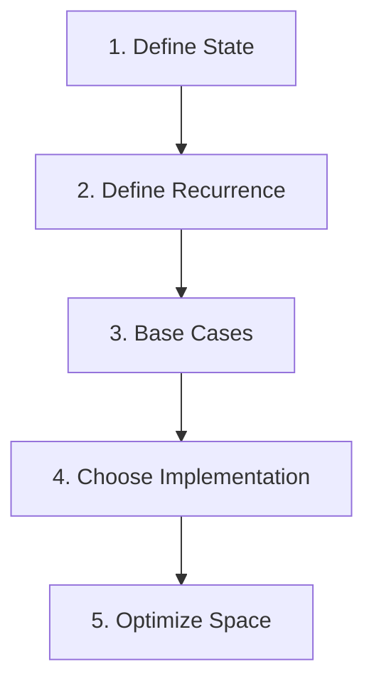

# 2. How to Design DP

## 1. Concept Overview

A repeatable framework for designing DP solutions: (1) Define the state, (2) Define the recurrence, (3) Determine base cases, (4) Choose memoization or tabulation, (5) Optimize space if possible.

## 2. Why It Matters

Without a framework, DP problems feel like guesswork. This framework turns DP into a systematic process that works for the vast majority of problems.

## 3. Formal Definition

The framework: identify what varies (state), how states relate (recurrence), the smallest subproblems (base cases), and the implementation strategy (memoization vs tabulation).

## 4. Visual Mental Model



## 5. Naive Formulation

Guessing the recurrence without structure.

## 6. Optimized Formulation

Follow the 5-step framework systematically.

## 7. Step-by-Step Derivation

1. State: what parameters describe a subproblem? (e.g., index, sum, bitmask)
2. Recurrence: how to compute dp[state] from smaller states?
3. Base cases: smallest subproblems with known answers.
4. Implementation: top-down (recursion + cache) or bottom-up (iteration + table).
5. Space: can we reduce dimensions? (e.g., 2D -> 1D using rolling arrays)

## 8. Reference Implementation

```python
# Framework example: Coin Change (min coins)
# 1. State: dp[amount] = min coins to make this amount
# 2. Recurrence: dp[a] = min(dp[a - c] + 1) for each coin c
# 3. Base: dp[0] = 0 (zero coins for zero amount)
# 4. Implementation: bottom-up
# 5. Space: 1D, can't reduce further

def coin_change(coins, amount):
    INF = float('inf')
    dp = [0] + [INF] * amount
    for a in range(1, amount + 1):
        for c in coins:
            if a >= c:
                dp[a] = min(dp[a], dp[a - c] + 1)
    return dp[amount] if dp[amount] != INF else -1
```

## 9. Complexity Analysis

| Resource | Complexity | Reason |
|---|---|---|
| Time | Varies | Depends on the problem. |
| Space | Varies | Depends on the state space. |

## 10. Worked Examples

### 10.1 House Robber
State: `dp[i]` = max money from houses 0..i. Recurrence: `dp[i] = max(dp[i-1], dp[i-2] + nums[i])`.

### 10.2 Longest Increasing Subsequence
State: `dp[i]` = LIS ending at index i. Recurrence: `dp[i] = max(dp[j] + 1)` for j < i with nums[j] < nums[i].

### 10.3 0/1 Knapsack
State: `dp[i][w]` = max value using first i items with weight limit w. Recurrence: `dp[i][w] = max(dp[i-1][w], dp[i-1][w - weight[i]] + value[i])`.

## 11. Variants and Extensions

- **State compression**: reduce dimensions using rolling arrays or bitmasks.
- **Reconstructing the solution**: store parent pointers alongside dp values.
- **Counting paths**: dp counts instead of optimizing.

## 12. Common Mistakes

- Skipping the state definition step.
- Wrong recurrence direction.
- Not handling edge cases in base cases.

## 13. Connection to Other Topics

[[1. What is Dynamic Programming]] - foundations.
[[3. 1D Dynamic Programming]] - patterns.
[[6. Knapsack Family]] - specific pattern.

## 14. Practice Problems

- [[66. Minimizing Coins]] - state = amount.
- [[3. House Robber]] - state = index.
- [[60. Two Sets II]] - state = sum.

## 15. Key Takeaways

- 1. Define state: what parameters describe the subproblem.
- 2. Define recurrence: how state depends on smaller states.
- 3. Base cases: smallest subproblems.
- 4. Choose: memoization (top-down) or tabulation (bottom-up).
- 5. Optimize space: rolling arrays, dimension reduction.
- Always verify with small examples.
