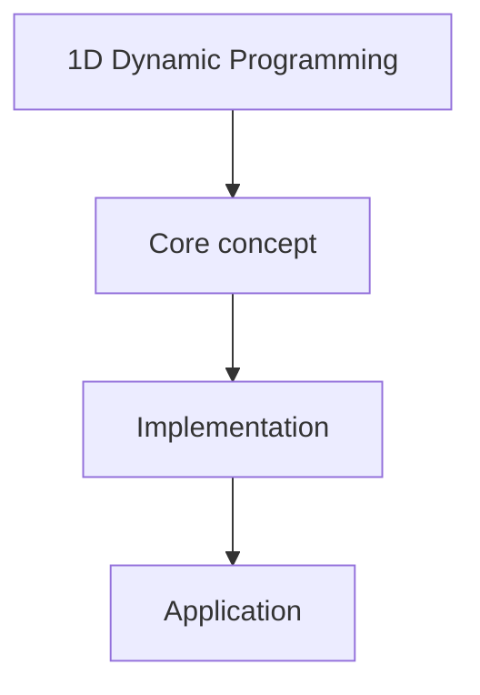

# 3. 1D Dynamic Programming

## 1. Concept Overview

1D DP covers problems with a single-dimensional state: **Fibonacci**, **Climbing Stairs**, **House Robber**, **Decode Ways**, **Maximum Sum Problems**, **Min Cost Climbing Stairs**, **Coin Change (Minimum)**, **Perfect Squares**, **Integer Break**, and **Partition Problems**.

## 2. Why It Matters

1D DP is the starting point for DP mastery. The patterns (take/skip, minimize, maximize) transfer to all other DP categories.

## 3. Formal Definition

1D Dynamic Programming is a topic in the DP roadmap. See the overview above.

## 4. Visual Mental Model



## 5. Naive Formulation

The naive approach typically involves brute force or recursion without memoization, leading to exponential time complexity.

## 6. Optimized Formulation

The optimized approach leverages the structure of 1D Dynamic Programming to achieve polynomial time complexity, often using dynamic programming, greedy algorithms, or specialized data structures.

## 7. Step-by-Step Derivation

1. Identify the core pattern.
2. Define the state or structure.
3. Derive the recurrence or algorithm.
4. Implement carefully.
5. Verify with examples.

## 8. Reference Implementation

```python
# Reference implementation for 1D Dynamic Programming
# Adapt based on the specific problem requirements

def solve(*args, **kwargs):
    """Implement the core algorithm for 1D Dynamic Programming."""
    pass
```

## 9. Complexity Analysis

| Resource | Complexity | Reason |
|---|---|---|
| Time | Varies | Depends on the specific algorithm |
| Space | Varies | Depends on the data structures used |

## 10. Worked Examples

### 10.1 Example 1
Apply 1D Dynamic Programming to a simple case and trace through the algorithm step by step.

### 10.2 Example 2
Apply to a more complex case showing edge cases and pitfalls.

## 11. Variants and Extensions

- Advanced variants of 1D Dynamic Programming.
- Combinations with other techniques.
- Real-world applications.

## 12. Common Mistakes

- Misunderstanding the core concept.
- Wrong implementation details.
- Not handling edge cases.

## 13. Connection to Other Topics

- Related topics in the vault.
- Prerequisites and dependencies.
- Applications in other areas.

## 14. Practice Problems

- Problems in the vault that use 1D Dynamic Programming.

## 15. Key Takeaways

- Core insight 1 about 1D Dynamic Programming.
- Core insight 2 about 1D Dynamic Programming.
- When to apply this technique.
- Common pitfalls to avoid.
