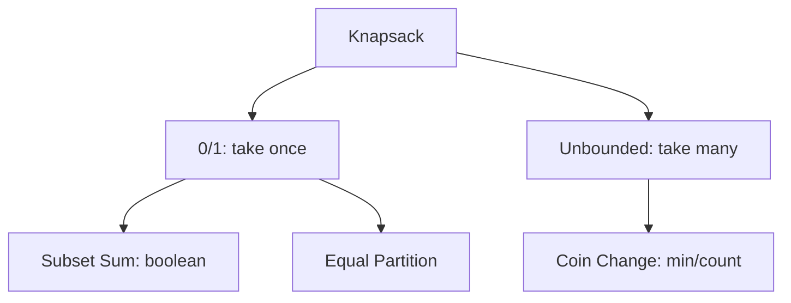

# 6. Knapsack Family

## 1. Concept Overview

The knapsack family of DP problems: **0/1 Knapsack**, **Unbounded Knapsack**, **Coin Change**, **Target Sum**, **Equal Partition**, **Subset Sum**, and **Count Subsets**.

## 2. Why It Matters

Knapsack is one of the biggest interview DP categories. The 'take / don't take' pattern appears in countless problems. Mastering the variants enables solving a wide range of optimization problems.

## 3. Formal Definition

**0/1 Knapsack**: each item can be taken at most once. `dp[i][w] = max(dp[i-1][w], dp[i-1][w - weight[i]] + value[i])`. **Unbounded**: items can be reused. `dp[w] = max(dp[w], dp[w - weight[i]] + value[i])`. **Subset Sum**: can we achieve sum `s`? `dp[s] = dp[s] or dp[s - weight[i]]`.

## 4. Visual Mental Model



## 5. Naive Formulation

Try all subsets: O(2^n).

## 6. Optimized Formulation

DP with state = (item index, weight/sum). Iterate over items, update dp for each possible weight.

## 7. Step-by-Step Derivation

1. 0/1 Knapsack: `dp[i][w]` = max value with first i items, weight limit w.
2. Unbounded: `dp[w]` = max value with weight limit w (items reusable).
3. Subset Sum: `dp[s]` = True if sum s is achievable.
4. Coin Change (min): `dp[a]` = min coins for amount a.
5. Coin Change (count): `dp[a]` = number of ways to make amount a.

## 8. Reference Implementation

```python
# 0/1 Knapsack
def knapsack_01(weights, values, capacity):
    n = len(weights)
    dp = [0] * (capacity + 1)
    for i in range(n):
        for w in range(capacity, weights[i] - 1, -1):  # reverse!
            dp[w] = max(dp[w], dp[w - weights[i]] + values[i])
    return dp[capacity]

# Unbounded Knapsack
def knapsack_unbounded(weights, values, capacity):
    dp = [0] * (capacity + 1)
    for w in range(1, capacity + 1):
        for i in range(len(weights)):
            if w >= weights[i]:
                dp[w] = max(dp[w], dp[w - weights[i]] + values[i])
    return dp[capacity]

# Subset Sum
def subset_sum(nums, target):
    dp = [False] * (target + 1)
    dp[0] = True
    for x in nums:
        for s in range(target, x - 1, -1):  # reverse!
            dp[s] = dp[s] or dp[s - x]
    return dp[target]
```

## 9. Complexity Analysis

| Resource | Complexity | Reason |
|---|---|---|
| Time | O(n * capacity) | n items * capacity weights. |
| Space | O(capacity) | 1D DP array (space-optimized). |

## 10. Worked Examples

### 10.1 0/1 Knapsack
Max value with weight limit, each item taken at most once. Reverse loop prevents reuse.

### 10.2 Unbounded Knapsack
Items can be reused. Forward loop allows reuse.

### 10.3 Subset Sum
Boolean: can we achieve target sum? Same structure as 0/1.

## 11. Variants and Extensions

- **Bounded knapsack**: items have a count (convert to 0/1 via binary representation).
- **Multi-dimensional knapsack**: multiple constraints (weight, volume).
- **Knapsack with reconstruction**: store parent pointers.

## 12. Common Mistakes

- 0/1 uses reverse loop (prevent reuse); unbounded uses forward (allow reuse). Getting this wrong silently produces incorrect results.
- Not initializing dp[0] correctly.
- Using 2D when 1D suffices.

## 13. Connection to Other Topics

[[4. Knapsack Family]] - this is the DP roadmap version.
[[16. Dynamic Programming]] - DP overview.
[[64. Book Shop]] - CSES knapsack.

## 14. Practice Problems

- [[64. Book Shop]] - 0/1 knapsack.
- [[66. Minimizing Coins]] - coin change (unbounded).
- [[67. Coin Combinations I]] - count ways.
- [[8. Coin Change]] - NeetCode.
- [[12. Partition Equal Subset Sum]] - subset sum.

## 15. Key Takeaways

- 0/1 knapsack: reverse loop, each item once.
- Unbounded knapsack: forward loop, items reusable.
- Subset sum: boolean DP, `dp[s] |= dp[s - x]`.
- Coin change (min/count): `dp[a] = min/count(dp[a - c] ...)`.
- Loop direction determines 0/1 vs unbounded.
- Space optimization: 1D using rolling array.
