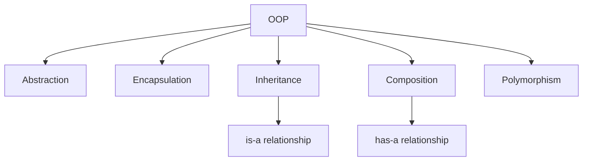

# 1. Object Modeling

## 1. Concept Overview

Object modeling is the process of identifying objects, their attributes, behaviors, and relationships in a system. Key concepts: **Abstraction**, **Encapsulation**, **Inheritance**, **Composition**, and **Polymorphism**.

## 2. Why It Matters

Object modeling is the foundation of OOP. It enables modeling real-world entities, code reuse, and maintainable software design. Understanding why composition is preferred over inheritance is crucial.

## 3. Formal Definition

**Abstraction**: hide complexity, expose essentials. **Encapsulation**: bundle data and methods, control access. **Inheritance**: derive new classes from existing ones. **Composition**: build complex objects from simpler ones. **Polymorphism**: same interface, different implementations.

## 4. Visual Mental Model



## 5. Naive Formulation

No structure: procedural code with global state.

## 6. Optimized Formulation

Composition over inheritance: build objects from smaller parts rather than deep hierarchies.

## 7. Step-by-Step Derivation

1. Identify entities (nouns in the problem).
2. Identify behaviors (verbs).
3. Define classes with attributes and methods.
4. Use encapsulation (private attributes, public methods).
5. Prefer composition (has-a) over inheritance (is-a) for flexibility.

## 8. Reference Implementation

```python
# Abstraction and Encapsulation
class BankAccount:
    def __init__(self, balance=0):
        self._balance = balance  # protected (convention)
    
    def deposit(self, amount):
        if amount > 0:
            self._balance += amount
    
    def withdraw(self, amount):
        if 0 < amount <= self._balance:
            self._balance -= amount
            return amount
        raise ValueError("Insufficient funds")
    
    @property
    def balance(self):
        return self._balance

# Inheritance
class SavingsAccount(BankAccount):
    def __init__(self, balance=0, interest_rate=0.05):
        super().__init__(balance)
        self.interest_rate = interest_rate
    
    def add_interest(self):
        self._balance *= (1 + self.interest_rate)

# Composition (preferred)
class Engine:
    def start(self):
        print("Engine started")

class Car:
    def __init__(self):
        self.engine = Engine()  # has-a
    
    def start(self):
        self.engine.start()
        print("Car started")
```

## 9. Complexity Analysis

| Resource | Complexity | Reason |
|---|---|---|
| Time | Varies | Object creation and method calls are O(1). |
| Space | Varies | Object attributes. |

## 10. Worked Examples

### 10.1 Modeling a Library
Books, patrons, loans. Use composition: Library has Books and Patrons.

### 10.2 Modeling a Shape Hierarchy
Shape (abstract) -> Circle, Rectangle, Triangle. Polymorphism: `area()` method.

### 10.3 Modeling a Game
Player, Enemy, Weapon. Composition: Player has Weapons.

## 11. Variants and Extensions

- **Multiple inheritance**: use mixins carefully.
- **Abstract base classes**: define interfaces.
- **Data classes**: Python's `@dataclass` for simple containers.

## 12. Common Mistakes

- Using inheritance when composition is better (rigid hierarchies).
- Not using encapsulation (public attributes everywhere).
- Deep inheritance trees (hard to maintain).

## 13. Connection to Other Topics

[[2. SOLID]] - design principles.
[[3. Modern Design Principles]] - more principles.
[[9. Creational Patterns]] - object creation.

## 14. Practice Problems

- Various OOP problems.

## 15. Key Takeaways

- Abstraction: hide complexity, expose essentials.
- Encapsulation: bundle data and methods.
- Inheritance: is-a relationship.
- Composition: has-a relationship (preferred).
- Polymorphism: same interface, different implementations.
- Prefer composition for flexibility.
