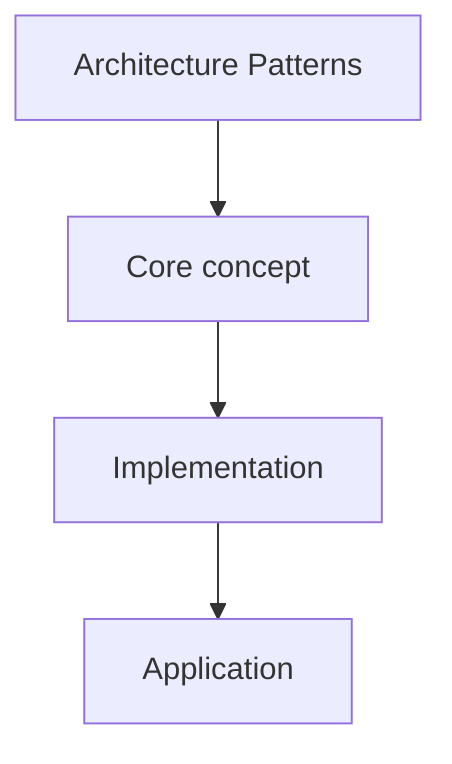

# 13. Architecture Patterns

## 1. Concept Overview

Architecture patterns: **MVC**, **MVVM**, **Layered**, **Clean Architecture**, **Hexagonal**, **Repository**, **Service Layer**, **DTO**, **CQRS**, and **Event-Driven**.

## 2. Why It Matters

Architecture patterns guide the overall structure of applications. They address concerns beyond individual classes.

## 3. Formal Definition

Architecture Patterns is a topic in the OOP roadmap. See the overview above.

## 4. Visual Mental Model



## 5. Naive Formulation

The naive approach typically involves brute force or recursion without memoization, leading to exponential time complexity.

## 6. Optimized Formulation

The optimized approach leverages the structure of Architecture Patterns to achieve polynomial time complexity, often using dynamic programming, greedy algorithms, or specialized data structures.

## 7. Step-by-Step Derivation

1. Identify the core pattern.
2. Define the state or structure.
3. Derive the recurrence or algorithm.
4. Implement carefully.
5. Verify with examples.

## 8. Reference Implementation

```python
# Reference implementation for Architecture Patterns
# Adapt based on the specific problem requirements

def solve(*args, **kwargs):
    """Implement the core algorithm for Architecture Patterns."""
    pass
```

## 9. Complexity Analysis

| Resource | Complexity | Reason |
|---|---|---|
| Time | Varies | Depends on the specific algorithm |
| Space | Varies | Depends on the data structures used |

## 10. Worked Examples

### 10.1 Example 1
Apply Architecture Patterns to a simple case and trace through the algorithm step by step.

### 10.2 Example 2
Apply to a more complex case showing edge cases and pitfalls.

## 11. Variants and Extensions

- Advanced variants of Architecture Patterns.
- Combinations with other techniques.
- Real-world applications.

## 12. Common Mistakes

- Misunderstanding the core concept.
- Wrong implementation details.
- Not handling edge cases.

## 13. Connection to Other Topics

- Related topics in the vault.
- Prerequisites and dependencies.
- Applications in other areas.

## 14. Practice Problems

- Problems in the vault that use Architecture Patterns.

## 15. Key Takeaways

- Core insight 1 about Architecture Patterns.
- Core insight 2 about Architecture Patterns.
- When to apply this technique.
- Common pitfalls to avoid.
