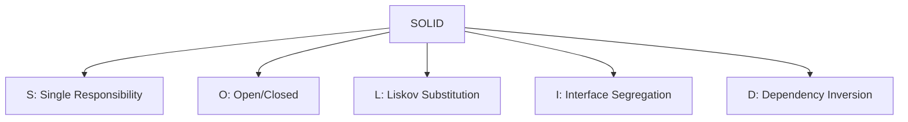

# 2. SOLID

## 1. Concept Overview

SOLID is a set of five design principles for maintainable OOP code: **Single Responsibility**, **Open/Closed**, **Liskov Substitution**, **Interface Segregation**, and **Dependency Inversion**.

## 2. Why It Matters

SOLID principles guide software design toward maintainability, extensibility, and testability. Violating them leads to rigid, fragile code that's hard to change.

## 3. Formal Definition

**SRP**: a class should have one reason to change. **OCP**: open for extension, closed for modification. **LSP**: subtypes must be substitutable for base types. **ISP**: many specific interfaces are better than one general. **DIP**: depend on abstractions, not concretions.

## 4. Visual Mental Model



## 5. Naive Formulation

God classes with mixed responsibilities.

## 6. Optimized Formulation

Apply each principle to decouple code and make it extensible.

## 7. Step-by-Step Derivation

1. SRP: identify the single responsibility of each class.
2. OCP: use abstraction and polymorphism for extension.
3. LSP: ensure subtypes honor the base type's contract.
4. ISP: split fat interfaces into specific ones.
5. DIP: use dependency injection with abstractions.

## 8. Reference Implementation

```python
# SRP: separate concerns
class Report:
    def generate(self):
        pass

class ReportPrinter:
    def print(self, report):
        pass

class ReportSaver:
    def save(self, report, filename):
        pass

# OCP: extend without modifying
class Discount:
    def apply(self, price):
        return price

class TenPercentOff(Discount):
    def apply(self, price):
        return price * 0.9

# LSP: subtype honors contract
class Bird:
    def fly(self):
        pass

class Penguin(Bird):  # Bad! Penguin can't fly
    def fly(self):
        raise NotImplementedError("Penguins can't fly")

# Better: separate interface
class FlyingBird:
    def fly(self): pass

class Bird: pass
class Penguin(Bird): pass
class Eagle(Bird, FlyingBird): pass

# ISP: specific interfaces
class Printable:
    def print(self): pass

class Scannable:
    def scan(self): pass

class MultiFunctionPrinter(Printable, Scannable):
    pass

# DIP: depend on abstraction
class Database:
    def save(self, data): pass

class UserService:
    def __init__(self, db: Database):  # dependency injection
        self.db = db
```

## 9. Complexity Analysis

| Resource | Complexity | Reason |
|---|---|---|
| Time | Varies | Depends on the design. |
| Space | Varies | Object overhead. |

## 10. Worked Examples

### 10.1 SRP Violation
A class that handles both business logic and persistence. Split into two.

### 10.2 OCP Violation
Adding a new shape requires modifying the area calculator. Use polymorphism instead.

### 10.3 DIP Violation
A service that directly creates its database dependency. Inject it instead.

## 11. Variants and Extensions

- **GRASP**: General Responsibility Assignment Software Patterns.
- **Law of Demeter**: don't talk to strangers.
- **Tell, don't ask**: command vs query.

## 12. Common Mistakes

- Over-applying SOLID (excessive abstraction).
- Violating LSP silently (subtypes that throw).
- Creating interfaces for everything (YAGNI).

## 13. Connection to Other Topics

[[1. Object Modeling]] - foundations.
[[3. Modern Design Principles]] - related.
[[4. Interfaces]] - interface design.

## 14. Practice Problems

- [[9. LRU Cache]] - design pattern.
- [[6. Design Twitter]] - SOLID application.

## 15. Key Takeaways

- SRP: one reason to change per class.
- OCP: open for extension, closed for modification.
- LSP: subtypes must be substitutable.
- ISP: many specific interfaces > one general.
- DIP: depend on abstractions, not concretions.
- Apply judiciously; don't over-engineer.
