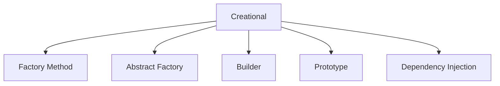

# 9. Creational Patterns

## 1. Concept Overview

Creational patterns handle object creation: **Factory Method**, **Abstract Factory**, **Builder**, **Prototype**, and **Dependency Injection**.

## 2. Why It Matters

Creational patterns decouple object creation from usage, making code more flexible and testable. They're essential for building complex objects and managing dependencies.

## 3. Formal Definition

**Factory Method**: define an interface for creating objects, let subclasses decide which to instantiate. **Abstract Factory**: create families of related objects. **Builder**: construct complex objects step by step. **Prototype**: clone existing objects. **Dependency Injection**: inject dependencies rather than creating them.

## 4. Visual Mental Model



## 5. Naive Formulation

Direct instantiation: `Foo()` everywhere. Hard to test and modify.

## 6. Optimized Formulation

Use factories, builders, and DI to decouple creation from usage.

## 7. Step-by-Step Derivation

1. Factory: centralize object creation.
2. Abstract Factory: create related families.
3. Builder: step-by-step construction of complex objects.
4. Prototype: clone instead of creating from scratch.
5. DI: inject dependencies via constructor or setter.

## 8. Reference Implementation

```python
# Factory Method
class Animal:
    def speak(self): pass

class Dog(Animal):
    def speak(self): return "Woof"

class Cat(Animal):
    def speak(self): return "Meow"

class AnimalFactory:
    @staticmethod
    def create(animal_type):
        if animal_type == "dog": return Dog()
        if animal_type == "cat": return Cat()
        raise ValueError(f"Unknown: {animal_type}")

# Builder
class Pizza:
    def __init__(self):
        self.toppings = []
        self.size = None
    
    def __str__(self):
        return f"Pizza(size={self.size}, toppings={self.toppings})"

class PizzaBuilder:
    def __init__(self):
        self.pizza = Pizza()
    
    def set_size(self, size):
        self.pizza.size = size
        return self
    
    def add_topping(self, topping):
        self.pizza.toppings.append(topping)
        return self
    
    def build(self):
        return self.pizza

# Prototype
import copy
class Document:
    def __init__(self, content):
        self.content = content
    def clone(self):
        return copy.deepcopy(self)

# Dependency Injection
class Logger:
    def log(self, msg): print(msg)

class Service:
    def __init__(self, logger: Logger):  # injected
        self.logger = logger
```

## 9. Complexity Analysis

| Resource | Complexity | Reason |
|---|---|---|
| Time | Varies | Object creation overhead. |
| Space | Varies | Object storage. |

## 10. Worked Examples

### 10.1 Factory for Database Drivers
Create the right driver based on configuration.

### 10.2 Builder for Complex Configurations
Build a configuration object step by step.

### 10.3 DI for Testability
Inject mock dependencies for unit testing.

## 11. Variants and Extensions

- **Singleton**: ensure one instance (use judiciously).
- **Object pool**: reuse expensive objects.
- **Lazy initialization**: create on first use.

## 12. Common Mistakes

- Using Singleton everywhere (often an anti-pattern).
- Builder for simple objects (overkill).
- Not injecting dependencies (hard to test).

## 13. Connection to Other Topics

[[1. Object Modeling]] - object basics.
[[8. Object Lifetime]] - lifetime management.
[[10. Structural Patterns]] - structural patterns.

## 14. Practice Problems

- [[9. LRU Cache]] - design.
- [[6. Design Twitter]] - DI.

## 15. Key Takeaways

- Factory: centralize creation.
- Abstract Factory: create families.
- Builder: step-by-step complex construction.
- Prototype: clone.
- DI: inject for testability.
- Singleton: use carefully, often an anti-pattern.
