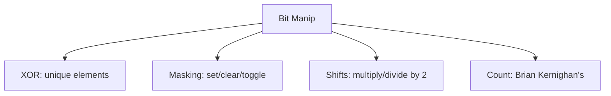

# 1. Bit Manipulation

## 1. Concept Overview

Bit manipulation techniques: **XOR Tricks**, **Bitmasking**, **Shifts**, **Set/Clear/Toggle Bits**, and **Brian Kernighan's Algorithm**.

## 2. Why It Matters

Bit manipulation enables compact storage and fast operations. It's essential for low-level programming, competitive programming, and certain interview questions.

## 3. Formal Definition

**XOR**: `a ^ a = 0`, `a ^ 0 = a`, useful for finding unique elements. **Set bit**: `x | (1 << i)`. **Clear bit**: `x & ~(1 << i)`. **Toggle bit**: `x ^ (1 << i)`. **Check bit**: `(x >> i) & 1`. **Brian Kernighan's**: count set bits by repeatedly clearing the lowest: `x &= x - 1`.

## 4. Visual Mental Model



## 5. Naive Formulation

Linear scan for each operation.

## 6. Optimized Formulation

Use bitwise operators for O(1) operations on individual bits.

## 7. Step-by-Step Derivation

1. XOR: cancel pairs, find unique.
2. Set/clear/toggle: combine with masks.
3. Shift: multiply/divide by 2.
4. Count: Brian Kernighan's (clear lowest set bit repeatedly).

## 8. Reference Implementation

```python
# XOR tricks
def find_unique(arr):
    result = 0
    for x in arr:
        result ^= x
    return result  # finds the unique element if all others appear twice

# Set/Clear/Toggle/Check
x = 0
x |= (1 << 3)       # set bit 3 -> x = 8
x &= ~(1 << 3)      # clear bit 3 -> x = 0
x ^= (1 << 3)       # toggle bit 3 -> x = 8
is_set = (x >> 3) & 1  # check bit 3 -> 1

# Brian Kernighan's algorithm (count set bits)
def count_set_bits(n):
    count = 0
    while n:
        n &= n - 1  # clear lowest set bit
        count += 1
    return count

# Powers of 2 check
def is_power_of_two(n):
    return n > 0 and (n & (n - 1)) == 0

# Get lowest set bit
def lowest_set_bit(n):
    return n & (-n)
```

## 9. Complexity Analysis

| Resource | Complexity | Reason |
|---|---|---|
| Time | O(1) per operation | Bitwise operations are constant time. |
| Space | O(1) | No extra space. |

## 10. Worked Examples

### 10.1 Find the Unique Number
XOR all elements; pairs cancel.

### 10.2 Count Set Bits
Brian Kernighan's: `n &= n - 1` clears the lowest set bit.

### 10.3 Subset Generation
Bitmask from 0 to 2^n - 1 represents all subsets.

## 11. Variants and Extensions

- **Bit DP**: state is a bitmask.
- **Bitwise tricks**: swap without temp, find rightmost set bit.
- **Bitset operations**: union, intersection, difference.

## 12. Common Mistakes

- Confusing `&` and `&&` (bitwise vs logical).
- Sign extension on right shift.
- Operator precedence (use parentheses).

## 13. Connection to Other Topics

[[19. Gray Code]] - bit pattern.
[[1. Single Number]] - XOR.
[[2. Number of 1 Bits]] - Brian Kernighan's.

## 14. Practice Problems

- [[1. Single Number]] - XOR.
- [[3. Counting Bits]] - DP on bits.
- [[5. Missing Number]] - XOR or math.

## 15. Key Takeaways

- XOR: `a ^ a = 0`, `a ^ 0 = a`. Find unique elements.
- Set: `x | (1 << i)`. Clear: `x & ~(1 << i)`. Toggle: `x ^ (1 << i)`.
- Brian Kernighan's: `n &= n - 1` clears lowest set bit.
- `n & (n - 1) == 0` checks power of 2.
- Bitmask enumeration for subsets.
