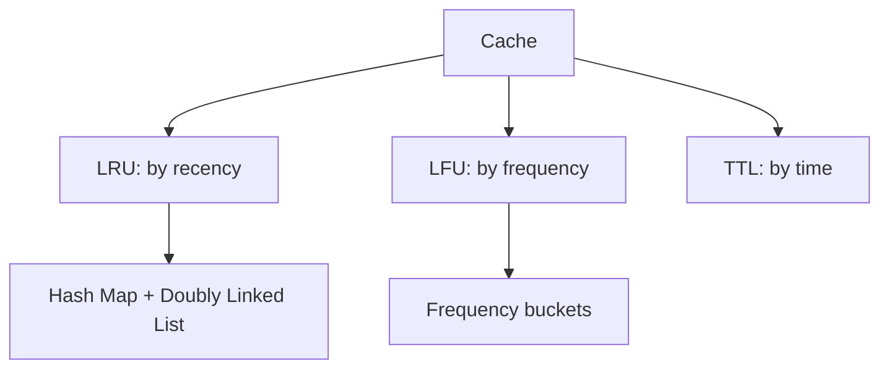

# 13. LRU LFU and Cache Design

## 1. Concept Overview

Cache eviction policies: **LRU (Least Recently Used)**, **LFU (Least Frequently Used)**, **TTL Cache**, and **Hash Map + Linked List** combination.

## 2. Why It Matters

Caches are essential for performance in databases, web browsers, and operating systems. Understanding eviction policies is a common system design interview topic.

## 3. Formal Definition

**LRU**: evict the least recently accessed item. Uses a hash map + doubly linked list for O(1) operations. **LFU**: evict the least frequently accessed item. More complex; uses frequency buckets. **TTL**: evict items after a time-to-live expires.

## 4. Visual Mental Model



## 5. Naive Formulation

Linear search for eviction: O(n).

## 6. Optimized Formulation

Hash map + doubly linked list for O(1) access and reorder.

## 7. Step-by-Step Derivation

1. Hash map: key -> node (for O(1) lookup).
2. Doubly linked list: maintains order (most recent at front).
3. On access: move node to front.
4. On capacity overflow: remove from back.

## 8. Reference Implementation

```python
# LRU Cache (simplified)
class Node:
    def __init__(self, key=0, val=0):
        self.key = key
        self.val = val
        self.prev = self.next = None

class LRUCache:
    def __init__(self, capacity):
        self.cap = capacity
        self.cache = {}
        self.head = Node()  # dummy front (most recent)
        self.tail = Node()  # dummy back (least recent)
        self.head.next = self.tail
        self.tail.prev = self.head
    
    def _remove(self, node):
        node.prev.next = node.next
        node.next.prev = node.prev
    
    def _add_front(self, node):
        node.next = self.head.next
        node.prev = self.head
        self.head.next.prev = node
        self.head.next = node
    
    def get(self, key):
        if key in self.cache:
            node = self.cache[key]
            self._remove(node)
            self._add_front(node)
            return node.val
        return -1
    
    def put(self, key, value):
        if key in self.cache:
            self._remove(self.cache[key])
        node = Node(key, value)
        self.cache[key] = node
        self._add_front(node)
        if len(self.cache) > self.cap:
            lru = self.tail.prev
            self._remove(lru)
            del self.cache[lru.key]

# Python's OrderedDict (simplified LRU)
from collections import OrderedDict
class LRUCacheSimple:
    def __init__(self, capacity):
        self.cap = capacity
        self.cache = OrderedDict()
    
    def get(self, key):
        if key not in self.cache:
            return -1
        self.cache.move_to_end(key)
        return self.cache[key]
    
    def put(self, key, value):
        if key in self.cache:
            self.cache.move_to_end(key)
        self.cache[key] = value
        if len(self.cache) > self.cap:
            self.cache.popitem(last=False)  # evict LRU
```

## 9. Complexity Analysis

| Resource | Complexity | Reason |
|---|---|---|
| Time | O(1) per operation | Hash map lookup + DLL manipulation are O(1). |
| Space | O(capacity) | Cache stores up to capacity items. |

## 10. Worked Examples

### 10.1 LRU Cache
Hash map + DLL. Move to front on access; evict from back.

### 10.2 LFU Cache
Track frequency. Move to appropriate frequency bucket on access.

### 10.3 Web Browser Cache
LRU for recently visited pages.

## 11. Variants and Extensions

- **ARC (Adaptive Replacement Cache)**: balances LRU and LFU.
- **2Q Cache**: two queues for new and old items.
- **CLOCK algorithm**: approximation of LRU used in OS.

## 12. Common Mistakes

- Using a plain dict (no order tracking).
- Not handling the case where the key already exists (update vs insert).
- Forgetting to remove from both cache and list on eviction.

## 13. Connection to Other Topics

[[6. Linked List/9. LRU Cache]] - NeetCode problem.
[[15. Practical Data Structures Rarely Covered]] - related.
[[9. Creational Patterns]] - design patterns.

## 14. Practice Problems

- [[9. LRU Cache]] - NeetCode.
- [[7. Find Median from Data Stream]] - related design.

## 15. Key Takeaways

- LRU: evict least recently used. Hash map + DLL for O(1).
- LFU: evict least frequently used. Frequency buckets.
- TTL: evict after time-to-live.
- Hash map for lookup, linked list for order.
- `OrderedDict` in Python provides built-in LRU.
