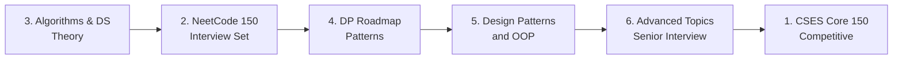

# Algorithm Mastery Vault

A comprehensive, self-contained Obsidian vault covering **competitive programming, interview preparation, algorithmic theory, dynamic programming, modern OOP, design patterns, and advanced topics**. Every note is written so that you can understand the concept end-to-end without needing to look anything up externally.

---

## 1. How This Vault Is Organized

The vault is divided into **six major top-level sections**, each representing one of the source roadmaps:

```mermaid
graph TD
    V["Algorithm Mastery Vault"]
    V --> S1["1. CSES Core 150"]
    V --> S2["2. NeetCode 150"]
    V --> S3["3. Algorithms and Data Structures"]
    V --> S4["4. Dynamic Programming Roadmap"]
    V --> S5["5. Design Patterns and OOP"]
    V --> S6["6. Advanced Topics"]

    S1 --> C1A["1. Introductory Problems"]
    S1 --> C1B["2. Sorting and Searching"]
    S1 --> C1C["3. Dynamic Programming"]
    S1 --> C1D["4. Graph Algorithms"]
    S1 --> C1E["5. Range Queries"]
    S1 --> C1F["6. Tree Algorithms"]

    S2 --> C2A["1. Arrays and Hashing"]
    S2 --> C2B["2. Two Pointers"]
    S2 --> C2C["3. Stack"]
    S2 --> C2D["4. Binary Search"]
    S2 --> C2E["5. Sliding Window"]
    S2 --> C2F["6. Linked List"]
    S2 --> C2G["7. Trees"]
    S2 --> C2H["8. Tries"]
    S2 --> C2I["9. Heap and Priority Queue"]
    S2 --> C2J["10. Backtracking"]
    S2 --> C2K["11. Graphs"]
    S2 --> C2L["12. Advanced Graphs"]
    S2 --> C2M["13. 1-D Dynamic Programming"]
    S2 --> C2N["14. 2-D Dynamic Programming"]
    S2 --> C2O["15. Greedy"]
    S2 --> C2P["16. Intervals"]
    S2 --> C2Q["17. Math and Geometry"]
    S2 --> C2R["18. Bit Manipulation"]

    style V fill:#1f2937,color:#fff,stroke:#10b981,stroke-width:2px
    style S1 fill:#3b82f6,color:#fff
    style S2 fill:#3b82f6,color:#fff
    style S3 fill:#3b82f6,color:#fff
    style S4 fill:#3b82f6,color:#fff
    style S5 fill:#3b82f6,color:#fff
    style S6 fill:#3b82f6,color:#fff
```

### 1.1 Section Summaries

| Section | Source | Notes | Purpose |
|---|---|---|---|
| [[1. CSES Core 150]] | cses.fi/problemset | 159 problems across 6 chapters | Competitive programming core skills |
| [[2. NeetCode 150]] | neetcode.io/roadmap | ~150 problems across 18 categories | Standard interview problem set |
| [[3. Algorithms and Data Structures]] | Theory roadmap | ~120 concept notes | Foundational theory across 5 tiers |
| [[4. Dynamic Programming Roadmap]] | DP roadmap | ~50 concept notes | Pattern-driven DP mastery |
| [[5. Design Patterns and OOP]] | Modern OOP roadmap | ~70 concept notes | Principles-first design education |
| [[6. Advanced Topics]] | Beyond-NeetCode roadmap | ~80 concept notes | Senior interview topics |

---

## 2. Note Conventions

### 2.1 File and Section Naming

- All file names use the format `Number. Title.md` with a **period and a single space**.
- All section headers inside notes use the same `Number. Title` convention.
- **No underscores** are used anywhere in file names or section titles. Spaces only.
- Example: `1. Weird Algorithm.md`, `## 3. Intuition`.

### 2.2 Frontmatter

Every note begins with YAML frontmatter containing tags, platform/difficulty (for problems), and complexity metadata. This makes the vault searchable via Obsidian's tag pane and Dataview.

### 2.3 Diagrams

All diagrams use **Mermaid** exclusively. No ASCII art, no box-drawing characters. Mermaid renders natively inside Obsidian.

### 2.4 Wikilinks

Notes link to related notes using `[[Note Name]]`. This creates the bidirectional graph that makes Obsidian powerful. The [[00. Master Index]] file is the central hub.

### 2.5 Code

All solutions are in **Python 3** with type hints and explanatory comments. Each solution is followed by a step-by-step walkthrough that explains every non-trivial line.

---

## 3. How to Use This Vault

### 3.1 If You Are Studying for Interviews

Follow this order:

### 3.2 If You Are Studying for Competitive Programming

Start with CSES, then move into the theory sections for depth:

1. [[1. CSES Core 150]] — work through all 159 problems.
2. [[3. Algorithms and Data Structures]] — read the Tier 2 and Tier 3 notes.
3. [[6. Advanced Topics]] — Parts 9, 11, 12, 13 are essential.

### 3.3 If You Are Reviewing a Specific Pattern

Use the **tags** in the frontmatter. For example:
- Search `#dp-knapsack` to find every note about the knapsack family.
- Search `#graph-bfs` to find every BFS-based problem.
- Search `#two-pointers` to find every two-pointer problem.

---

## 4. Note Templates

Two templates are stored in `_templates/`:

- [[Problem Note Template]] — used for every CSES and NeetCode problem.
- [[Concept Note Template]] — used for every theory / pattern / design note.

You can copy these templates when adding new notes of your own.

---

## 5. Useful Entry Points

- [[00. Master Index]] — full table of contents for the entire vault.
- [[1. CSES Core 150/1. Introductory Problems/1. Weird Algorithm|Start with CSES]]
- [[2. NeetCode 150/1. Arrays and Hashing/1. Contains Duplicate|Start with NeetCode]]
- [[3. Algorithms and Data Structures/1. Linear Structures/1. Array|Start with theory]]
- [[4. Dynamic Programming Roadmap/0. Foundations/1. What is Dynamic Programming|Start with DP]]
- [[5. Design Patterns and OOP/1. Object Modeling/1. Abstraction|Start with OOP]]
- [[6. Advanced Topics/1. Bit Manipulation/1. XOR Tricks|Start with advanced]]

---

## 6. Source Attribution

- CSES problem statements: https://cses.fi/problemset/ — used under their public problem set.
- NeetCode problem statements: https://leetcode.com via the NeetCode roadmap at https://neetcode.io/roadmap/neetcode-150.
- All solutions, explanations, dry runs, and diagrams are original to this vault and written for educational purposes.
