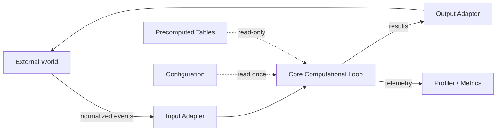

# 1. Defining the Engine Concept in Modern Computation

> "An engine is not a single algorithm, not a single architecture, and not a single library. It is a **computational loop wrapped in a system design philosophy** — a tightly optimized core that repeatedly transforms input state into output state under constraints of speed, correctness, and scalability."

When most learners hear the word "engine" they instinctively picture a single piece of code: the chess move generator, the Lucene query evaluator, the Unreal rendering pipeline. That mental model is dangerously incomplete. An engine is **not** a function. It is **not** a class. It is **not** even a program in the conventional sense. It is a *continuous, stateful, iterative process* that has been engineered around the realities of hardware, memory hierarchies, and the structure of the problem domain itself.

This note establishes the foundational vocabulary we will use throughout the entire course. Read it carefully: every later chapter assumes you have internalized these definitions.

---

## 1.1 The Engine Paradigm — Formal Definition

An **engine** is a software system that satisfies all of the following properties simultaneously:

1. **Iterative state transformation.** It maintains a *state* variable that evolves through repeated application of a transition function $F$. It is not a one-shot `compute(input) → output` call.
2. **Domain-specific intelligence.** $F$ encodes knowledge about a particular problem (chess tactics, relevance scoring, market microstructure, grammar rules). This is what separates an "engine" from a generic loop.
3. **Hardware awareness.** Its design is shaped by the target hardware's memory hierarchy, cache line size, SIMD width, branch predictor behavior, and concurrency model. A "fast engine" is one whose data structures and loops *match* the hardware.
4. **Operational constraints.** It runs under hard constraints — typically a combination of **speed** (latency budget), **correctness** (deterministic or probabilistic guarantees), and **scalability** (vertical on a single core, horizontal across many cores or machines).

If any one of these is missing, the system is *not an engine* in the sense used in this course. A web server handling requests is iterative but has no domain intelligence — it is infrastructure, not an engine. A sorting algorithm is domain-aware but not iterative or hardware-shaped — it is an algorithm. A neural network forward pass is iterative (layer by layer) and domain-aware, but only becomes an "inference engine" when wrapped in a runtime that handles batching, memory layout, kernel fusion, and hardware dispatch (e.g., TensorRT).

### 1.1.1 Contrast with Single Algorithms

| Property | Single Algorithm | Engine |
|---|---|---|
| Execution model | One input, one output, terminate | Continuous loop, may run forever |
| State | Stateless or local only | Persistent, evolving, often gigabytes |
| Optimization target | Asymptotic complexity | Real wall-clock latency under a budget |
| Hardware coupling | Abstracted away | First-class design concern |
| Failure mode | Wrong answer | Wrong answer *or* missed deadline |

The single most important shift in this course is moving from the left column to the right. Algorithms are studied in the abstract; engines are studied in the concrete.

### 1.1.2 Contrast with Passive System Architectures

A typical "system" — say, a CRUD web application — is *passive*. It sits idle waiting for a request, does some work, returns a response, and goes back to sleep. Latency is dominated by I/O and database queries, not by the structure of the computation itself.

An engine is *active*. Even when no external input arrives, the engine may be running internal loops: precomputing, prefetching, refining cached results, training models. A trading engine in particular is *never* idle during market hours — it must react to every market data tick within microseconds, and the worst thing it can do is "wait." A chess engine running on a clock is continuously deepening its search tree; it does not compute a move and stop, it computes until told to stop and returns the best move found so far.

### 1.1.3 The Encapsulation of a Core Computational Loop

At the heart of every engine lies a **core computational loop**. This loop is encapsulated — isolated from I/O, isolated from configuration, isolated from external events — so that it can be measured, optimized, and reasoned about independently. The encapsulation is what allows the engine to be tuned to within a few percent of theoretical hardware limits.



Notice that the **core loop** has *no* direct contact with the outside world. It reads from pre-loaded configuration and precomputed tables, and writes only to internal state and to an output buffer. All I/O is mediated by adapters. This is what allows the same engine core to be reused in different deployment contexts — embedded in a desktop app, running as a service, or benchmarked in isolation.

### 1.1.4 Operational Constraints: The Engine Triangle

Every engine is squeezed by three competing constraints. Understanding the trade-offs between them is the single most important practical skill in engine engineering.

```mermaid
triangle
    Speed
    Correctness
    Scalability
```

- **Speed.** The engine must produce output within a deadline. For a chess engine, the deadline is the per-move time control. For a trading engine, it is microseconds per market data update. For a search engine, it is tens of milliseconds per query at the 99th percentile. Missing the deadline is treated as a *failure*, not just a slowdown.
- **Correctness.** The engine's output must satisfy some correctness criterion. For chess, "correct" means "the best move found within the time budget." For trading, it means "every order sent was the order we intended, at the price we intended." For search, it means "results are ranked according to the scoring model." Correctness in engines is often *approximate by design* — you trade exactness for speed.
- **Scalability.** The engine must continue to meet its speed and correctness targets as the input size grows. Vertical scalability means using more cores, more SIMD lanes, more memory bandwidth on a single machine. Horizontal scalability means partitioning work across multiple machines. The two are not interchangeable: a system that scales horizontally but not vertically will hit a wall on a single hot shard.

**The fundamental tension:** you cannot maximize all three simultaneously. A perfectly correct engine (exhaustive search) is too slow. A perfectly fast engine (single greedy heuristic) is wrong too often. A perfectly scalable engine (embarrassingly parallel map-reduce) cannot handle stateful, sequential decision problems. Real engine design is the art of finding the right *compromise point* for your domain.

---

## 1.2 Why the Definition Matters

You might be tempted to skip past this definitional material and get to the "real" content — the algorithms, the data structures, the benchmarks. Don't. The definition is the lens through which every subsequent design decision is evaluated. Without it, you will fall into one of two traps:

### Trap 1: Treating an Engine as a Library

A junior engineer asked to "build a search engine" will often reach for Elasticsearch, wrap it in a thin API, and call it done. This is *using* an engine, not *building* one. The moment you need to change ranking logic, optimize a query shape that Elasticsearch handles poorly, or reduce p99 latency below what the JVM allows, you are stuck — because you do not control the core loop.

### Trap 2: Treating an Engine as an Algorithm

An engineer with a strong algorithms background will often try to build an engine by selecting the "right" algorithms — minimax for chess, BM25 for search, Black-Scholes for pricing. The result is a system that is correct but slow, because the engineer has not thought about cache behavior, branch prediction, memory layout, or scheduling. The algorithm is correct; the engine is unusable.

The mindset shift required is this: **the algorithm is the smallest part of an engine**. The data structures, the memory layout, the I/O strategy, and the runtime loop are where 90% of the engineering effort — and 90% of the performance — lives.

---

## 1.3 The Universal Engine Pattern

Despite the diversity of domains — chess, search, trading, parsing, simulation, recommendation — every serious engine we will study in this course reduces to the same abstract pattern. This is not a coincidence. It is a consequence of the constraints above: when you must be fast, correct, and scalable simultaneously, the design space collapses to a small set of viable architectures.

```mermaid
flowchart TB
    Start[Initial State] --> Check{terminal?}
    Check -->|No| Apply["state ← F(state, context)"]
    Apply --> Check
    Check -->|Yes| Return[result(state)]
```

Formally:

$$\text{state}_0 \xrightarrow{F} \text{state}_1 \xrightarrow{F} \text{state}_2 \xrightarrow{F} \dots \xrightarrow{F} \text{state}_n = \text{output}$$

Or, in pseudocode that we will see repeatedly:

```python
state = initial_input
while not terminal(state):
    state = F(state, context)
return result(state)
```

Where:

- `state` is the **compressed representation** of the problem at the current moment.
- `F` is the **transition function** — typically a pipeline of deterministic algorithms, heuristics, probabilistic estimators, and (in modern engines) learned models.
- `context` is everything `F` needs that is not in `state` — precomputed tables, caches, models, configuration, the current wall-clock time.
- `terminal(state)` is the **halting condition** — a deadline reached, a goal state found, a budget exhausted, or a signal from outside.
- `result(state)` is the **output projection** — converting internal compressed state back into something the external world can consume (a move, a ranked list, an order, a parse tree).

This five-element pattern is the spine of the entire course. Every chapter either expands one of these elements (Chapter 2 unpacks `F`, Chapter 4 unpacks `state` and `context`), studies how a particular domain instantiates them (Chapter 3), or explains how to engineer them in practice (Chapters 5, 6, 7).

---

## 1.4 The "Illusion of Intelligence"

A persistent confusion among newcomers is the belief that engines are "intelligent." They are not — at least, not in any meaningful sense of the word. What they exhibit is the *illusion* of intelligence, manufactured by four engineering techniques that we will study in depth in Chapter 5:

1. **Massive search-space pruning.** Engines do not explore the full space of possibilities; they explore a *tiny, highly relevant subset*. The intelligence appears to live in the engine; in reality it lives in the pruning function.
2. **Heuristics that approximate expensive truth.** Engines replace "compute the exact answer" with "compute a fast approximation that is right 95% of the time." The approximation is tuned until it is indistinguishable from exact computation for the cases that matter.
3. **Cached knowledge.** Engines remember. They store the results of past computation in transposition tables, query caches, learned embeddings. What looks like insight is often just memory.
4. **Iterative refinement.** Engines do not produce a single answer; they produce a *stream* of increasingly good answers and return the best one when the deadline hits. The user perceives "the engine found the answer," but the engine merely returned its current best guess.

Recognizing these four techniques is the key to demystifying engines. When you see an "intelligent" engine, you should always ask: *where is the pruning? what is the heuristic? what is being cached? how is it being refined?* The answers are usually more illuminating than the engine's apparent behavior.

---

## 1.5 Background Knowledge You Are Expected to Have

This course assumes you are comfortable with the following. If any of these are fuzzy, review them before proceeding — they will be used without re-explanation.

- **Basic algorithms and data structures.** Big-O notation, hash maps, balanced trees, heaps, graphs, dynamic programming. You should be able to look at a piece of code and reason about its asymptotic complexity without effort.
- **Computer architecture fundamentals.** You should know what a cache line is (64 bytes on x86 and ARM), what L1/L2/L3 caches are and their approximate latencies, what a branch predictor does, what SIMD is at a conceptual level, what virtual memory and TLBs are. We will go deeper on all of these in Chapter 4, but you need the vocabulary first.
- **Operating systems fundamentals.** Processes and threads, virtual memory, system calls, file descriptors, the kernel/user boundary. You should understand why a system call is expensive (context switch, kernel/user transition) and why I/O is the typical bottleneck in non-engine systems.
- **At least one systems programming language.** C, C++, or Rust preferred. We will write pseudocode in Python for readability, but the actual implementation techniques we discuss require a language with manual or deterministic memory management. If you only know Python or JavaScript, you can still follow the course, but the performance numbers we cite will be unattainable in your own code without a systems language.
- **Basic probability and linear algebra.** Engines increasingly rely on learned models, which means vectors, matrices, dot products, cosine similarity, and basic probability distributions. You should be comfortable with these at the level of a first university course.

---

## 1.6 Common Misconceptions and Pitfalls

This section catalogs the mistakes that students make *every single time* they encounter this material for the first time. Read this section twice. Refer back to it whenever you feel confused.

### Pitfall 1: "A faster algorithm always makes a faster engine."

No. A faster *asymptotic* algorithm often has worse constants and worse cache behavior. The classic example is binary search versus linear search on small arrays: for arrays that fit in a single cache line (≤8 eight-byte integers), linear search wins on every modern CPU because the binary search's pointer chasing incurs more cache misses than the linear scan's branch prediction saves. In engines, **constant factors dominate asymptotics** for the inner loop.

### Pitfall 2: "Engines are written in C++ because C++ is faster."

C++ is not inherently faster than C, Rust, or even Java for many workloads. Engines are written in C++ (or Rust) because those languages give the engineer **control over memory layout** — and memory layout is what determines speed on modern hardware. You can write a slow engine in C++ and a fast one in Java (provided you are extremely careful with object layout and garbage collection). The language is the means, not the end.

### Pitfall 3: "Engines are about algorithms."

They are not. They are about **data structures and memory layout**. Algorithms are the easy part; you can look them up. The hard part is arranging your data so that the algorithm runs at hardware speed. Chapter 4 is dedicated to this.

### Pitfall 4: "The engine's intelligence comes from the model."

In modern engines (especially those with ML components), there is a temptation to attribute the engine's behavior to the model. This is misleading. The model is one component of $F$, often a small one. The pruning, the caching, the candidate generation, the scheduling — these are what make the engine appear intelligent. The model is the cherry on top; the rest is the cake.

### Pitfall 5: "Engines are deterministic."

Some are (chess engines with fixed search depth). Most are not. Trading engines depend on wall-clock timing of network packets. Search engines depend on the order in which index shards respond. Recommendation engines depend on random sampling during candidate generation. **Treat determinism as a deliberate engineering choice, not a default.** Chapter 6 covers how to make engines deterministic when you need them to be (e.g., for testing).

---

## 1.7 Important Reminders

Things you will forget and need to be reminded of:

- **The 64-byte cache line.** Every data structure you design should be sized with the 64-byte cache line in mind. A struct that is 65 bytes wastes an entire cache line of bandwidth on every access. A struct that is exactly 64 bytes fits perfectly.
- **Throughput vs latency.** These are different optimization targets and they conflict. A batching strategy that maximizes throughput will increase latency for the first item in the batch. Decide which one you are optimizing before you start.
- **p99, not mean.** Engine performance is judged by tail latency, not average latency. A query that is fast 99% of the time and slow 1% of the time is *worse* than a query that is medium-speed 100% of the time, because the slow 1% will trigger user-visible failures (timeouts, retries, cascading load).
- **Latency numbers every engineer should know.** L1 cache: ~1 ns. L2 cache: ~4 ns. L3 cache: ~12 ns. Main memory: ~100 ns. SSD read: ~100 μs. Network within a datacenter: ~500 μs. These numbers change slowly; memorize the order of magnitude.
- **The engine never sits idle in a tight loop.** If your engine has a `while True: pass` or a `sleep(0)` spinning on a flag, you are doing it wrong. Either you should be doing useful work in that loop, or you should be parked on an OS wait primitive that does not consume CPU.
- **Measuring is half the work.** An unmeasured engine is an unoptimized engine. The first feature of any engine you build should be a profiler hook. Chapter 6 covers this in depth.

---

## 1.8 Summary

An engine is a *highly optimized iterative state transformer with domain-specific intelligence*. It is not an algorithm, not a library, not a single architecture — it is a *system design philosophy* expressed in code. Every engine, regardless of domain, follows the same abstract pattern: `state ← F(state, context)` until a terminal condition is reached. The intelligence it appears to exhibit is the product of pruning, heuristics, caching, and iterative refinement — not magic.

The rest of this course unpacks this definition. Chapter 2 shows how `F` decomposes into six architectural layers. Chapter 3 maps the pattern onto five real domains. Chapter 4 explains how to make `state` and `context` fast on real hardware. Chapter 5 explains how heuristic search creates the illusion of intelligence. Chapter 6 walks through the engineering lifecycle. Chapter 7 catalogs the tools and libraries you will reach for along the way.

Read on. The material gets harder from here, but the foundation does not change.

---

**Next note:** [[2. Mathematical and Formal System Abstractions]]
