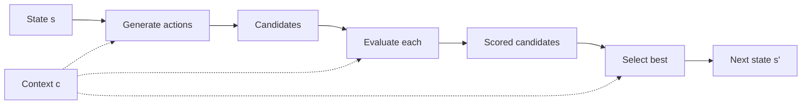
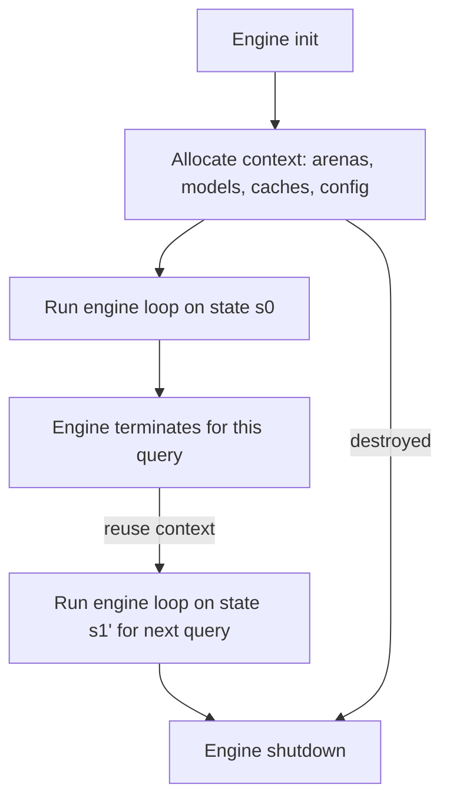

# 2. Mathematical and Formal System Abstractions

The previous note gave a working definition of an engine. This note makes that definition **mathematically precise**. The reason for the formality is not academic: every optimization we will study in later chapters (pruning, caching, batching, vectorization) is best understood as a transformation of the abstract engine equation. Without the equation, the optimizations appear to be ad hoc tricks; with it, they become systematic techniques.

This note is the most abstract in the entire course. Read it slowly. Refer back to it whenever a later chapter introduces a new optimization and you need to understand *what* it is optimizing.

---

## 2.1 State-to-State Transition Paths

An engine, formally, is a tuple:

$$\mathcal{E} = \langle S, s_0, F, C, \tau, \rho \rangle$$

Where:

- $S$ is the **state space** — the set of all possible states the engine can be in.
- $s_0 \in S$ is the **initial state** — the state at engine startup.
- $F : S \times C \to S$ is the **transition function** — given a state and a context, produce the next state.
- $C$ is the **context space** — the set of all possible runtime contexts (caches, models, configuration).
- $\tau : S \to \{\text{true}, \text{false}\}$ is the **termination predicate** — should the engine stop?
- $\rho : S \to O$ is the **result projection** — convert the final state into an external output.

The execution of the engine is the sequence:

$$s_0 \;\xrightarrow{F(\cdot, c_0)}\; s_1 \;\xrightarrow{F(\cdot, c_1)}\; s_2 \;\xrightarrow{F(\cdot, c_2)}\; \cdots \;\xrightarrow{F(\cdot, c_{n-1})}\; s_n$$

where each $c_i \in C$ is the context *at step $i$* (the context may itself evolve — see Section 2.5), and the loop halts at the first $n$ where $\tau(s_n) = \text{true}$. The engine's output is then $\rho(s_n) \in O$.

Linearly visualized:

```mermaid
flowchart LR
    s0["s₀ (initial)"] -->|F(·, c₀)| s1["s₁"]
    s1 -->|F(·, c₁)| s2["s₂"]
    s2 -->|F(·, c₂)| s3["s₃"]
    s3 -->|...| sn["sₙ (terminal)"]
    sn -->|ρ| O["output"]
```

### 2.1.1 Why the Formalism Matters

Engineers without this formalism tend to conflate three different things:

1. The state of the *problem* (e.g., the chess position).
2. The state of the *search* (e.g., the current depth, the principal variation so far).
3. The state of the *engine runtime* (e.g., the cache, the allocation arena, the time budget remaining).

All three live inside $S$ in our formalism, but they evolve at different rates and obey different invariants. Conflating them leads to bugs that are nearly impossible to diagnose — for example, "the engine returns a different move for the same position depending on how long it has been running" is a classic symptom of mixing problem state with search state.

**Discipline:** Always be explicit about which component of $S$ you are modifying. If you cannot name it, you should not be modifying it.

---

## 2.2 Formal Iteration Loop Mechanics

The pseudocode rendering of the engine equation is:

```python
state = initial_input
while not terminal(state):
    state = F(state, context)
return result(state)
```

This is *the* engine loop. Every engine you will ever study or build is, at some level of abstraction, an instance of this loop. The variations are infinite — some engines unroll the loop, some split it across cores, some run it asynchronously — but the abstraction holds.

### 2.2.1 Subtle Points About This Loop

There are four subtleties that beginners miss:

**1. `state` is reassigned, not mutated in place — conceptually.** In real code, `state` is usually a mutable data structure (a bitboard, a hash map, an arena) and `F` mutates it in place. But *conceptually*, `F` produces a *new* state. This distinction matters because it tells you that the engine is *functional in spirit*, even when the implementation is imperative. If you ever find yourself unable to reason about what state the engine is in, it is usually because you have lost track of which mutations belong to "this iteration's $F$" versus "permanent modifications to $S$."

**2. `context` is shared, not reassigned.** Context (caches, models, configuration) is typically read by $F$ but not modified. When $F$ *does* modify context (e.g., writing to a transposition table), that modification is a *side effect* of the iteration, not part of the state transition. Understanding this distinction is essential for reasoning about correctness in concurrent engines.

**3. `terminal(state)` is a function of state, not of wall-clock time — conceptually.** In practice, every engine has a deadline, and `terminal` checks the wall clock. But the formalism insists that the deadline be *encoded in state*, because otherwise the engine is non-deterministic: same input, same context, different output depending on when you ran it. The standard trick is to include a `deadline` field in $S$, set at engine startup, and have `terminal` check `now() >= state.deadline`. This makes the engine *deterministic by construction*.

**4. `result(state)` is a projection, not a computation.** It does not "compute the answer"; it extracts the answer that has already been computed into `state` by previous iterations of $F$. If `result` does substantial work, your design is wrong — the work should have been done inside $F$, and `result` should be $O(1)$.

### 2.2.2 A More Explicit Form

For the rest of the course, we will use this slightly more explicit form when we want to be precise:

```python
def run_engine(s0: State, ctx: Context) -> Output:
    s = s0
    while not s.terminal:
        s = F(s, ctx)  # F may also write to ctx (e.g., caches)
    return rho(s)
```

Note that:

- `s.terminal` is a *field* of state, not a free function — emphasizing that termination is part of state.
- `F` is allowed to mutate `ctx`, but the *return value* is the new `s`. This models the typical pattern where caches are updated as a side effect.
- `rho` (the Greek letter ρ) is the projection function. We will use this name throughout the course.

---

## 2.3 Decomposition of the State Variable

The state variable $s \in S$ is the single most important design decision in any engine. A poorly chosen state representation will make every subsequent optimization either impossible or grotesquely complex. A well-chosen state representation makes the engine feel almost effortless.

### 2.3.1 What State Must Capture

State must capture *everything that affects the next transition*. If your engine's next decision depends on something, that something must be in state. This includes:

- **Problem state.** The chess position, the search query, the order book, the input token stream.
- **Search state.** Current depth, current branch, principal variation, alpha-beta window.
- **Runtime state.** Time budget remaining, allocation arena pointer, current thread ID.
- **History state.** Past states, for transposition lookup or for undo/rollback.
- **External state snapshot.** Whatever the engine needs to know about the world outside (e.g., the current market reference price).

### 2.3.2 What State Must NOT Capture

State must *not* capture anything that can be derived from the above. If a field can be computed from other fields, it should not be stored — unless caching the computation is itself a deliberate optimization. This discipline keeps state small, and small state is fast state (because it fits in cache).

Common violations of this rule:

- Storing both the position *and* the legal moves list (the moves can be regenerated from the position).
- Storing both the order book *and* the mid-price (the mid-price is derived).
- Storing both the AST *and* the symbol table (the symbol table can be rebuilt by walking the AST).

There are exceptions — sometimes you store derived data because recomputing it is too expensive. But every exception must be a *deliberate* engineering decision, not an accident.

### 2.3.3 Compression Strategies for Multidimensional Problem Spaces

Real problem spaces are enormous. The state of a chess board is $13^{64} \approx 10^{71}$ positions; the state of a search engine index is the power set of all documents; the state of a trading engine's view of the market is the full order book plus all outstanding orders plus all client positions. You cannot store any of these naively.

State compression is therefore the first optimization in every engine. The general techniques are:

1. **Bit-packing.** Encode multiple values into a single machine word using bit fields. The classic example is the **bitboard** in chess: 64 squares, one bit per square, one 64-bit word per piece type. Eight bitboards (one per piece type) capture the entire board in 64 bytes — fits in a single cache line.
2. **Canonicalization.** If two states are equivalent under some symmetry, store only the canonical form. In chess, positions that differ only by castling rights and en-passant square are not equivalent, but positions that differ only by side-to-move can sometimes be evaluated symmetrically.
3. **Differential encoding.** Store the *delta* from a reference state rather than the full state. Trading engines do this: they store the initial order book and a stream of deltas. Search engines do this: they store the delta from the previous query for incremental evaluation.
4. **Hashing.** For *comparison* purposes (e.g., transposition table lookup), store a hash of the state rather than the state itself. The **Zobrist hash** in chess is the canonical example: a 64-bit hash that uniquely identifies a position with probability of collision $\approx 2^{-64}$.

### 2.3.4 Memory Footprint Minimization to Match Cache Lines

The goal of state compression is not abstract elegance — it is **to make state fit in cache**. A state that fits in a single 64-byte cache line can be read in one memory access (~1 ns from L1, ~4 ns from L2, ~12 ns from L3). A state that spills across multiple cache lines pays one full memory access per line.

The cache-line budget should be treated as a hard constraint, like a database schema:

| State component | Target size | Typical encoding |
|---|---|---|
| Hot problem state | 64 bytes (1 cache line) | Bit-packed words |
| Search state (depth, alpha, beta, PV) | 32 bytes | Plain integers + pointers |
| Runtime state (deadline, thread ID) | 16 bytes | Plain integers |
| **Total hot state** | **112 bytes (2 cache lines)** | |

The cold state (history, large caches, models) lives outside this budget and is accessed less frequently. The discipline of separating "hot" state (touched every iteration) from "cold" state (touched occasionally) is the foundation of Chapter 4.

```mermaid
flowchart TB
    subgraph Hot State
        A1[Problem state — 64 B]
        A2[Search state — 32 B]
        A3[Runtime state — 16 B]
    end
    subgraph Cold State
        B1[Transposition table — MB to GB]
        B2[Learned models — MB to GB]
        B3[History stack — KB to MB]
    end
    Hot State -->|every iteration| CPU[L1/L2 cache]
    Cold State -->|occasional| RAM[Main memory]
```

---

## 2.4 The Composable Transformation Function $F$

The transition function $F$ is where the engine's *intelligence* lives. It is almost never a single algorithm — it is a **pipeline** of algorithms, heuristics, probabilistic estimators, and (increasingly) learned models.

### 2.4.1 General Form

$$F(s, c) = \rho_{\text{select}} \circ \rho_{\text{eval}} \circ \rho_{\text{gen}}(s, c)$$

Where:

- $\rho_{\text{gen}} : S \times C \to \mathcal{P}(A)$ is the **candidate generator** — produce the set of possible actions / next states from $s$. (The notation $\mathcal{P}(A)$ is the power set of the action space $A$.)
- $\rho_{\text{eval}} : \mathcal{P}(A) \times S \times C \to \mathbb{R}^{|A|}$ is the **evaluator** — score each candidate.
- $\rho_{\text{select}} : \mathbb{R}^{|A|} \times \mathcal{P}(A) \to S$ is the **selector** — pick the best candidate and commit to it as the next state.

In Python:

```python
def F(state, context):
    candidates = generate_actions(state, context)        # rho_gen
    scored     = evaluate(candidates, state, context)    # rho_eval
    next_state = select_best(scored, candidates)         # rho_select
    return next_state
```

Each of these three sub-functions is itself composable. For example, $\rho_{\text{eval}}$ is often a weighted sum of many sub-scorers:

$$\rho_{\text{eval}}(a, s, c) = \sum_{i=1}^{k} w_i \cdot f_i(a, s, c)$$

In a search engine, the $f_i$ might be: BM25 text match score, PageRank, freshness boost, personalization score, click-through rate prediction. The weights $w_i$ are learned offline and stored in context.

### 2.4.2 Functional Pipeline Layering

The pipeline structure is critical because it lets each stage be optimized, tested, and replaced independently. A well-designed engine has the following properties:

1. **Each stage is pure.** Given the same inputs, each stage produces the same outputs. (Purity is relaxed for caches and other performance side channels, but the *logical* behavior must be pure.)
2. **Each stage is independently testable.** You can run $\rho_{\text{gen}}$ on a fixed state and assert the candidate set. You can run $\rho_{\text{eval}}$ on a fixed candidate set and assert the scores.
3. **Each stage is replaceable.** You can swap a learned model for a hand-tuned heuristic without touching the rest of the pipeline. This is what enables A/B testing and incremental improvement.



### 2.4.3 Deterministic vs Probabilistic vs Learned Components

The sub-functions of $F$ can come from three different worlds:

| Type | Example | Pros | Cons |
|---|---|---|---|
| Deterministic algorithm | Alpha-beta pruning | Exact, reproducible, easy to test | Brittle; can be slow on large spaces |
| Heuristic | "Prefer central squares in chess" | Fast, interpretable, tunable | Not provably correct; requires domain expertise |
| Probabilistic estimator | Monte Carlo rollouts | Handles huge state spaces | High variance; needs many samples |
| Learned model | Neural network evaluation | Captures patterns humans can't express | Opaque; requires training data; may have blind spots |

Modern engines typically use **all four** in the same pipeline. A chess engine (Stockfish-style) uses deterministic search (alpha-beta) at the top, heuristics for move ordering, and a learned model for leaf evaluation (NNUE). A trading engine uses deterministic risk checks, heuristics for signal generation, and learned models for short-term price prediction.

The art of $F$ design is **putting the right type of computation at the right stage**. Deterministic components belong at the *top* of the pipeline (where they prune the search space aggressively). Learned components belong at the *bottom* (where they evaluate the small remaining candidate set with high accuracy). Heuristics sit in the middle, doing the work that deterministic search is too slow for and learned models are too expensive for.

---

## 2.5 The Execution Context Variable

Context $C$ is the *second-class citizen* of engine formalisms — most textbooks barely mention it. In practice, context is where 80% of the performance lives. Understanding what goes in context, and how it is updated, is essential.

### 2.5.1 What Belongs in Context

Context contains everything that $F$ needs to do its job *but that is not part of the evolving state*. Specifically:

1. **Pre-allocated memory blocks.** Arenas, pools, scratch buffers. These are allocated once at engine startup and reused across iterations to avoid the cost of `malloc`/`free`.
2. **Dynamic heuristic tables.** Move-ordering tables, history heuristics, killer moves. These evolve over time but are *not* part of the logical state — they are performance hints.
3. **External and internal reference data.** Opening books (chess), stopwords (search), reference data (trading). These are read-only and loaded once.
4. **Probabilistic models and precomputed lookups.** Neural network weights, Zobrist random number tables, precomputed attack tables, endgame tablebases. All read-only after load.
5. **Runtime configuration.** Time budget, search depth limits, feature flags. Set once at startup (or rarely updated).
6. **Caches.** Transposition tables, query caches, memoization tables. Updated as a side effect of $F$, but conceptually separate from state.

### 2.5.2 Context Updates — Side Effects of $F$

$F$ may *write* to context as a side effect. The most common writes are:

- **Cache writes.** After evaluating a position, store the result in the transposition table so future visits to the same position are free.
- **Heuristic updates.** If a move caused a beta cutoff in chess, increment its "history heuristic" score so it is tried earlier next time.
- **Statistics.** Update counters that the profiler reads.

These writes are conceptually *side effects* — they do not affect the *logical* output of the engine, only its *performance*. This distinction matters for two reasons:

1. **Concurrency.** If $F$ runs in parallel across many threads, the side-effect writes must be thread-safe. This is usually achieved with lock-free data structures or per-thread contexts.
2. **Determinism.** If you want the engine to be deterministic (e.g., for testing), the side effects must be either disabled or made deterministic. The standard trick is to have a "test mode" that disables all heuristic updates.

### 2.5.3 Context Lifecycle

Context has a different lifecycle than state. State is *transient* — it is created at engine startup, evolves during execution, and is discarded at termination. Context is *persistent* — it is created at engine initialization, may live across multiple engine invocations (e.g., the transposition table is preserved between moves in a chess game), and is only destroyed when the engine process exits.



This lifetime difference has practical implications:

- Context should be *large* — it is allocated once, so the per-iteration cost is amortized to zero. A multi-gigabyte transposition table is fine.
- State should be *small* — it is touched every iteration, so its size directly affects performance. State that grows during execution (e.g., the search tree) must be aggressively pruned or you will run out of memory.
- Context should be *initialized eagerly* at startup, not lazily on first use. Lazy initialization introduces unpredictable latency spikes during execution.
- State should be *initialized cheaply* — typically by copying from a previous state and applying a delta.

---

## 2.6 A Worked Example: Formalizing a Chess Engine

To make the abstractions concrete, let us formalize a chess engine using the vocabulary above. (We will return to this example in detail in Chapter 3.)

- **State $S$:** A tuple $\langle \text{board}, \text{sideToMove}, \text{castlingRights}, \text{enPassant}, \text{halfmoveClock}, \text{deadline} \rangle$. The `board` is eight 64-bit bitboards (one per piece type). The full state fits in about 80 bytes — one cache line plus a few extra words.
- **Initial state $s_0$:** The standard chess starting position, with `deadline` set to the time-control deadline.
- **Context $C$:** A tuple $\langle \text{transpositionTable}, \text{moveOrderingTables}, \text{nnueWeights}, \text{openingBook}, \text{endgameTablebase} \rangle$. The transposition table might be 1 GB; the NNUE weights might be 100 MB.
- **Transition $F$:** The composition of (1) generate pseudo-legal moves, (2) filter for legality, (3) order moves by heuristic, (4) recursively search with alpha-beta, (5) evaluate leaves with NNUE, (6) select best move by minimax.
- **Termination $\tau$:** `now() >= state.deadline` OR `searchDepth >= targetDepth` OR `onlyOneLegalMove`.
- **Result $\rho$:** Extract the principal variation from the transposition table and return the first move.

Notice how each element of the formalism maps onto a concrete engineering artifact. This is not coincidence — the formalism was *designed* to map cleanly onto real engines.

---

## 2.7 Common Pitfalls

### Pitfall 1: Treating Context as State

A common bug is to put something in state that should be in context (or vice versa). The test is: **does this field evolve as part of the logical computation, or is it a performance hint?** If the former, it is state; if the latter, it is context. The transposition table is context (it does not change the answer the engine returns, only how fast it returns it). The current depth in the search tree is state (the answer the engine returns depends on it).

### Pitfall 2: Side Effects in $\rho$

The result projection $\rho$ must be a *pure* function of state. It must not modify state, not modify context, and not perform I/O. If you need to log the result, do it *after* `return result(state)` in the caller, not inside $\rho$. The reason is that $\rho$ is the *last* thing the engine does before yielding control, and any side effects there are impossible to undo if the engine is later asked to continue searching.

### Pitfall 3: Non-terminating Termination Predicates

$\tau$ must be *monotonic* — once it becomes true, it must stay true. A non-monotonic termination predicate leads to engines that "almost finish" and then start running again, which is a recipe for missed deadlines. The standard pattern is: $\tau(s) = \text{now()} \geq s.\text{deadline}$, where `deadline` is set once and never decreased.

### Pitfall 4: Storing Derivable State

Every field in state must be either (a) not derivable from other fields, or (b) so expensive to derive that caching it is worth the memory cost. Storing derivable fields "for convenience" is the slow path to bloat.

---

## 2.8 Important Reminders

- The engine equation is `state ← F(state, context)` until `terminal(state)` is true, then `return result(state)`. **Memorize this.** Every chapter in this course is an elaboration of one part of this equation.
- State is *transient*; context is *persistent*. Do not mix their lifecycles.
- $F$ is a *pipeline* of generation, evaluation, and selection. Each stage is independently optimizable.
- Context may be updated as a side effect of $F$, but these updates must not affect the *logical* output of the engine.
- The 64-byte cache line is the *unit of memory*. State that fits in one cache line is fast; state that spills across many is slow.
- Caches, transposition tables, and learned models live in *context*, not *state*. The state should be small.

---

## 2.9 Summary

We formalized an engine as the tuple $\mathcal{E} = \langle S, s_0, F, C, \tau, \rho \rangle$ and showed that every engine — chess, search, trading, parsing, recommendation — can be expressed in this form. The state $S$ must be small (cache-line sized), the context $C$ can be large (gigabytes), and $F$ is a composable pipeline of generation, evaluation, and selection. The terminal predicate must be monotonic, and the result projection must be pure.

With this formalism in hand, we are ready to decompose $F$ into its six architectural layers in Chapter 2, and to map the formalism onto five real domains in Chapter 3.

---

**Previous note:** [[1. Defining the Engine Concept in Modern Computation]]
**Next note:** [[3. Core Mindset Shifts for Engine Engineers]]
