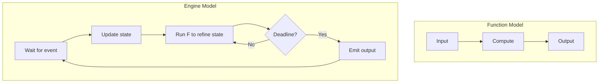
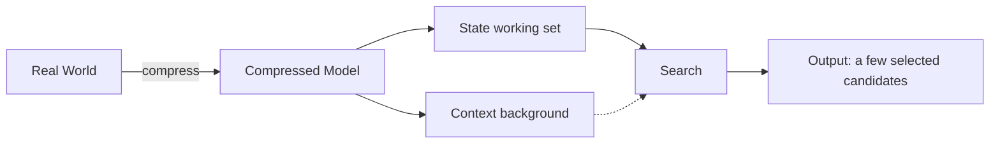
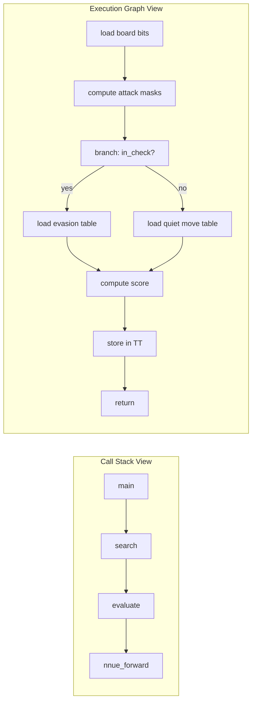

# 3. Core Mindset Shifts for Engine Engineers

The previous two notes established *what* an engine is and *how* to formalize it. This note is about *how to think* when you build one. Most engineers who fail at engine building do not fail because they lack knowledge — they fail because they apply the wrong mental model. They think about engines the way they think about web applications, or the way they think about algorithms homework, and both of those mental models lead them astray.

This note identifies the three mindset shifts that separate engine engineers from the rest of the field. Each shift is small to state and hard to internalize. We will return to all three repeatedly throughout the course.

---

## 3.1 Iterative Transformation vs Single-Execution Functions

The first mindset shift is the most fundamental: **engines are not functions**.

A typical software engineer spends their career writing functions: `compute_invoice(orders) → invoice`, `parse_request(http) → response`, `train_model(dataset) → weights`. Each function takes an input, does some work, produces an output, and returns. The function's lifetime is one call. Its performance is measured in milliseconds. Its correctness is binary — either it returns the right answer or it doesn't.

Engines do not work this way. An engine:

- Runs for *hours, days, or indefinitely*. A trading engine runs for the entire trading session. A search engine runs 24/7. A chess engine runs for the duration of a game.
- Has *state that persists across queries*. The transposition table is not discarded between moves. The index is not discarded between searches. The neural network weights are not reloaded between inferences.
- Is *interrupt-driven, not call-driven*. The engine does not wait to be called; it reacts to events (a market data tick, a search query, a user move) by running its core loop until the event is handled.
- Is *measured by tail latency and throughput, not by single-call latency*. A search engine that returns in 5 ms 99% of the time but in 500 ms 1% of the time is *worse* than one that returns in 20 ms 100% of the time, because the 500 ms outliers trigger timeouts and retries that cascade into failures.

### 3.1.1 What This Means in Practice

The shift from function-thinking to engine-thinking has concrete consequences for how you write code:

**1. Avoid allocation in the hot loop.** In a function, you can `malloc` freely — the function returns and the allocator reclaims memory. In an engine, the hot loop runs millions of times per second; every `malloc` is a slow system call and every `free` is a fragmentation risk. Pre-allocate everything you need at startup, into arenas and pools, and never allocate in the hot loop.

**2. Avoid blocking I/O in the hot loop.** In a function, blocking on a file read is fine — the caller waits, then gets the result. In an engine, blocking stops the entire engine. Every millisecond blocked is a millisecond the engine cannot respond to other events. I/O must be async, queued, and consumed by the engine loop on its own schedule.

**3. Treat the loop as the unit of work.** In a function, you optimize the function's body. In an engine, you optimize the *loop* — the boundary between iterations. This is where cache behavior matters most, where branch prediction is won or lost, where prefetching succeeds or fails.

**4. Measure tail, not mean.** In a function, you measure how long it takes to run once. In an engine, you measure p50, p90, p99, p99.9 — and you optimize the *worst* percentiles, because those are the ones that cause user-visible failures.

### 3.1.2 The Engine Loop as a Continuous Process

In the function model, the system is idle between calls. In the engine model, the system is *never* idle — it is either handling an event or refining its internal state in anticipation of the next one. A search engine that has just returned a query result is not "waiting" — it is prefetching the next likely query, warming its caches, running background index merges. A trading engine between market data ticks is not "waiting" — it is re-evaluating its risk exposures, preparing contingent orders, monitoring its own latency.

**Mindset shift:** When you design an engine, ask not "what does this function do?" but "what does this loop do between events?" The answer should never be "nothing."

---

## 3.2 The Engine as a Search System Over a Compressed World Model

The second mindset shift is the most *useful* mental model in this course. Memorize it:

> **An engine is a search system over a compressed world model.**

Every engine — chess, search, trading, parsing, recommendation — does the same three things:

1. **Compresses the world** into a small, structured representation (the state $S$).
2. **Searches** that representation for promising candidates (the transition $F$).
3. **Selects** one or a few candidates and emits them as output (the projection $\rho$).

The differences between engines are differences in *what* the world is, *how* it is compressed, and *how* the search is conducted. They are not differences in the fundamental pattern.

### 3.2.1 The Compressed World Model

The "world" the engine models is the part of reality that affects its decisions:

- For a chess engine, the world is the game state: the board, the side to move, the move history.
- For a search engine, the world is the document corpus: every document, every word in every document, every link between documents.
- For a trading engine, the world is the market: the order book, the recent trade tape, the positions of all participants.
- For a parser, the world is the input stream: the characters, the tokens, the grammar rules.
- For a recommendation engine, the world is the user-item graph: every user, every item, every interaction.

The full world is *enormous* — far too large to fit in memory, let alone in cache. So the engine compresses it. Compression is lossy: the engine keeps the information that matters for its decisions and discards the rest. A chess engine does not store the full game history (only enough to detect threefold repetition). A search engine does not store full documents in its index (only the terms and their positions). A trading engine does not store every tick forever (only the recent ones, plus aggregated statistics).

The compressed world model is the engine's *state* and *context* together. State is the *working set* of the model — the part the engine is currently reasoning about. Context is the *background* — the part that informs the reasoning but is not itself being reasoned about.

### 3.2.2 Search Over the Compressed Model

Once the world is compressed into a manageable representation, the engine searches it. "Search" here is used broadly — it includes any procedure that explores possibilities and selects among them. The main varieties are:

- **Tree search.** The engine enumerates possible futures (chess: the move tree; parsing: the parse tree; planning: the action tree) and selects the best one. Discussed in Chapter 2.
- **Index search.** The engine builds an index over the compressed model and looks up relevant entries (search: the inverted index; recommendation: the embedding index). Discussed in Chapter 3.
- **Optimization.** The engine iteratively refines a candidate solution to maximize some objective (trading: portfolio optimization; ML training: gradient descent). Discussed in Chapter 5.
- **Pattern matching.** The engine matches the current state against known patterns (parser: grammar rules; IDS: signature database; chess opening book).

### 3.2.3 Why This Model Matters

The "search over a compressed world model" framing is useful because it tells you *where to focus your engineering effort*. There are only three places to optimize:

1. **The compression.** A better compression makes the model smaller, which makes it fit in cache, which makes search faster. Most engine improvements over the past 50 years have been better compressions: bitboards replaced 2D arrays; inverted indexes replaced full-text scans; embeddings replaced one-hot vectors.
2. **The search algorithm.** A better search algorithm explores fewer candidates or explores them more efficiently. Alpha-beta replaced full minimax; ANN replaced exact nearest neighbor; MCTS replaced fixed-depth search.
3. **The selection.** A better selection criterion picks better candidates from the searched set. NNUE replaced hand-tuned evaluation; learned ranking replaced BM25-only ranking; smart order routing replaced naive limit orders.

When you encounter a slow engine, ask: *which of these three is the bottleneck?* The answer tells you where to optimize.

### 3.2.4 Balancing Fidelity and Performance

There is a fundamental tension in the compressed world model: **higher fidelity (more information retained) means slower search**. You must choose how much information to keep.

A chess engine that retained the full 50-move history would be more faithful (it could detect subtle patterns) but slower (more state to copy per move). A search engine that stored full documents in its index would be more faithful (it could answer any question) but slower (the index would be 100× larger). A trading engine that stored every tick forever would be more faithful (it could do arbitrarily deep historical analysis) but slower (memory would fill up in minutes).

The art of compression is choosing *what to throw away*. The thrown-away information must be:

1. **Irrelevant to the decision.** The chess engine does not need to know the exact move that led to the current position, only the current position itself (mostly).
2. **Reconstructable when needed.** If you throw away the full game history, you must be able to reconstruct enough of it (e.g., from a PGN file) when a threefold-repetition check is needed.
3. **Bounded in impact.** Throwing away information that *might* matter is acceptable only if the probability of mattering is low enough. The expected cost of being wrong must be less than the cost of retaining the information.

This trade-off appears in every chapter of the course. Watch for it.

---

## 3.3 Hardware-Centric vs Software-Centric Abstractions

The third mindset shift is the hardest for engineers trained in modern high-level languages. It is this:

> **Hardware is not an implementation detail. Hardware is the design.**

A software-centric abstraction hides the hardware behind convenient interfaces: objects, garbage collection, virtual function calls, dynamic typing, exception handling. These abstractions make code easier to write and easier to read. They also make code slow — sometimes 10× slow, sometimes 100× slow, on modern hardware.

An engine engineer thinks differently. They do not ask "what is the cleanest way to express this?" They ask "what is the *machine code* the CPU will actually execute, and is it the fastest version of this computation the CPU can run?" They think in terms of:

- **Memory access patterns**, not object graphs.
- **Execution graphs**, not call stacks.
- **CPU instruction cycles**, not algorithm steps.

### 3.3.1 Deconstructing Software-Centric Abstractions

Let us examine the cost of common software-centric abstractions. These numbers are approximate and vary by hardware, but the orders of magnitude are stable:

| Abstraction | What it costs | Why it's slow |
|---|---|---|
| Virtual function call (C++) | ~5 ns | Indirect branch; branch predictor may mispredict |
| Heap allocation (`malloc`) | ~50–200 ns | Lock contention, free-list traversal, possible system call |
| Hash map lookup (std::unordered_map) | ~20–50 ns | Pointer chasing, cache misses on bucket list |
| Linked list traversal | ~5 ns per node | One cache miss per node (pointers spread across memory) |
| Dynamic type check (Python, JS) | ~10 ns | Type tag comparison, indirect dispatch |
| Garbage collection (Java) | Variable, can be ms | Stop-the-world pauses; write barriers on every pointer store |
| Exception throw (C++) | ~1 μs | Stack unwinding, RAII destructors |

Each of these is "fast" by human standards. None of them are fast by engine standards. A chess engine doing 100 million node evaluations per second cannot afford a 5 ns virtual call per node — that is 500 ms of virtual call overhead per second, eating half the budget. A trading engine that allocates memory per tick will spend more time in `malloc` than in actual trading logic.

### 3.3.2 Structuring Around Memory Access Patterns

The hardware-centric engineer designs code around how memory will be accessed. The fundamental question is: **when the CPU reads byte $X$, will byte $X+1$ already be in cache?** If yes, the access is fast (~1 ns from L1). If no, the access is slow (~100 ns from DRAM) — 100× slower.

This leads to a set of design rules that we will develop in Chapter 4:

1. **Prefer contiguous arrays over linked structures.** An array of $N$ 64-bit integers can be scanned at ~10 GB/s on modern hardware (memory bandwidth limited). A linked list of $N$ nodes, each allocated separately, scans at ~100 MB/s (cache miss per node) — 100× slower.
2. **Prefer structure-of-arrays over array-of-structures** when you process one field across many elements. This is the foundation of vectorization (Chapter 4).
3. **Prefer pre-allocated arenas over per-use `malloc`.** Arenas allocate a large block once and bump-allocate from it. Per-use `malloc` goes through the allocator every time.
4. **Prefetch memory you will need soon.** Modern CPUs have prefetch instructions (`__builtin_prefetch` in GCC, `_mm_prefetch` in MSVC) that tell the cache to start loading a cache line before you need it.
5. **Lay out data so the prefetcher can predict access.** Sequential access patterns are prefetched automatically by the hardware. Random access patterns are not — every access is a cache miss.

### 3.3.3 Structuring Around Execution Graphs

A software-centric engineer thinks in terms of call stacks: function A calls function B which calls function C. This is correct but unhelpful for performance. The hardware-centric engineer thinks in terms of **execution graphs**: the actual sequence of operations the CPU will perform, including all the implicit operations (cache fills, branch mispredictions, dependency stalls).

The execution graph view exposes the *actual* cost of the computation. The `branch: in_check?` node in the graph is a branch — if it is unpredictable, it costs ~10 ns per misprediction. The `load evasion table` node is a memory load — if the table is not in cache, it costs ~100 ns. The `store in TT` node is a memory store — if the TT is contended across threads, it costs ~30 ns for the cache coherence protocol.

The call stack view hides all of this. The execution graph view makes it visible.

### 3.3.4 Structuring Around CPU Instruction Cycles

The deepest level of hardware-centric thinking is reasoning about CPU instruction cycles. Every operation the CPU performs has a cost in cycles:

- Integer add: 1 cycle (1 ns at 1 GHz, 0.3 ns at 3 GHz).
- Integer multiply: 3 cycles.
- Integer divide: 20–40 cycles.
- L1 cache load: 3–4 cycles.
- L2 cache load: 12–14 cycles.
- L3 cache load: 30–40 cycles.
- DRAM load: 200–400 cycles.
- Branch misprediction: 15–20 cycles.
- SIMD operation (8 floats): 1–4 cycles (amortized 0.1–0.5 cycles per float).

A typical engine iteration might execute 100–1000 instructions. If the engine runs at 100 million iterations per second (10 ns per iteration), that is 30–300 cycles at 3 GHz — well within the budget. But a single DRAM load (200 cycles) blows the budget entirely. **Memory, not compute, is the bottleneck in almost every engine.** This is the central insight of Chapter 4.

### 3.3.5 The Mindset in One Sentence

A software-centric engineer asks: *"Does this code correctly implement the algorithm?"*

A hardware-centric engineer asks: *"Does this code make the CPU execute the minimum number of cycles to produce the correct answer?"*

Both questions matter. The first is necessary; the second is what separates engines from prototypes.

---

## 3.4 The Three Shifts Together

The three mindset shifts are not independent — they reinforce each other:

- The **iterative transformation** shift makes you think about loops, not functions. This forces you to think about what happens *between* iterations, which is dominated by memory access patterns.
- The **compressed world model** shift makes you think about what to keep and what to throw away. This forces you to think about cache sizes and memory layout, which are hardware concerns.
- The **hardware-centric** shift makes you think about cycles and cache lines. This forces you to design data structures that fit in cache, which makes the iteration loop fast.

An engineer who internalizes all three shifts will look at a piece of code and immediately see:

1. Whether it is structured as an iterative loop or a single function call.
2. What the compressed world model is, and whether the compression is appropriate.
3. How the data is laid out in memory, and whether the layout matches the access pattern.

This three-part vision is what makes an engine engineer.

---

## 3.5 Common Pitfalls

### Pitfall 1: Applying Function Thinking to Engine Code

The most common mistake. Symptom: code that allocates in the hot loop, uses virtual functions for extensibility, treats exceptions as control flow. Fix: read the code and ask "would this be fast if it ran a billion times per second?" If not, rewrite it.

### Pitfall 2: Over-Compressing the World Model

Compression is good; over-compression is fatal. Symptom: the engine produces wrong answers in corner cases because the compression threw away information that mattered. Fix: identify the corner cases, verify the compression is faithful for them, and either keep more information or accept the failure mode explicitly.

### Pitfall 3: Under-Compressing the World Model

The opposite mistake. Symptom: the engine is slow because state is too large, and profiling shows cache misses dominating. Fix: profile, identify the largest state fields, ask whether each is derivable from the others, and aggressively prune.

### Pitfall 4: Trusting the Compiler

Modern compilers are good, but they cannot fix bad data layout. A compiler will not transform an array of linked lists into a flat array. A compiler will not vectorize a loop with a data dependency. A compiler will not prefetch memory it cannot predict. The engineer must design for hardware; the compiler can only execute the design.

### Pitfall 5: Optimizing Before Measuring

The cardinal sin of engine engineering. Symptom: the engineer "knows" the bottleneck is in function X, spends two days optimizing it, and the engine is not measurably faster. Fix: profile first. Always profile first. Chapter 6 covers profiling tools in detail.

---

## 3.6 Important Reminders

- **Engines are loops, not functions.** Design for the iteration boundary, not the function call.
- **An engine is a search system over a compressed world model.** Optimize the compression, the search, or the selection.
- **Hardware is the design, not an implementation detail.** Memory layout matters more than algorithms.
- **Memory, not compute, is the bottleneck.** Optimize for cache hits first, instruction count second.
- **Always profile before optimizing.** Intuition about bottlenecks is wrong ~80% of the time.
- **Tail latency, not mean latency, is what users feel.** Optimize p99, not p50.
- **Never allocate in the hot loop.** Pre-allocate at startup.
- **Never block in the hot loop.** Use async I/O.
- **Never throw exceptions in the hot loop.** They are 1000× slower than return codes.

---

## 3.7 Summary

Three mindset shifts separate engine engineers from the rest of the field:

1. **Iterative transformation, not single execution.** Engines are loops; design for the iteration boundary.
2. **Search over a compressed world model.** Engines compress reality into a small representation, search it, and select a few candidates.
3. **Hardware-centric, not software-centric.** Memory layout, execution graphs, and CPU cycles are the design; objects, abstractions, and algorithms are the expression.

Internalize these shifts. Every subsequent chapter assumes you have done so.

---

**Previous note:** [[2. Mathematical and Formal System Abstractions]]
**Next chapter:** [[1. Layer 1 The Input Normalization Layer]]
