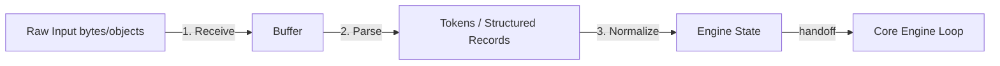
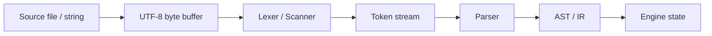
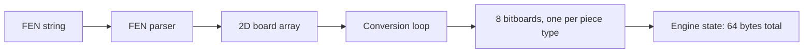
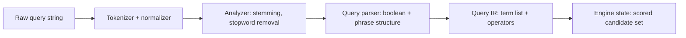

# 1. Layer 1 — The Input Normalization Layer

> "Garbage in, garbage out — but *slow* garbage in is even worse. The input layer is the gatekeeper between the messy, asynchronous, encoding-inconsistent external world and the clean, deterministic, cache-aligned interior of the engine. Get this layer wrong and every downstream layer pays for it."

The Input Normalization Layer is the **first** of the six architectural layers that compose a fast engine. It is the most easily underestimated layer — many textbooks skip it entirely, treating input as "given." In real engine engineering, the input layer is where 10–30% of total latency is won or lost, and where most concurrency bugs originate. This note covers its role, its design patterns, and the pitfalls you must avoid.

---

## 1.1 Role and Criticality in the Ingestion Path

The input layer has three jobs, in order of importance:

1. **Convert raw external input into the engine's internal state representation.** This is the *logical* job — translating bytes on the wire into the data structures the engine reasons about.
2. **Do this conversion as fast as possible.** This is the *performance* job — minimizing the time between "input arrives" and "engine starts work."
3. **Do this conversion without blocking the engine.** This is the *concurrency* job — ensuring that slow or malformed input cannot stall the engine's core loop.

If any of these three jobs is done poorly, the engine suffers. A slow input layer means the engine spends its time parsing instead of computing. A blocking input layer means a single bad input can freeze the entire system. A semantically wrong input layer means the engine reasons about a corrupted model of the world and produces confidently wrong output.

### 1.1.1 Why This Layer Is Underestimated

The input layer is underestimated for a simple reason: **in functional code, it doesn't matter**. If you are writing a function that processes a list, the function does not care how the list was constructed. The list is just there. The construction cost is paid once, before the function is called, and is invisible to the function.

In an engine, this is no longer true. The engine's core loop runs millions of times per second. If the input layer is in the hot path — and in many engines it is — then the input layer's cost is paid millions of times per second. A 100-nanosecond inefficiency in input parsing becomes a 100-millisecond-per-second tax on the entire engine.

The discipline is: **treat the input layer with the same rigor as the core loop**. Profile it, optimize it, and benchmark it. Do not assume it is fast because it is "just parsing."

### 1.1.2 The Three-Stage Ingestion Pipeline

A well-designed input layer is itself a small three-stage pipeline:



**Stage 1: Receive.** Raw input is read from the external source (network socket, file, IPC channel, hardware DMA buffer) into a contiguous in-memory buffer. The receive stage is *purely about bytes* — it does not interpret them. Its job is to get bytes off the wire and into memory as fast as possible, ideally without copying.

**Stage 2: Parse.** The byte buffer is interpreted according to the input's encoding (JSON, protobuf, FIX, binary, text grammar). The output of parsing is a structured representation — tokens, records, or a partial AST. Parsing is the most expensive of the three stages and the one where most optimization effort goes.

**Stage 3: Normalize.** The parsed structure is converted into the engine's *internal* state representation. This is where domain knowledge enters: a parsed "buy 100 shares at $50.00" message becomes an internal `Order` object with the right enum values, normalized price (in ticks, not dollars), and a precomputed hash for O(1) comparison.

The three stages can be fused (parse-while-receiving) or strictly separated (receive-then-parse-then-normalize). The choice depends on the input's characteristics, which we discuss below.

---

## 1.2 Raw Input Transformation Pipelines

Different engine domains have radically different input characteristics. The input layer must be designed for the specific characteristics of the domain. Below we cover four canonical examples.

### 1.2.1 Text Streams → Token Sequences (Parser Engines)

**Domain:** Compilers, interpreters, configuration parsers, log analyzers, code search tools.

**Input characteristics:**
- Variable-length text (bytes encoded as UTF-8, UTF-16, or ASCII).
- No length prefix — the parser does not know how long the input is until it reads it.
- Highly irregular structure (whitespace, comments, escape sequences).
- Often human-readable, which means encodings and quirks must be tolerated.

**Transformation pipeline:**



**Key techniques:**

1. **Zero-copy lexing.** Tokens are represented as `(pointer, length)` pairs into the original buffer, not as copied strings. This eliminates the most common source of lexer overhead.
2. **Lookup-table-driven scanners.** The lexer's transition function is encoded as a 256-entry table indexed by byte value, not as a switch statement. This makes the lexer branch-free and predictable for the CPU.
3. **Sentinel-terminated buffers.** Append a sentinel byte (e.g., `\0` or `0xFF`) to the end of the input buffer. The lexer can then check for end-of-input as part of its character classification, rather than as a separate bounds check.
4. **Arena allocation for tokens.** Tokens are allocated from a bump allocator (arena) that is reset between parses, not from `malloc`. Allocation is O(1) and frees are batched.

**Common pitfall:** Using a general-purpose regex library for lexing. Regex libraries are designed for flexibility, not speed; they are typically 10–100× slower than a hand-written or table-driven lexer. Use regex for prototyping, switch to a hand-written lexer for production.

### 1.2.2 Board Coordinates → Bitboards (Chess Engines)

**Domain:** Chess, checkers, Go (with modifications), any grid-based game engine.

**Input characteristics:**
- Small, fixed-size input (a chess position is 64 squares × ~4 bits/square = 32 bytes).
- Input format is typically FEN (Forsyth-Edwards Notation), a text string of ~80 characters.
- Conversion must be done once per move (cheap) or once per node in the search tree (potentially expensive).

**Transformation pipeline:**



**Key techniques:**

1. **Direct bitboard construction.** Skip the intermediate 2D array. Parse the FEN directly into bitboards, one bit at a time.
2. **Precomputed attack tables.** The bitboard for "all squares a knight on e4 can reach" is precomputed at engine initialization and stored in a lookup table indexed by square. The input layer just looks up the right table entry.
3. **Zobrist hashing at parse time.** As the position is parsed, the Zobrist hash (used for transposition table lookup) is computed incrementally. This avoids a separate hashing pass over the bitboards.
4. **Castling rights and en-passant as separate fields.** Do not try to encode these into the bitboards; store them as separate bytes in the state struct.

**Common pitfall:** Storing the board as a 2D array of piece enums "for readability." This costs 64 bytes per board and requires expensive conversions for move generation. Bitboards are 8×64 = 64 bytes (same size!) but enable bitwise move generation that is 10–100× faster.

### 1.2.3 Market Ticks → Feature Vectors (Trading Engines)

**Domain:** High-frequency trading, market data processing, real-time analytics.

**Input characteristics:**
- High rate (10,000–10,000,000 messages per second per instrument).
- Variable-length binary format (FIX, ITCH, proprietary binary).
- Strict latency budget (microseconds per message, not milliseconds).
- Often multicast — many receivers process the same feed.

**Transformation pipeline:**


**Key techniques:**

1. **Kernel bypass.** Use DPDK, Solarflare OpenOnload, or Linux AF_XDP to read packets directly from the NIC into user-space memory, bypassing the kernel network stack. This eliminates the syscall and copy overhead of `recv()`.
2. **Ring buffers for handoff.** The receive thread writes raw packets into a single-producer-single-consumer ring buffer. The parser thread reads from it. No locks; no contention.
3. **Specialized binary parsers.** FIX is text-based and slow to parse; many firms translate FIX to a compact binary format at the gateway. Native exchange formats (ITCH, OMDC) are already binary and can be parsed by direct memory reads.
4. **Incremental order book maintenance.** The order book is not rebuilt from scratch on each tick. Each message is an *incremental update* (add, modify, delete) applied to the existing book. The book itself is a sorted data structure (typically a sorted array of price levels, each with a list of orders).
5. **Precomputed feature deltas.** When the book updates, only the affected features (e.g., mid-price, imbalance) are recomputed, not the entire feature vector. This is *incremental computation* and is critical for sub-microsecond feature update.

**Common pitfall:** Using a generic JSON parser for market data. JSON parsing is ~100× slower than binary parsing and is unacceptable in HFT. Even for non-HFT use cases, FIX-over-JSON is a sign that the input layer was not designed, but assembled.

### 1.2.4 User Queries → Search State (Search Engines)

**Domain:** Web search, document search, log search, code search.

**Input characteristics:**
- Short text (1–10 words typically for web search; up to a paragraph for advanced queries).
- Variable structure (boolean operators, field qualifiers, phrase queries).
- High fan-out (one query may touch hundreds of index shards).

**Transformation pipeline:**



**Key techniques:**

1. **Aggressive normalization at index time, mirrored at query time.** Whatever normalization is applied to documents (lowercasing, stemming, accent removal) must be applied identically to queries. The input layer and the indexing layer must share normalization code.
2. **Query rewriting.** The user's query is rewritten into an internal form that the engine can evaluate efficiently. For example, `"machine learning"` becomes a phrase query; `machine learning` (no quotes) becomes a boolean AND; `machine OR learning` becomes a boolean OR. The rewrite is done once, at input time, not at evaluation time.
3. **Stopword removal.** Common words ("the", "a", "is") are removed from the query because they appear in every document and contribute nothing to ranking. The stopword list must be the same as the one used at index time.
4. **Stemming.** "Running", "runs", "ran" all reduce to the stem "run". Stemming is typically done with a Porter stemmer or a Snowball stemmer; the choice must match the index.
5. **Query plan caching.** The internal IR form of a query is cached keyed by the raw query string. If the same query is repeated, the parse step is skipped.

**Common pitfall:** Normalizing queries differently from documents. If queries are lowercased but documents are not, no query will ever match any document. This sounds obvious, but it is one of the most common bugs in search engines.

---

## 1.3 General Principles for Input Layer Design

Across all four domains, the same principles apply. Internalize these.

### 1.3.1 Zero-Copy Where Possible

Every byte copy costs ~1 ns per byte on modern hardware (memory bandwidth limited). A 1 KB input copied three times costs 3 μs — significant if you are processing 100,000 inputs per second.

The goal is to read input bytes *once*, into a buffer, and then have all subsequent processing reference that buffer by pointer. This is called **zero-copy parsing**.

Techniques:

- **`(pointer, length)` slices** instead of `std::string` or `String`. The slice does not own memory; it just points into the input buffer.
- **Memory-mapped files** (`mmap`) instead of `read()`. The file is mapped into the process's address space; the OS pages it in as needed. No explicit copy.
- **Sendfile-style I/O** for streaming pipelines, where the kernel copies data directly from one file descriptor to another without passing through user space.

### 1.3.2 Branchless Parsing Where Possible

Branches are expensive when mispredicted (~15 cycles). Input parsing is full of branches: "is this character a digit?", "is this field present?", "is the length prefix valid?".

Branchless parsing replaces branches with arithmetic. For example, converting a digit character to its numeric value:

```c
// Branched version
int digit = (c >= '0' && c <= '9') ? (c - '0') : -1;

// Branchless version
int digit = (c - '0') & -((c - '0') < 10);
```

The branchless version compiles to a few arithmetic instructions with no branch. Whether it is faster depends on the predictability of the branch — if the branch is highly predictable (e.g., 99% digits), the branched version is faster; if it is unpredictable (e.g., 50% digits), the branchless version is faster.

For input parsing, branches are usually unpredictable (the parser does not know what is coming next), so branchless techniques often win.

### 1.3.3 SIMD for Bulk Operations

Modern CPUs can process 16–64 bytes per instruction using SIMD (AVX2 = 32 bytes, AVX-512 = 64 bytes). Input parsing has many bulk operations that benefit:

- **Whitespace scanning.** Find the next non-whitespace character in a buffer. SIMD: scan 32 bytes at once.
- **Delimiter search.** Find the next comma in a CSV. SIMD: scan 32 bytes at once.
- **Character class checks.** Find all digits in a buffer. SIMD: compare 32 bytes against '0'-'9' in one instruction.

Libraries like `simdjson` (JSON parsing) and `hyperscan` (regex matching) use SIMD to achieve 1–10 GB/s parsing speeds, vs. 100–500 MB/s for scalar parsers. If your input layer is parsing structured text, SIMD is mandatory.

### 1.3.4 Backpressure and Bounded Buffers

The input layer must handle the case where input arrives faster than the engine can process it. There are two strategies:

1. **Bounded buffers with backpressure.** The input layer has a fixed-size buffer. When the buffer is full, the input layer signals "stop" to the source (e.g., TCP receive window, flow control message). The source must respect this signal.
2. **Drop oldest / drop newest.** The input layer has a fixed-size buffer. When full, new inputs either overwrite old ones (drop oldest) or are discarded (drop newest). This is appropriate when the engine is processing a real-time stream where old data is worthless (e.g., market data — if you cannot process the latest tick, processing an old tick is worse than skipping it).

The wrong choice is **unbounded buffers**, which lead to out-of-memory crashes under load. Always bound your buffers; always decide explicitly what happens when they fill.

### 1.3.5 Asynchronous, Non-Blocking Reception

The receive stage must never block the engine's core loop. There are three patterns:

1. **Separate receive thread.** A dedicated thread does blocking `recv()` calls and writes to a ring buffer. The engine core loop reads from the ring buffer. Simple and effective; the standard pattern for moderate-performance engines.
2. **Event-driven I/O.** The engine core loop is itself an event loop (epoll, kqueue, io_uring). When input is available, the loop is notified and processes it. Standard for high-concurrency servers.
3. **Kernel bypass + busy polling.** The engine core loop busy-polls the NIC's receive ring. No syscall, no context switch. Used in HFT where every microsecond matters.

The choice depends on the latency budget. Microsecond latency requires kernel bypass; millisecond latency is fine with epoll; tens of milliseconds is fine with a separate thread.

---

## 1.4 A Concrete Example: Parsing a FIX Message

To make this concrete, let us walk through the input layer of a hypothetical trading engine receiving a FIX `NewOrderSingle` message.

The raw FIX message (text, with `|` representing the SOH delimiter, byte 0x01):

```
8=FIX.4.4|9=123|35=D|49=CLIENT|56=VENUE|11=order123|55=AAPL|54=1|38=100|44=150.25|10=123|
```

**Naive parser (slow):**

```python
def parse_fix(msg: str) -> dict:
    result = {}
    for field in msg.split('|'):
        if '=' in field:
            tag, value = field.split('=', 1)
            result[int(tag)] = value
    return result
```

This parser is correct but slow: it allocates a list of fields, a dict, and many strings. For a 100-byte message, it might allocate 1 KB of memory and take 5–10 μs.

**Fast parser:**

```c
struct Order {
    char symbol[8];
    int32_t side;       // 1 = buy, 2 = sell
    int32_t quantity;   // in shares
    int64_t price;      // in ticks (price * 10000)
    char client_id[16];
};

void parse_fix_into(const char* buf, size_t len, Order* out) {
    const char* p = buf;
    const char* end = buf + len;
    while (p < end) {
        // Parse tag (integer)
        int tag = 0;
        while (*p >= '0' && *p <= '9') {
            tag = tag * 10 + (*p - '0');
            ++p;
        }
        ++p;  // skip '='
        // Parse value (until SOH or end)
        const char* vstart = p;
        while (p < end && *p != 0x01) ++p;
        size_t vlen = p - vstart;
        ++p;  // skip SOH
        // Dispatch on tag
        switch (tag) {
            case 11: memcpy(out->client_id, vstart, vlen); break;
            case 55: memcpy(out->symbol, vstart, vlen); break;
            case 54: out->side = parse_int(vstart, vlen); break;
            case 38: out->quantity = parse_int(vstart, vlen); break;
            case 44: out->price = parse_price(vstart, vlen); break;
            default: break;  // ignore other tags
        }
    }
}
```

This parser:

- **Allocates nothing.** The output `Order` is passed in by the caller, pre-allocated.
- **Copies each value at most once**, directly into the destination field.
- **Converts integers and prices inline**, not into a string first.
- **Uses no virtual functions, no exceptions, no hash maps.**
- **Runs in ~200 ns** for a typical message, vs. ~5 μs for the naive version — 25× faster.

This is the kind of optimization the input layer requires. It is not glamorous, but it is essential.

---

## 1.5 Common Pitfalls

### Pitfall 1: Allocating in the Input Layer

Every allocation in the input layer is paid for every input. Use arenas, pools, or caller-allocated output structures. Never `malloc` per input.

### Pitfall 2: Using Generic Parsers

Generic parsers (JSON, XML, regex) are designed for flexibility, not speed. They are typically 10–100× slower than specialized parsers. Use them for prototyping, replace them for production.

### Pitfall 3: Confusing Encoding with Semantics

The input layer has two jobs: decode bytes into structured fields (encoding), and convert those fields into engine state (semantics). These are separate jobs and should be in separate functions. Conflating them makes both harder to test and optimize.

### Pitfall 4: No Backpressure

Without backpressure, a slow engine under heavy input load will accumulate a growing backlog of unprocessed inputs. Eventually memory fills and the engine crashes. Always implement backpressure, even if you do not think you need it.

### Pitfall 5: Synchronous I/O in the Core Loop

If the core loop does `recv()`, it blocks. While it blocks, it cannot process anything else. Move I/O to a separate thread or use async I/O.

### Pitfall 6: Not Validating Input

The input layer is the engine's boundary with the outside world. All input must be validated here: bounds checks, type checks, semantic checks. Bugs that slip past the input layer will corrupt engine state and be nearly impossible to diagnose later.

### Pitfall 7: Not Logging Rejected Input

When the input layer rejects a malformed input, log it. Otherwise you will have no way to debug why the engine is missing inputs. The log should be sampled (not every rejection) to avoid flooding.

---

## 1.6 Important Reminders

- **The input layer is in the hot path.** Profile it like you profile the core loop.
- **Zero-copy is the goal.** Every byte copy is wasted memory bandwidth.
- **Branchless and SIMD parsing can be 10–100× faster than naive parsing.** Use them for any structured-text input.
- **Backpressure is mandatory.** Unbounded buffers will eventually crash the engine.
- **Validate at the boundary.** The input layer is the only place where you can reliably reject bad input.
- **Pre-allocate output structures.** Let the caller provide the memory; the input layer fills it in.
- **Test the input layer with adversarial inputs.** Malformed, truncated, oversized, and rapidly-arriving inputs all need tests.

---

## 1.7 Summary

The Input Normalization Layer is the gatekeeper between the external world and the engine's interior. Its three jobs are: receive raw bytes, parse them into structured fields, and normalize those fields into engine state. The layer must be fast (zero-copy, branchless, SIMD where possible), concurrency-safe (asynchronous, non-blocking, with backpressure), and rigorous (validate everything, log rejections).

The four canonical input types — text streams, board coordinates, market ticks, user queries — each have their own transformation pipelines, but all share the same design principles. Mastering those principles is the foundation of a fast engine.

---

**Previous note:** [[3. Core Mindset Shifts for Engine Engineers]]
**Next note:** [[2. Layer 2 The State Representation Layer]]
