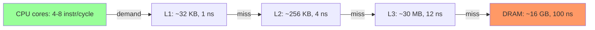
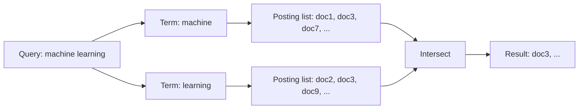
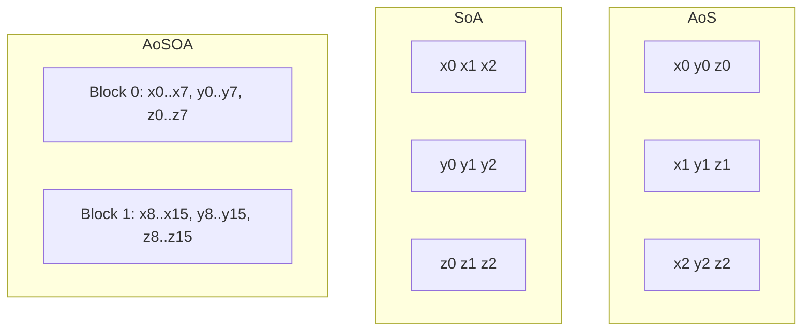

# 2. Layer 2 — The State Representation Layer

> "Algorithms are not the bottleneck. Memory is. The state representation you choose sets the **architectural performance ceiling** of your engine — no amount of cleverness in $F$ can overcome a bad choice of $S$."

The State Representation Layer is the second of the six layers, and it is the single most impactful design decision in engine engineering. A poorly chosen state representation caps the engine's performance no matter how clever the algorithm. A well-chosen representation makes the algorithm feel almost free.

This note covers the principles of state representation, the structural primitives available, and how to choose among them. The material here is foundational to Chapter 4 (Hardware-Aware Design), where we go deeper into memory layout.

---

## 2.1 Setting the Architectural Performance Ceiling

The state representation determines the engine's **performance ceiling** — the maximum speed achievable no matter how well you optimize everything else. This ceiling is set by two factors:

1. **Cache behavior.** State that fits in L1 cache (~32 KB) is accessed in ~1 ns. State that fits in L2 (~256 KB) is accessed in ~4 ns. State that spills to L3 (~30 MB) is accessed in ~12 ns. State that spills to DRAM is accessed in ~100 ns. A 100× spread between best and worst case, determined entirely by state size.
2. **Instructions per state access.** A bitboard move generation is ~5 instructions. A 2D-array move generation is ~30 instructions. The data structure determines the instruction count.

A chess engine using 2D arrays cannot reach 100 million nodes per second, no matter how good its search algorithm. A chess engine using bitboards routinely does. The difference is not the algorithm — it is the state representation.

### 2.1.1 The Iron Law of Memory

Modern CPUs are **memory-bound, not compute-bound**. A modern CPU can execute 4–8 instructions per cycle (superscalar, out-of-order) but can fetch only one cache line per cycle from L2, and one cache line per ~3 cycles from L3, and one cache line per ~15 cycles from DRAM. If your algorithm requires more memory accesses than the cache can supply, the CPU stalls waiting for memory, and your "compute" speed is irrelevant.



The green CPU is fast. The red DRAM is slow. The state representation determines whether your accesses stay in the green zone or spill into the red.

### 2.1.2 How State Size Maps to Cache Levels

Roughly:

| State size | Where it lives | Access latency | Engine use case |
|---|---|---|---|
| ≤ 64 B (one cache line) | L1 | ~1 ns | Hot per-iteration state |
| ≤ 32 KB | L1 | ~1 ns | Hot working set |
| ≤ 256 KB | L2 | ~4 ns | Moderate working set |
| ≤ 30 MB | L3 | ~12 ns | Large working set (e.g., a hot transposition table) |
| > 30 MB | DRAM | ~100 ns | Cold caches, models, indexes |

A typical engine wants its **hot state** (the part touched every iteration) in L1, its **warm state** (touched occasionally) in L2, and its **cold state** (touched rarely) in DRAM. The state representation's job is to enable this layering.

---

## 2.2 Structural Primitives

We now catalog the structural primitives available for state representation, in roughly increasing order of complexity.

### 2.2.1 Compressed Binary and Memory Layouts

The simplest primitive: **pack your data into the minimum number of bits, then lay it out in contiguous memory**.

**Bitboards (chess).** A chess board has 64 squares. A bitboard is a 64-bit unsigned integer where each bit represents one square. Eight bitboards (one per piece type: white pawns, white knights, ..., black king) capture the entire board in 64 bytes — exactly one cache line. Move generation is bitwise: a knight's possible moves are `(knight_bb & attack_table[from_square])`, where `attack_table` is precomputed. This is one bitwise AND, one lookup — ~1 ns total.

**Bit-packed structs.** If your state has many small fields, pack them into bytes/words using bit fields:

```c
struct PackedState {
    uint8_t  side_to_move : 1;       // 0 = white, 1 = black
    uint8_t  castling_rights : 4;    // 4 bits for WK, WQ, BK, BQ
    uint8_t  en_passant_square : 7;  // 0-64 (no square = 127)
    uint8_t  halfmove_clock : 8;     // 0-255
    uint32_t zobrist_hash;           // 32-bit hash (or 64-bit if you can afford it)
};  // Total: 8 bytes
```

The whole struct is 8 bytes — fits in a single cache line along with the eight bitboards (64 bytes), totaling 72 bytes (two cache lines).

**Bit-packed enums.** If you have an enum with 4 possible values, use 2 bits, not a full byte. The savings add up across millions of state copies.

### 2.2.2 Fast Indexes

When state includes a large collection that must be searched frequently, you need an **index**. The index is a separate data structure that allows O(1) or O(log N) lookup into the collection.

**Inverted indexes (search engines).** The collection is a set of documents. The index maps each term to the list of documents containing it. Looking up "machine learning" is two O(1) lookups: one for "machine", one for "learning", then an intersection of the resulting document lists.



**Hash indexes.** For exact-match lookups, a hash table is O(1) average. But hash tables have poor cache behavior (every lookup is a potential cache miss) and should be avoided in hot paths. Use them only for cold lookups (e.g., symbol tables, configuration).

**B-tree indexes.** For range queries, a B-tree is O(log N). B-trees have good cache behavior because each node is typically one cache line (or a small number), and the tree depth is small.

### 2.2.3 Probabilistic Summaries

When you need to know something approximately, and exact answers are too expensive, use a **probabilistic summary**.

**Bloom filters.** A Bloom filter is a bit array plus k hash functions. To insert an element, set the k bits at positions `h1(x), h2(x), ..., hk(x)`. To test membership, check whether all k bits are set. False positives are possible (with probability tunable by the bit-array size); false negatives are impossible.

Use case: a search engine uses a Bloom filter per shard to skip shards that definitely do not contain a given term. The filter is small (1–8 bits per document) and lookups are O(k) — much faster than a full index lookup.

**HyperLogLog.** Estimates the cardinality (number of distinct elements) of a multiset using O(log log N) memory. Use case: a trading engine estimating the number of distinct clients active in the last minute, for risk monitoring.

**Count-Min Sketch.** Estimates the frequency of items in a stream using sublinear memory. Use case: a search engine tracking query frequencies for trend detection.

**T-Digest.** Estimates quantiles (median, p99, etc.) of a stream. Use case: monitoring engine latency in real time.

### 2.2.4 High-Density Dimensional Matrices (Vector Embeddings)

Modern engines increasingly use **vector embeddings** — fixed-length vectors of floats (typically 64–1536 dimensions) that represent items in a learned latent space. Embeddings are the state representation of choice for:

- Recommendation engines (user embeddings, item embeddings).
- Semantic search (document embeddings, query embeddings).
- ML-based evaluation in chess engines (NNUE — efficiently updatable neural networks, which use a 256-dimensional hidden layer).

Embeddings are stored as flat arrays of floats, laid out for SIMD access:

```c
struct Embedding {
    float values[256];  // 1 KB per embedding
};
```

For similarity search, embeddings are organized into **Approximate Nearest Neighbor (ANN)** structures: HNSW graphs, IVF indices, or product-quantized codes. We cover ANN in Chapter 3 (recommendation engines).

---

## 2.3 Choosing a State Representation

Given the primitives above, how do you choose? The decision is driven by four questions:

### 2.3.1 Question 1: How Big Is the Natural State?

If the natural state is small (≤ 64 bytes), use bit-packing and call it done. The state fits in one cache line; nothing else matters much.

If the natural state is large (> 1 MB), you need an index or a probabilistic summary. You cannot scan the state every iteration; you need O(1) or O(log N) access to the relevant subset.

In between (64 B to 1 MB), you have a choice. The trade-off is between *compactness* (smaller = more cache-friendly) and *accessibility* (more structured = faster lookups).

### 2.3.2 Question 2: What Is the Access Pattern?

- **Sequential access** (process every element in order): use flat arrays. Maximum cache friendliness.
- **Random access by key**: use a hash table or B-tree. Accept the cache misses.
- **Range access** (all elements with key in [a, b]): use a B-tree or sorted array with binary search.
- **Aggregate access** (count, sum, average): use a probabilistic summary if exactness is not required.
- **Similarity access** (find k most similar to a query): use an ANN structure.

### 2.3.3 Question 3: How Often Does State Change?

- **Static** (set once at startup, never changes): use the most compact representation possible. Lay it out for read-only access. Use memory-mapped files.
- **Append-only** (elements added but never modified): use a log-structured representation. LSM trees, append-only arrays.
- **Mutable in place**: choose a representation that supports in-place update without rewriting. Hash tables, B-trees, in-place arrays.
- **Mostly-read, rarely-write**: optimize for reads. Use immutable snapshots with copy-on-write for writes.

### 2.3.4 Question 4: What Is the Concurrency Model?

- **Single-threaded**: any representation works. Optimize freely.
- **Read-only concurrent readers, single writer**: use a representation that supports fast snapshotting (copy-on-write, persistent data structures).
- **Multiple concurrent writers**: use a representation with fine-grained locking or lock-free algorithms. This constrains your choices significantly — many data structures do not have good lock-free variants.

---

## 2.4 Worked Examples

Let us apply the principles to the five engine domains.

### 2.4.1 Chess Engine

**State:** Board position + game metadata.

**Representation:** Eight 64-bit bitboards (one per piece type) + 8 bytes of metadata (side to move, castling rights, en passant, halfmove clock) + 8 bytes of Zobrist hash. Total: 80 bytes (two cache lines).

**Why:** Move generation is bitwise AND of bitboards with precomputed attack tables — one instruction per move type. The entire state can be copied for undo in 80 bytes (one cache line plus a few words).

**Alternative considered:** 2D array of piece enums (64 bytes). Same size, but move generation requires iterating over the array and computing moves per piece — 10× slower.

### 2.4.2 Search Engine

**State:** The index (a large persistent structure) + the current query (small, transient).

**Index representation:** Inverted index. For each term, a posting list of (document ID, term frequency, positions) tuples. Posting lists are compressed with Roaring Bitmaps or Elias-Fano encoding.

**Query representation:** A list of terms (each a 4-byte integer ID) plus operators (AND, OR, phrase). Total: ~50 bytes per query.

**Why:** The inverted index gives O(1) lookup per term, plus posting-list intersection for Boolean queries. Compression keeps the index small enough to fit in RAM (10–30% of the raw document size).

### 2.4.3 Trading Engine

**State:** Order book + outstanding orders + positions + risk limits.

**Order book representation:** Sorted array of price levels, each with a linked list of orders at that level. For each side (bid/ask), an array of `(price, quantity, order_list_head)` tuples, sorted by price. The top of book is `array[0]`.

**Outstanding orders:** Hash table by client order ID, plus per-instrument linked lists for cancel-by-instrument.

**Positions and risk:** Flat arrays indexed by instrument ID. Each entry is ~32 bytes (position, average price, P&L, risk limits).

**Why:** Order book updates are append/delete at known price levels — O(log N) for binary search to find the level, O(1) for the append. Top-of-book access is O(1). Risk checks are array lookups — O(1).

### 2.4.4 Parser Engine

**State:** Current token + AST being built + symbol table.

**Token representation:** A `(type_enum, value_pointer, value_length, source_location)` tuple — 24 bytes per token. Tokens are stored in a contiguous array (arena-allocated).

**AST representation:** Arena-allocated tree. Each node is a `(type, children_offset, children_count, payload)` tuple — 32 bytes per node. Children are stored in a separate array (structure-of-arrays for cache efficiency during traversal).

**Symbol table:** Hash table mapping symbol name (string ID) to declaration node. One entry per symbol; small enough to fit in L2.

**Why:** Tokens and AST nodes are accessed sequentially during parsing, so contiguous arrays give maximum cache performance. The symbol table is accessed randomly, but it is small and infrequently updated.

### 2.4.5 Recommendation Engine

**State:** User embeddings + item embeddings + interaction history.

**Embeddings:** Flat arrays of floats, one row per user/item. 256-dimensional float embeddings = 1 KB per item. For 100 million items, that is 100 GB — too large for RAM, so embeddings are sharded across machines.

**ANN index:** Hierarchical Navigable Small World (HNSW) graph. Each node is an item; edges connect similar items. Lookup is O(log N) — for 100 million items, ~25 hops, each a cache miss — so ~2.5 μs per lookup.

**Interaction history:** Append-only log, partitioned by user. Used for re-training embeddings periodically.

**Why:** Embeddings give semantic similarity; HNSW gives fast similarity search. The combination allows real-time "items similar to this one" queries over 100 million items.

---

## 2.5 The Structure-of-Arrays vs Array-of-Structures Trade-Off

A critical decision in state representation is **AoS vs SoA**. The choice has major performance implications.

**Array of Structures (AoS):**

```c
struct Particle { float x, y, z; float vx, vy, vz; };
Particle particles[N];  // Each particle is 24 bytes
```

Memory layout: `[x0,y0,z0,vx0,vy0,vz0, x1,y1,z1,vx1,vy1,vz1, ...]`

**Structure of Arrays (SoA):**

```c
struct Particles {
    float xs[N], ys[N], zs[N];
    float vxs[N], vys[N], vzs[N];
};
Particles particles;
```

Memory layout: `[x0,x1,...,xN, y0,y1,...,yN, ...]`

### 2.5.1 When AoS Is Better

- You access all fields of one element at a time (e.g., "process particle 5"). AoS gives you all fields in one cache line.
- The struct is small (≤ 64 bytes, fits in one cache line).
- You iterate over elements but use most fields per element.

### 2.5.2 When SoA Is Better

- You access one field across many elements (e.g., "compute the sum of all x coordinates"). SoA gives you all x values contiguously, perfect for SIMD.
- The struct is large (> 64 bytes, spilling cache lines).
- You iterate over elements but use only a few fields per element.
- You want to vectorize the computation (SIMD requires contiguous data).

### 2.5.3 Hybrid: AoSOA

For maximum flexibility, use **Array of Structures of Arrays (AoSOA)**:

```c
struct ParticleBlock { float xs[8], ys[8], zs[8], vxs[8], vys[8], vzs[8]; };
ParticleBlock blocks[N / 8];  // Each block holds 8 particles, SoA within
```

This gives you SIMD-friendly access within each block of 8, and cache-friendly access to all fields of one particle (within the same block). Used heavily in game physics engines.



---

## 2.6 Common Pitfalls

### Pitfall 1: Premature Generalization

Engineers trained on enterprise code love abstract data structures: `Map<Key, Value>`, `List<T>`, `Set<T>`. These general-purpose structures are almost always wrong for engines. Use the *specific* data structure that fits your access pattern: a flat array, a bitboard, a Bloom filter, an HNSW graph. Specific beats general every time.

### Pitfall 2: Linked Structures

Linked lists, trees with pointer-based children, and graph structures with pointer-based edges are cache-unfriendly. Every node is a separate allocation; every traversal is a cache miss. Prefer array-based representations: a tree stored as an array with integer indices for children (heap-style), a graph stored as an adjacency array with edge offsets.

### Pitfall 3: Ignoring Alignment

A struct field misaligned to its natural boundary (e.g., a 4-byte int at an odd address) is slow on some architectures and forbidden on others. Use `alignas(64)` to align structs to cache lines, and let the compiler handle intra-struct alignment.

### Pitfall 4: Pointer Chasing

Every pointer dereference is a potential cache miss. Replace pointers with integer indices into arrays. The index is just an integer (cheap to compute with); the array access is sequential (cheap to prefetch).

### Pitfall 5: Storing Redundant Data

If a field can be derived from other fields, do not store it. The exception is when derivation is expensive (e.g., the Zobrist hash, which is expensive to recompute but cheap to update incrementally).

### Pitfall 6: Not Benchmarking Alternative Representations

The choice between, say, a hash table and a sorted array for a particular use case is not obvious. Benchmark both. Be prepared to be surprised — the "obvious" choice is wrong ~30% of the time.

---

## 2.7 Important Reminders

- **State size determines cache level.** Target L1 (≤ 32 KB) for hot state.
- **Bit-packing is your friend.** Pack small fields into bytes/words.
- **AoS vs SoA matters.** SoA for vectorized bulk operations; AoS for per-element access.
- **Linked structures are cache-hostile.** Use array-based representations.
- **Indexes beat scans.** For any non-trivial collection, build an index.
- **Probabilistic summaries beat exact computation.** When approximate is enough.
- **Embeddings are the modern representation.** For semantic similarity, use learned vectors.
- **Profile, do not guess.** The choice of representation should be benchmarked against realistic workloads.

---

## 2.8 Summary

The State Representation Layer sets the engine's architectural performance ceiling. The four classes of structural primitives — compressed binary layouts, fast indexes, probabilistic summaries, and dimensional matrices — cover the vast majority of real engine designs. The choice among them is driven by four questions: how big is the state, what is the access pattern, how often does it change, and what is the concurrency model.

The AoS vs SoA decision is particularly important for vectorizable workloads. Linked structures should be avoided in favor of array-based representations. And every representation decision should be benchmarked, not guessed.

With a well-chosen state representation, the engine's transition function $F$ has a chance to be fast. With a poorly chosen one, no amount of algorithmic cleverness can save you.

---

**Previous note:** [[1. Layer 1 The Input Normalization Layer]]
**Next note:** [[3. Layer 3 The Core Transition Function Layer]]
