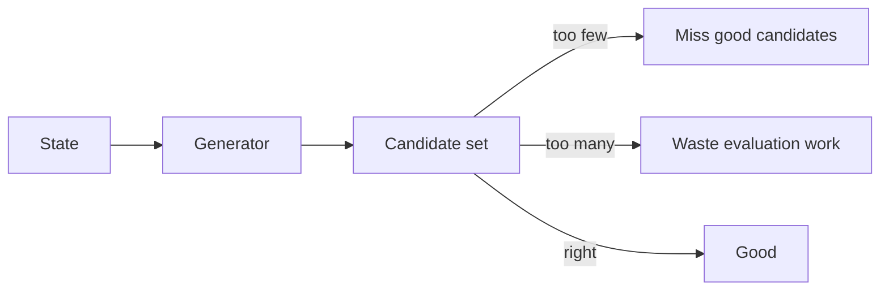
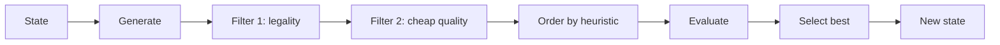
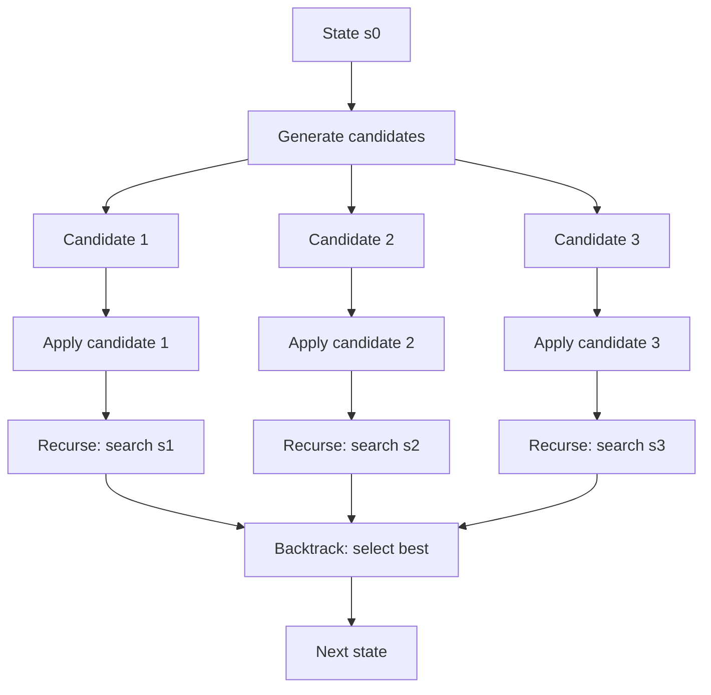
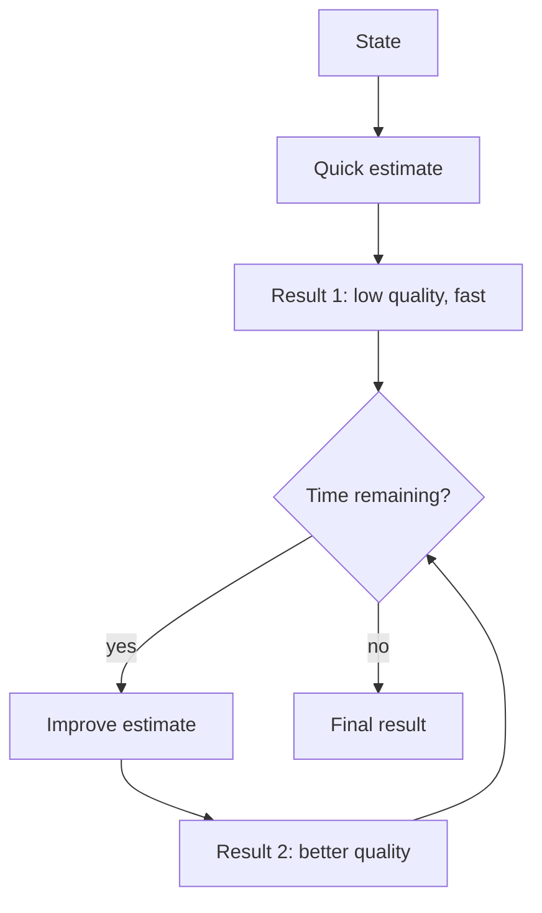
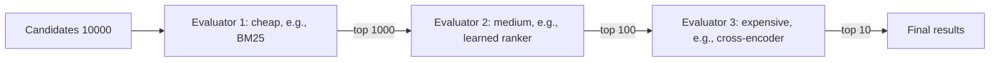
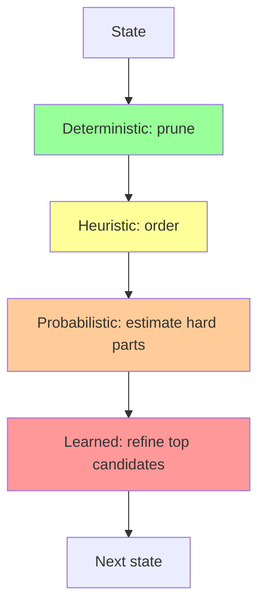

# 3. Layer 3 — The Core Transition Function Layer

> "If state is the engine's body, the transition function $F$ is its mind. This is where the engine's 'intelligence' is encoded — through a layered composition of deterministic algorithms, heuristics, probabilistic estimators, and learned models. Get the composition right and the engine feels effortless. Get it wrong and you spend your life fighting the algorithm."

The Core Transition Function Layer is the third of the six layers and the most studied in computer science curricula. It is also the most over-studied relative to its actual impact on engine performance — most engine textbooks spend 80% of their pages here, when in reality $F$ is responsible for maybe 20% of the engineering effort and 30% of the performance. The other layers (state, memory, control) matter more.

That said, $F$ is the layer where the *logical* behavior of the engine is defined, and a well-designed $F$ is essential for correctness. This note covers its structure, its composition patterns, and the design discipline required.

---

## 3.1 Logical Execution of the Core Evaluation Cycle

Recall from Chapter 1 that $F$ decomposes into three sub-functions:

$$F(s, c) = \rho_{\text{select}} \circ \rho_{\text{eval}} \circ \rho_{\text{gen}}(s, c)$$

In code:

```python
def F(state, context):
    candidates = generate_actions(state, context)        # rho_gen
    scored     = evaluate(candidates, state, context)    # rho_eval
    next_state = select_best(scored, candidates)         # rho_select
    return next_state
```

We now examine each sub-function in detail.

### 3.1.1 Candidate Generation

The candidate generator $\rho_{\text{gen}}$ produces the set of possible next states (or actions that lead to next states) from the current state. Its design is governed by two competing goals:

1. **Completeness.** The generator must produce *all* viable candidates. Missing a candidate means the engine can never select it, even if it would have been the best choice.
2. **Selectivity.** The generator should produce *only* viable candidates. Producing too many forces the evaluator to waste work on hopeless options.

These goals conflict. A perfectly complete generator produces every possible action, including absurd ones; the evaluator must then filter them. A perfectly selective generator produces only the obviously-good actions, but may miss non-obvious ones. Real generators sit on a spectrum.



**Strategies for balancing completeness and selectivity:**

- **Multi-stage generation.** Generate a broad candidate set cheaply, then filter in stages. The first stage produces all pseudo-candidates; the second stage applies cheap filters; the third stage applies expensive filters. This is the dominant pattern in modern engines.
- **Heuristic generation.** Generate candidates in order of estimated quality. The evaluator can stop early if it finds a clearly-good candidate. Used in chess engines (move ordering by history heuristic).
- **Sampled generation.** When the candidate space is too large to enumerate, sample from it. Used in Monte Carlo Tree Search.

### 3.1.2 Candidate Evaluation

The evaluator $\rho_{\text{eval}}$ assigns a score to each candidate. The score represents the *expected value* of selecting that candidate, given the current state and context. Evaluation is where most of $F$'s complexity lives.

**The structure of an evaluator:**

```python
def evaluate(candidates, state, context):
    scores = []
    for c in candidates:
        score = 0
        for scorer in context.scorers:
            score += scorer.weight * scorer.evaluate(c, state, context)
        scores.append(score)
    return scores
```

Each `scorer` is a sub-function that computes one feature of the candidate. The final score is a weighted sum. This pattern — *linear combination of features* — is the workhorse of evaluation in every domain.

**Types of scorers:**

1. **Deterministic scorers.** Compute a feature exactly. Example: "is this move a check?" (boolean, 0 or 1).
2. **Heuristic scorers.** Compute a feature approximately using a hand-tuned formula. Example: "material balance after this move" (sum of piece values).
3. **Probabilistic scorers.** Estimate a feature statistically. Example: "probability this trade is profitable" (from a logistic regression on past trades).
4. **Learned scorers.** Compute a feature using a trained model. Example: "expected reward of this position" (from a neural network).

Modern engines use a mix of all four. The deterministic scorers are cheap and exact; the heuristic scorers add domain knowledge; the probabilistic scorers handle uncertainty; the learned scorers capture patterns that humans cannot express.

### 3.1.3 Optimal Selection and Commitment

The selector $\rho_{\text{select}}$ picks the best-scored candidate and commits to it as the next state. Selection is typically simple — `argmax` over the scored candidates — but has important variants:

- **Greedy selection.** Pick the candidate with the highest score. Simple, fast, but myopic.
- **Softmax selection.** Pick a candidate randomly, weighted by `exp(score / temperature)`. Used in exploration phases of reinforcement learning.
- **Top-k selection.** Pick the top k candidates and recurse into each (this is what tree search does).
- **Constraint-satisfying selection.** Pick the highest-scored candidate that satisfies some constraint (e.g., risk limits in trading).

After selection, the candidate is *committed* to the state. Commitment means: apply the candidate's effects to the state, update the context (e.g., caches) as a side effect, and return the new state.

---

## 3.2 Functional Composition of the Loop Core

The decomposition above — generate, evaluate, select — is the simplest structure of $F$. Real engines compose $F$ from many more sub-functions, arranged in pipelines and trees.

### 3.2.1 The Linear Pipeline Pattern

The simplest composition: a sequence of transformations applied one after another.



Each stage takes the previous stage's output as input. The pipeline is easy to reason about and easy to profile (each stage's cost is independent).

**When to use:** when each stage's input depends only on the previous stage's output, and there is no need to backtrack or recurse.

**Examples:** search engines (tokenize → parse → evaluate → rank → return), trading engines (receive → parse → validate → score → route → execute).

### 3.2.2 The Tree Search Pattern

When the engine needs to look ahead — to consider not just the immediate candidates but the consequences of those candidates — the linear pipeline becomes a tree.



Each candidate is applied to produce a new state, and $F$ is called recursively on that new state. The results are aggregated (typically by minimax in adversarial games, or by expectimax in stochastic ones) to select the best candidate at the root.

**When to use:** when the engine must plan multiple steps ahead, and the cost of looking ahead is justified by the quality of the resulting decision.

**Examples:** chess engines (alpha-beta search), planning engines (A* search), parser engines (recursive descent with backtracking).

### 3.2.3 The Iterative Refinement Pattern

When the engine can produce a "good enough" answer quickly and improve it over time, the loop becomes an iterative refinement.



The engine produces a stream of increasingly accurate results, returning the best one when the deadline hits. This is the dominant pattern in real-time engines.

**When to use:** when the engine has a hard deadline and can produce a useful (if suboptimal) answer quickly.

**Examples:** chess engines (iterative deepening — search depth 1, then depth 2, then depth 3, ...), search engines (return top 10 first, then refine the ranking), recommendation engines (return fast ANN results, then refine with a learned model).

### 3.2.4 The Multi-Stage Cascade Pattern

When candidates pass through multiple evaluators of increasing cost, the pipeline is a cascade.



Each stage filters the candidates more aggressively, using a more expensive evaluator. The total work is bounded by the cost of the cheap evaluator on the full set, plus the cost of the expensive evaluators on the small filtered sets.

**When to use:** when candidate quality is correlated across evaluators (so the cheap evaluator can safely filter out most candidates), and the expensive evaluator is too costly to run on the full set.

**Examples:** web search (BM25 → learned ranker → cross-encoder re-ranker), recommendation (ANN retrieval → collaborative filter → deep model), trading (signal screening → risk check → execution).

---

## 3.3 Functional Composition of $F$ — Sub-Function Types

We now catalog the four types of sub-functions that compose $F$, in order of increasing complexity.

### 3.3.1 Pure Deterministic Algorithms

A deterministic algorithm is one that, given the same input, always produces the same output. It has no randomness, no learned parameters, no dependence on external state.

**Examples:**

- Alpha-beta search (chess, checkers).
- Binary search, merge sort, Dijkstra's algorithm.
- LL/LR parsing (compilers).
- Set intersection (search engine Boolean queries).

**Properties:**

- *Reproducible.* Same input, same output. Essential for testing and debugging.
- *Predictable cost.* You can compute the cost in advance from the input size.
- *No training required.* The algorithm is fully specified by its definition.

**When to use:** when the problem has a known exact solution, the cost is acceptable, and you need reproducibility.

**When not to use:** when the cost is too high (e.g., exhaustive search), when the problem has no exact solution (e.g., probabilistic environments), or when learned patterns outperform hand-coded rules.

### 3.3.2 Heuristic Evaluation Paths

A heuristic is a rule of thumb — a hand-coded function that approximates the right answer in most cases. Heuristics are the engineer's way of injecting domain knowledge into the engine.

**Examples:**

- "In chess, a knight on the rim is dim." (Penalize knights on edge squares.)
- "In search, fresher documents are more relevant." (Boost recent documents.)
- "In trading, large orders move the price." (Slippage model: `slippage = α * order_size / volume`.)
- "In parsing, longer matches are preferred." (Maximal munch tokenization.)

**Properties:**

- *Fast.* Typically a few arithmetic operations.
- *Hand-tuned.* Weights and thresholds are set by the engineer, often by trial and error.
- *Interpretable.* You can read the heuristic and understand why it gives the answer it does.

**When to use:** when you have domain knowledge that the deterministic algorithm does not capture, when the cost of a learned model is not justified, when interpretability matters.

**When not to use:** when the heuristic is too simple to capture the relevant patterns (then use a learned model), when the heuristic requires constant tuning to keep up with changing conditions.

### 3.3.3 Probabilistic Estimation Methods

A probabilistic estimator uses statistical sampling or modeling to estimate a quantity that is too expensive to compute exactly.

**Examples:**

- Monte Carlo Tree Search (MCTS). Estimate the value of a game state by simulating many random playouts.
- HyperLogLog. Estimate the cardinality of a multiset using O(log log N) memory.
- Bootstrap confidence intervals. Estimate the uncertainty of a statistic by resampling.

**Properties:**

- *Stochastic.* Same input may produce different outputs (different random samples).
- *Bounded error.* The estimate is within ε of the true value with probability 1-δ.
- *Cost controlled by sample size.* More samples → less error → more cost.

**When to use:** when the exact computation is intractable but you can sample, when you need a confidence interval, when the input itself is probabilistic.

**When not to use:** when the cost of exact computation is acceptable (then use deterministic), when the variance is too high for the sample size you can afford.

### 3.3.4 Learned Models and Neural Execution Graphs

A learned model is a function whose parameters are fit to data, typically by gradient descent. The most common form is the neural network, but linear models, gradient-boosted trees, and other ML models also qualify.

**Examples:**

- NNUE (efficiently updatable neural network) for chess evaluation.
- BERT-based rankers for search.
- Reinforcement-learned policies for trading.
- Collaborative filtering models for recommendation.

**Properties:**

- *Powerful.* Can capture patterns that humans cannot express as heuristics.
- *Expensive.* Inference is typically 10–10000 ns per call, depending on model size.
- *Opaque.* Hard to interpret why the model gives the answer it does.
- *Brittle.* May produce wildly wrong answers on out-of-distribution inputs.

**When to use:** when you have lots of training data, when the patterns are too complex for heuristics, when inference cost is acceptable.

**When not to use:** when training data is scarce, when interpretability is required, when inference cost is too high for the hot loop.

### 3.3.5 Composing the Four Types

The four types are not interchangeable — each has its sweet spot. The art of $F$ design is putting the right type at the right place in the pipeline:



- **Deterministic at the top.** Cheap, exact, reproducible. Use for the bulk of candidate generation and initial filtering.
- **Heuristic in the middle.** Domain knowledge that deterministic algorithms lack. Use for ordering candidates so the next stage processes good ones first.
- **Probabilistic for the hard parts.** When exact computation is intractable, sample.
- **Learned at the bottom.** Expensive, powerful, applied only to the few candidates that survive all previous stages.

This layering is the dominant pattern in modern engines. Stockfish uses deterministic search (alpha-beta) at the top, heuristics for move ordering, and a learned model (NNUE) at the leaves. Google Search uses deterministic Boolean operations, heuristics for freshness and authority, and learned models for final ranking.

---

## 3.4 Side Effects and Context Updates

$F$ is conceptually pure — it takes state and context, returns new state. But in practice, $F$ updates context as a side effect. The most common side effects:

### 3.4.1 Cache Writes

After computing a value, store it in the cache so future requests for the same value are free. Example: after evaluating a chess position to depth 5, store the result in the transposition table.

### 3.4.2 Heuristic Updates

After observing that a particular candidate was good (or bad), update the heuristic tables so future evaluations order it higher (or lower). Example: chess engines update "history heuristic" scores for moves that caused alpha-beta cutoffs.

### 3.4.3 Statistics Collection

Update counters that the profiler reads. Example: increment `nodes_searched` after each node in the search tree.

### 3.4.4 The Discipline of Side Effects

Side effects must follow two rules:

1. **They must not affect the logical output of $F$.** Two runs of $F$ with the same state and the same context (ignoring side effects) must produce the same next state. Side effects affect *future* calls to $F$, not the current one.
2. **They must be thread-safe.** If $F$ runs in parallel across multiple threads, side-effect updates must use atomic operations or per-thread buffers.

A common bug: a side effect that *does* affect the current call. Example: a cache that returns the cached value *before* checking whether the cache is valid for the current state. This breaks the purity of $F$ and makes the engine non-deterministic.

---

## 3.5 A Concrete Example: $F$ in a Chess Engine

To make this concrete, let us sketch $F$ for a chess engine.

```python
def F(state, context):
    # Stage 1: Generate pseudo-legal moves (deterministic)
    moves = generate_pseudo_legal_moves(state)

    # Stage 2: Filter for legality (deterministic)
    legal_moves = [m for m in moves if is_legal(state, m)]

    # If only one legal move, return immediately
    if len(legal_moves) == 1:
        return apply_move(state, legal_moves[0])

    # Stage 3: Order moves by heuristic (heuristic)
    legal_moves.sort(key=lambda m: move_ordering_score(m, state, context))

    # Stage 4: Search with alpha-beta (deterministic, recursive)
    best_move = None
    best_score = -INF
    alpha = -INF
    beta = INF
    for move in legal_moves:
        new_state = apply_move(state, move)
        score = -alpha_beta(new_state, context, depth - 1, -beta, -alpha)
        if score > best_score:
            best_score = score
            best_move = move
        alpha = max(alpha, score)

    # Stage 5: Update context (side effects)
    context.transposition_table[state.zobrist_hash] = (best_move, best_score, depth)
    context.history_heuristic[best_move] += depth * depth

    return apply_move(state, best_move)
```

The structure:

- Stage 1 is deterministic candidate generation.
- Stage 2 is deterministic filtering.
- Stage 3 is heuristic ordering (history heuristic, killer moves, MVV-LVA).
- Stage 4 is deterministic search with alpha-beta pruning, which recurses into $F$ itself.
- Inside the recursion, leaf nodes are evaluated by a learned model (NNUE).
- Stage 5 updates context as a side effect.

This is the dominant pattern for game-tree search engines. Variations exist (different pruning techniques, different evaluators), but the overall shape is stable.

---

## 3.6 Common Pitfalls

### Pitfall 1: Monolithic $F$

A common anti-pattern: $F$ is one giant function that does everything. This is unmaintainable, untestable, and unoptimizable. Always decompose $F$ into stages, each with a clear input and output.

### Pitfall 2: Side Effects That Affect the Current Call

If a side effect changes the result of the current call to $F$, the engine becomes non-deterministic and impossible to test. Side effects must be deferred to *after* the result is computed.

### Pitfall 3: Wrong Type at Wrong Stage

Using a learned model where a deterministic algorithm would do (wasting inference budget). Using a deterministic algorithm where a probabilistic estimator is needed (failing on large state spaces). Using a heuristic where a learned model would do better (leaving accuracy on the table). Match the type to the stage.

### Pitfall 4: Premature Optimization of $F$

Engineers love to optimize $F$ because it is the most algorithmically interesting part. But $F$ is rarely the bottleneck — memory access in $F$ is. Profile before optimizing. If $F$ is compute-bound, the algorithm matters; if $F$ is memory-bound, the data structures matter (Chapter 4).

### Pitfall 5: Recursive $F$ Without Tail-Call Optimization

Recursive tree search can blow the stack if the depth is large. Either ensure the depth is bounded (and the stack is large enough), or convert the recursion to an explicit stack.

### Pitfall 6: Forgetting to Update Context

After computing a result, update the relevant caches and heuristics. Forgetting this means the engine re-computes the same result on every call, defeating the purpose of the cache.

### Pitfall 7: Mixing Logical and Performance Code

The logical structure of $F$ (what it computes) should be separable from the performance structure (how it caches, how it orders, how it parallelizes). Mixing them makes both harder to maintain.

---

## 3.7 Important Reminders

- **$F$ decomposes into generate → evaluate → select.** Each stage is independently optimizable.
- **Use the right type at the right stage.** Deterministic at top, heuristic in middle, probabilistic for hard parts, learned at bottom.
- **Side effects must not affect the current call.** They affect future calls only.
- **Linear pipelines, tree search, iterative refinement, and cascades are the four dominant composition patterns.** Choose based on the problem.
- **$F$ is rarely the bottleneck.** Memory access within $F$ is. Profile before optimizing.
- **Decompose $F$ into testable stages.** Monolithic $F$ is unmaintainable.
- **Update context as a side effect, after the result is computed.**

---

## 3.8 Summary

The Core Transition Function Layer is where the engine's logical behavior is defined. $F$ decomposes into candidate generation, candidate evaluation, and optimal selection, each of which can be composed into pipelines, trees, refinement loops, or cascades. The four sub-function types — deterministic, heuristic, probabilistic, learned — each have their sweet spot in the pipeline.

The art of $F$ design is putting the right type at the right stage, keeping side effects separate from logical computation, and decomposing $F$ into testable, optimizable units. With a well-designed $F$, the engine's behavior is correct and its performance is bounded only by the layers below and above — memory layout and control strategy.

---

**Previous note:** [[2. Layer 2 The State Representation Layer]]
**Next note:** [[4. Layer 4 The Multi-Tier Optimization Layer]]
