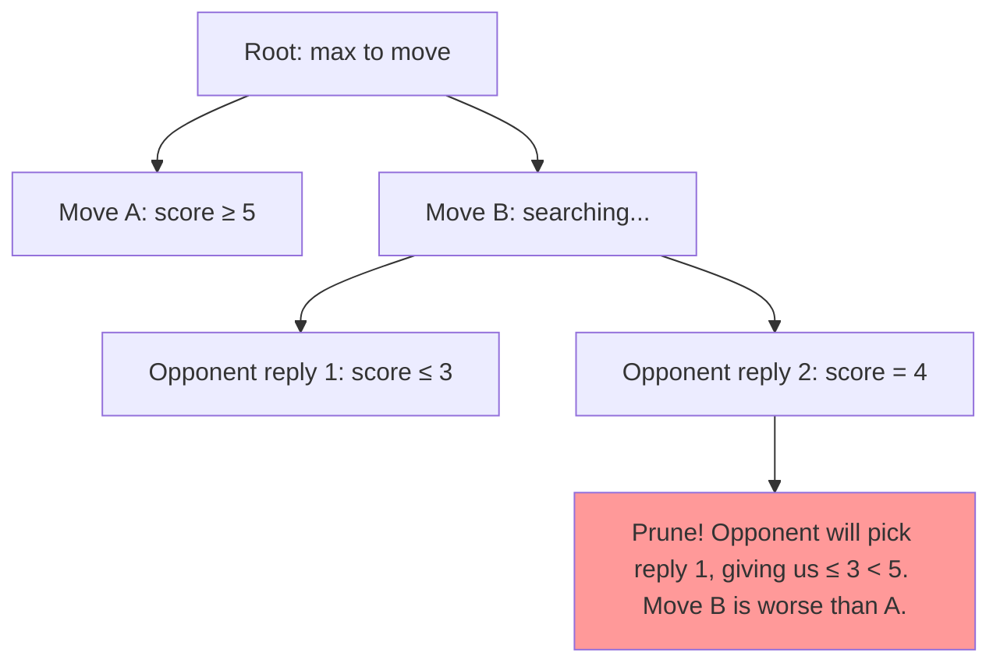
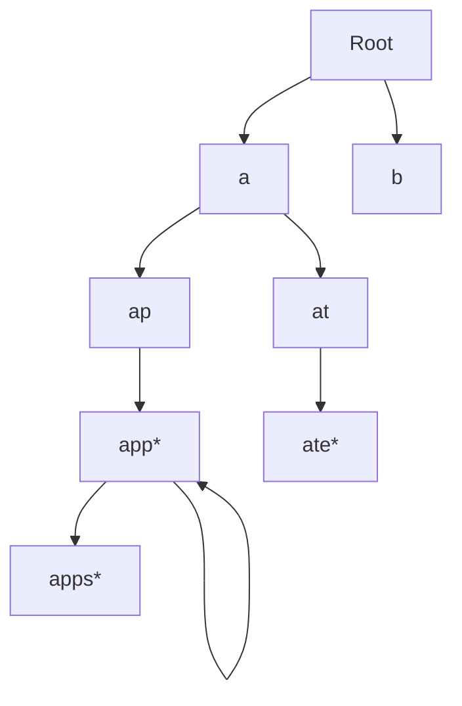
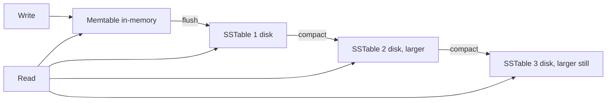
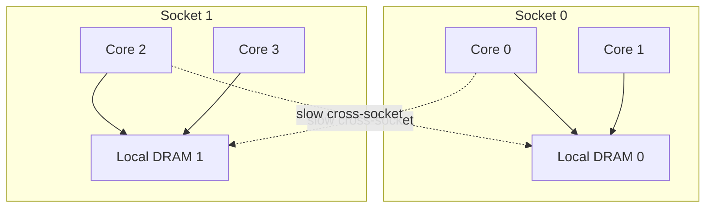
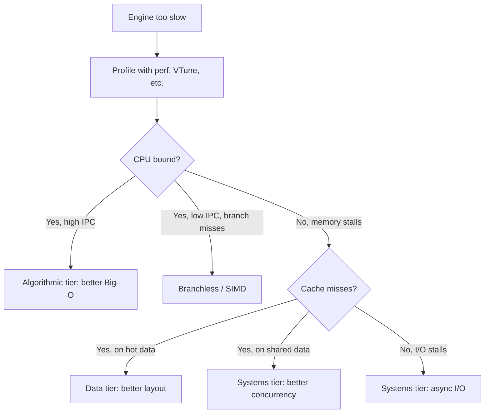

# 4. Layer 4 — The Multi-Tier Optimization Layer

> "This is where the engineering lives. Anyone can write a correct engine; making it fast requires mastery of three optimization tiers — algorithmic, data, and systems — and the wisdom to know which tier to apply when."

The Optimization Layer is the fourth of the six layers and, in practical terms, the layer where engineers spend the most time. It is also the layer with the steepest learning curve, because the techniques span three distinct sub-disciplines (algorithms, data structures, and systems programming) that are usually taught separately.

This note covers all three tiers in depth. Read it carefully — every later chapter assumes you understand this material.

---

## 4.1 Algorithmic Optimization Paradigms

The first tier: choosing the right algorithm. This is what most computer science curricula teach, and it is necessary but not sufficient. Algorithmic optimization is about reducing the **asymptotic complexity** of the computation, measured in Big-O notation.

### 4.1.1 Big-O Complexity Transformations

The classic optimization: replace an $O(N^2)$ algorithm with an $O(N \log N)$ one, or $O(N \log N)$ with $O(N)$, or $O(N)$ with $O(\log N)$, or $O(\log N)$ with $O(1)$.

**Common transformations:**

| From | To | Technique | Example |
|---|---|---|---|
| $O(N^2)$ | $O(N \log N)$ | Sort + binary search, or divide-and-conquer | Two-sum: brute force vs. sort + two pointers |
| $O(N \log N)$ | $O(N)$ | Hashing, counting sort, radix sort | Find duplicates: sort vs. hash set |
| $O(N)$ | $O(\log N)$ | Indexing, binary search | Linear scan vs. B-tree lookup |
| $O(\log N)$ | $O(1)$ | Perfect hashing, direct addressing | Binary search vs. array indexed by key |
| $O(2^N)$ | $O(N^2)$ | Dynamic programming | Fibonacci: naive recursion vs. memoized |

**When algorithmic optimization matters:**

- When the input is large. $O(N^2)$ vs. $O(N \log N)$ is a 1000× difference at $N = 10^6$.
- When the algorithm is in the cold path (called rarely). Algorithmic optimization is cheap to apply and has no ongoing cost.
- When the constants are similar. If the $O(N \log N)$ algorithm has 10× larger constants than the $O(N^2)$ one, the crossover point may be at $N = 10^9$, beyond your actual input size.

**When algorithmic optimization does NOT matter:**

- When the input is small (e.g., $N < 100$). Constants dominate.
- When the algorithm is in the hot path and is memory-bound. Reducing instruction count does not help if the CPU is waiting for memory.
- When the algorithm is already optimal in Big-O. Further gains must come from the data or systems tiers.

### 4.1.2 Mathematical Pruning of Search Pathways

When $F$ is a tree search, most of the tree can often be proven to be irrelevant. Pruning removes these irrelevant subtrees, reducing the search from exponential to (in the best case) polynomial.

**Alpha-beta pruning (chess, checkers, etc.).** In adversarial game search, if you have found a move that gives you score $\alpha$, and the opponent has a move that gives them score $\beta < \alpha$, the opponent will never let you reach this position — so you can stop searching this branch. Alpha-beta reduces the search from $O(b^d)$ to $O(b^{d/2})$ in the best case, where $b$ is the branching factor and $d$ is the depth.



**Branch-and-bound (optimization).** In an optimization problem, if you have a feasible solution with value $V$, any branch whose upper bound is $< V$ can be pruned. Used in integer programming, traveling salesman, scheduling.

**Constraint propagation (CSP).** In a constraint satisfaction problem, propagate the consequences of a choice to prune future choices. If you assign `x = 5` and a constraint says `x + y < 10`, then `y < 5` — prune all `y >= 5` candidates. Used in SAT solvers, scheduling, puzzle solvers.

**Quiescence search (chess).** Stop searching at a depth limit only if the position is "quiet" (no captures, checks, or threats in progress). Otherwise, continue searching until the position becomes quiet. This avoids the "horizon effect" where the engine misses tactics just beyond its search depth.

### 4.1.3 Early Stopping and Short-Circuit Evaluation

Often the engine does not need the full result — it needs only the *best* result, or *any* result above a threshold. Early stopping exploits this.

**Early termination in search.** If the engine has found a "good enough" move (score above a threshold), stop searching. Used in real-time engines with hard deadlines.

**Short-circuit Boolean evaluation.** In `A and B`, if `A` is false, do not evaluate `B`. In `A or B`, if `A` is true, do not evaluate `B`. Most languages do this automatically; ensure your code is structured to exploit it.

**Top-k selection.** If you only need the top k candidates, do not sort the full list. Use a min-heap of size k; iterate through the candidates, pushing each onto the heap and popping the smallest when the heap exceeds size k. This is $O(N \log k)$ vs. $O(N \log N)$ for a full sort.

**WAND (Weak AND) for search engines.** When evaluating a query with many terms, skip documents that cannot possibly make the top-k. If a document's maximum possible score (sum of all term upper bounds) is less than the current k-th best score, skip it. This is the foundation of modern search engine performance.

---

## 4.2 Data Layout and Storage Optimization

The second tier: choosing the right data structures and storage layouts. This tier is more important than the algorithmic tier for most modern engines, because memory is the bottleneck, not compute.

### 4.2.1 Transposition Tables and State-Based Memoization

A transposition table is a cache of previously computed results, keyed by state. When the engine encounters a state it has seen before, it looks up the result in the table instead of recomputing.

**Chess transposition table.** Keyed by Zobrist hash (64-bit). Value: `(best_move, score, depth_searched, flag)`. The flag indicates whether the score is exact, an upper bound, or a lower bound (from alpha-beta). Size: typically 1–16 GB. Lookup: O(1) average, ~100 ns (DRAM access).

**Memoization in compilers.** When parsing expressions, memoize the result of parsing at each position. Avoids exponential blowup in ambiguous grammars. (Packrat parsing.)

**Query result caching in search engines.** Cache the results of frequent queries. The cache is keyed by query string; the value is the ranked document list. Size: typically 10–100 GB. Hit rate: 30–50% for typical web search workloads.

**The trade-off:** Memoization trades memory for compute. The right trade-off depends on the relative cost of memory and compute, and on the hit rate. A hit rate of 50% means half your lookups are free; a hit rate of 5% means the cache is mostly wasted memory.

### 4.2.2 Offline Precomputation of Static Execution Paths and Lookup Tables

If a computation depends only on static data, precompute it offline and store the result in a lookup table.

**Attack tables (chess).** For each square and each piece type, precompute the bitboard of squares that piece can attack from that square. 64 squares × 6 piece types = 384 entries, each 8 bytes = 3 KB total. Fits in L1.

**Endgame tablebases (chess).** Precompute the exact result (win/draw/loss, distance to mate) for all positions with ≤ 7 pieces. Size: ~150 TB for 7-piece tablebases. Stored on SSD; only the relevant slice is loaded into RAM.

**Opening books (chess).** Precompute the best moves for the first 10–20 moves of the game, based on master games and deep engine analysis. Stored as a polyglot binary file.

**PageRank (search).** Precompute the PageRank of every page offline. The values are queried at runtime but never recomputed. (PageRank is updated periodically, e.g., monthly.)

**Move generation tables.** For sliding pieces (bishop, rook, queen), use magic bitboards: precompute attack tables for each "occupancy" of the relevant squares. ~800 KB total; fits in L2.

The general principle: **if the same computation is done many times with the same inputs, precompute it.** The precomputation cost is amortized across all uses.

### 4.2.3 High-Performance Indexing Structures

When the state contains a large collection that must be searched frequently, an index transforms the search from O(N) scan to O(log N) or O(1) lookup.

**Tries (prefix trees).** For string keys. Each node represents a prefix; children represent extensions. Lookup is O(L) where L is the key length. Used in autocomplete, IP routing, dictionary lookup.



(Asterisks mark terminal nodes — valid keys.)

**Priority queues and binary heaps.** For repeatedly finding the minimum (or maximum) element. O(log N) insert and extract-min. Used in Dijkstra's algorithm, A* search, event-driven simulation.

**Log-Structured Merge-Trees (LSM Trees).** For write-heavy workloads (databases, log engines). Writes go to an in-memory memtable; when the memtable fills, it is flushed to disk as an immutable SSTable. Reads merge multiple SSTables. Writes are O(1) amortized; reads are O(log N) per level.



**B-trees and B+ trees.** For read-heavy workloads with range queries. Each node has many children (typically 100–1000); the tree is shallow (3–4 levels for billions of entries). Used in databases (PostgreSQL, MySQL/InnoDB), file systems (ReiserFS, Btrfs).

**Skip lists.** Probabilistic alternative to balanced trees. Simpler to implement, lock-free variants exist. Used in Redis, LevelDB.

**Roaring Bitmaps.** For sets of integers (typically document IDs). Compress runs of consecutive integers; provides O(1) intersection and union. Used in search engines, columnar databases.

**HNSW (Hierarchical Navigable Small World).** For approximate nearest neighbor search in high-dimensional spaces. O(log N) lookup with high recall. Used in vector databases (Milvus, Pinecone, Weaviate).

---

## 4.3 Systems and Hardware Optimization

The third tier: optimizing for the actual hardware the engine runs on. This tier is where 10× speedups live, and where most engineers have the least training.

### 4.3.1 SIMD (Single Instruction, Multiple Data)

SIMD instructions perform the same operation on multiple data elements in parallel. Modern x86 CPUs have:

- **SSE** (128-bit): 4 floats or 2 doubles per instruction.
- **AVX / AVX2** (256-bit): 8 floats or 4 doubles per instruction.
- **AVX-512** (512-bit): 16 floats or 8 doubles per instruction.

ARM has **NEON** (128-bit).

**Example: adding two arrays of 8 floats.**

Scalar:
```c
for (int i = 0; i < 8; i++) c[i] = a[i] + b[i];
// 8 loads + 8 loads + 8 adds + 8 stores = 32 operations
```

SIMD (AVX2):
```c
__m256 va = _mm256_loadu_ps(a);  // load 8 floats
__m256 vb = _mm256_loadu_ps(b);
__m256 vc = _mm256_add_ps(va, vb);  // add all 8 in one instruction
_mm256_storeu_ps(c, vc);
// 1 load + 1 load + 1 add + 1 store = 4 operations
```

8× fewer instructions, and the SIMD instructions have similar latency to scalar. Net speedup: 4–8×.

**When SIMD helps:**

- The same operation is applied to many data elements.
- The data is laid out contiguously (SoA, not AoS).
- There are no data dependencies between elements.

**When SIMD does not help:**

- The operation is inherently scalar (e.g., parsing variable-length records).
- The data has dependencies between elements (e.g., each element depends on the previous).
- The data is not contiguous (e.g., linked list).

**How to use SIMD:**

1. **Intrinsics.** Direct calls to CPU-specific functions (`_mm256_add_ps` etc.). Most control, most portability pain.
2. **Auto-vectorization.** Write plain loops; the compiler vectorizes them. Requires careful loop structure (no data dependencies, fixed trip count, contiguous access).
3. **Libraries.** Use Eigen, Blaze, or xtensor for linear algebra; use SIMDJSON for JSON parsing; use highway or SIMDe for portable SIMD.

### 4.3.2 Massively Parallel Offloading via GPU Acceleration

For workloads that are both data-parallel and compute-heavy, GPUs offer 10–100× more throughput than CPUs. A modern GPU has 5000–10000 cores, each slower than a CPU core but collectively much faster.

**Use cases:**

- Deep learning training and inference (the dominant use case).
- Search engine ranking (some engines move final ranking to GPU).
- Physics simulation (game engines, scientific computing).
- Cryptography (password cracking, blockchain).

**The cost:**

- Data transfer between CPU and GPU is slow (~10 μs per transfer). The computation must be large enough to amortize the transfer.
- GPU memory is limited (8–80 GB vs. 256 GB+ for CPU servers).
- Programming model is restrictive (SIMT — single instruction, multiple threads).

**When to use GPU:**

- The computation is highly parallel (thousands of independent work items).
- Each work item does substantial computation (so transfer cost is amortized).
- The data fits in GPU memory.

**When not to use GPU:**

- The computation has many branches (GPUs handle branches poorly — SIMT means all threads in a warp execute the same instruction).
- The data is too large for GPU memory.
- The latency budget is too tight for CPU↔GPU transfer.

### 4.3.3 Cache-Aware and Cache-Oblivious Data Layout Design

Modern CPUs have 3–4 levels of cache (L1, L2, L3, sometimes L4). Each level is larger but slower than the previous. The engine's data layout determines which level is hit.

**Cache-aware design.** The data structure is sized to fit specific cache levels. Example: a hash table whose bucket array is sized to fit in L2 (256 KB). Lookups hit L2, not DRAM.

**Cache-oblivious design.** The data structure works well at all cache levels without knowing their sizes. Example: a van Emde Boas tree layout — recursively subdivide the data so that each level of recursion fits in some cache level.

**Practical techniques:**

- **Pad structs to cache line boundaries.** `alignas(64) struct HotState { ... };`. Ensures the struct occupies whole cache lines, avoiding false sharing between threads.
- **Separate hot and cold fields.** If a struct has some fields accessed every iteration (hot) and some accessed rarely (cold), split them into two structs. The hot struct fits in cache; the cold struct does not pollute the cache.
- **Tile loops for cache.** For matrix multiplication, instead of iterating `for i, for j, for k`, iterate `for ii, for jj, for kk, for i in ii, for j in jj, for k in kk`. The inner loops operate on a tile that fits in cache.

```mermaid
flowchart TB
    subgraph Hot Struct fits in L1
        H1[field 1]
        H2[field 2]
        H3[field 3]
    end
    subgraph Cold Struct lives in DRAM
        C1[field 4]
        C2[field 5]
        C3[field 6]
        C4[field 7]
    end
    Hot Struct -.->|pointer| Cold Struct
```

### 4.3.4 Lock-Free, Wait-Free Concurrency and Thread Affinity

For multi-threaded engines, the synchronization strategy determines scalability.

**Lock-based concurrency.** Threads acquire a lock before accessing shared data. Simple, but limited scalability: as threads increase, lock contention dominates. Throughput plateaus at ~4–8 threads for typical workloads.

**Lock-free concurrency.** Threads use atomic operations (CAS — compare-and-swap) to update shared data without locks. Higher scalability: throughput continues to grow with threads, up to the bandwidth limit. Implementation is tricky — easy to introduce subtle bugs.

**Wait-free concurrency.** Every thread makes progress in a bounded number of steps, regardless of what other threads do. Strongest guarantee, hardest to implement. Used in real-time systems.

**Thread affinity.** Pin threads to specific cores, so the OS scheduler does not migrate them. Migration loses cache state (the new core's caches are cold). Use `pthread_setaffinity_np` on Linux or `SetThreadAffinityMask` on Windows.

**NUMA awareness.** On multi-socket systems, memory is closer to one socket than another. Allocate memory on the same socket as the accessing thread. Use `numa_alloc_onnode` on Linux.



The Disruptor pattern (Martin Thompson) is a canonical example: a single-producer-single-consumer ring buffer with no locks, used in HFT for passing events between threads at sub-microsecond latency.

---

## 4.4 Choosing the Right Tier

The three tiers are not interchangeable. The right tier to apply depends on where the bottleneck is.



The order of optimization:

1. **Profile first.** Always. Without profiling, you are guessing.
2. **If CPU-bound on compute:** algorithmic tier (better Big-O) or SIMD.
3. **If CPU-bound on branches:** branchless techniques or SIMD.
4. **If memory-bound on hot data:** data tier (better layout, smaller state).
5. **If memory-bound on shared data:** systems tier (better concurrency).
6. **If I/O-bound:** systems tier (async I/O, kernel bypass).

**Never optimize without measuring.** Intuition about bottlenecks is wrong ~80% of the time. Chapter 6 covers profiling in detail.

---

## 4.5 A Concrete Example: Optimizing a Hash Table

To make the three tiers concrete, let us walk through optimizing a hash table lookup.

**Naive hash table (using std::unordered_map):**
- Lookup: ~50 ns. Why? Pointer chasing: hash to bucket, walk linked list of entries in bucket, compare keys. Each step is a cache miss.

**Algorithmic optimization:** Switch from chained hashing (linked lists) to open addressing (array of slots). Same Big-O, but better constants. Lookup: ~20 ns.

**Data layout optimization:** Use linear probing with cache-line-sized slots (8 entries per cache line). Each lookup touches 1 cache line on hit, 2 on miss. Lookup: ~10 ns.

**Systems optimization:** Use SIMD to compare 8 keys in parallel (compare the probe key against all 8 keys in the cache line at once). Lookup: ~5 ns.

**Further optimization:** Prefetch the next bucket while processing the current one. Lookup: ~3 ns.

**Total speedup:** 50 ns → 3 ns = 17×. Each tier contributes: algorithmic (50 → 20, 2.5×), data (20 → 10, 2×), systems (10 → 3, 3.3×).

This is what multi-tier optimization looks like. No single tier gives you the full speedup; you need all three.

---

## 4.6 Common Pitfalls

### Pitfall 1: Optimizing the Wrong Tier

If the bottleneck is memory layout, optimizing the algorithm does not help. If the bottleneck is concurrency, optimizing the data structure does not help. Profile first, then choose the tier.

### Pitfall 2: Optimizing Without Measuring

"I think this function is slow" → spend two days optimizing it → no measurable improvement. The function was not the bottleneck. Profile first.

### Pitfall 3: Premature SIMD

SIMD is hard. Before reaching for SIMD, ensure your data layout is SoA, your loops are branchless, and your access pattern is sequential. SIMD on top of bad data layout gives at most 2× speedup; SIMD on top of good data layout gives 8×.

### Pitfall 4: Over-eager Lock-Free

Lock-free code is much harder to write correctly than lock-based code. If locks are not your bottleneck (profile!), do not go lock-free. A correct lock-based system beats a buggy lock-free one.

### Pitfall 5: Ignoring Constants

A hash table with $O(1)$ lookup but 50 ns per lookup is slower than a sorted array with $O(\log N)$ binary search at 10 ns per lookup, for $N < 1000$. Always consider constants, not just Big-O.

### Pitfall 6: Not Batching

Per-item processing is 10–100× slower than batch processing, due to per-call overhead and lost SIMD opportunities. Always look for batching opportunities.

### Pitfall 7: Cache-Unfriendly Optimizations

"Some clever optimization" that increases cache misses is a net loss. Always re-measure cache behavior after an optimization.

---

## 4.7 Important Reminders

- **Three tiers: algorithmic, data, systems.** All three matter; choose based on the bottleneck.
- **Profile before optimizing.** Intuition is wrong 80% of the time.
- **SIMD requires SoA layout and branchless loops.** Lay the groundwork first.
- **Lock-free is hard.** Only go there if locks are the bottleneck.
- **Cache behavior dominates.** A 100 ns DRAM access is 100× slower than a 1 ns L1 access.
- **Batch everything.** Per-item processing is 10–100× slower than batched.
- **Precompute static data.** Lookup tables are your friend.
- **Transposition tables (memoization) are universal.** Use them whenever the same state is encountered multiple times.

---

## 4.8 Summary

The Optimization Layer has three tiers: algorithmic (Big-O improvements, pruning, early stopping), data (caching, precomputation, indexing structures), and systems (SIMD, GPU, cache-aware layout, lock-free concurrency). All three tiers are necessary for a fast engine; the right tier to apply depends on where the bottleneck is, which can only be determined by profiling.

Multi-tier optimization — combining all three tiers — is what gives 10–100× speedups. No single tier suffices.

---

**Previous note:** [[3. Layer 3 The Core Transition Function Layer]]
**Next note:** [[5. Layer 5 Control Logic and Decision Strategy Layer]]
