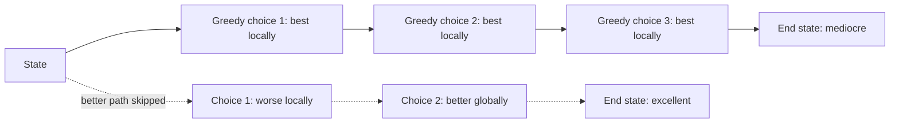
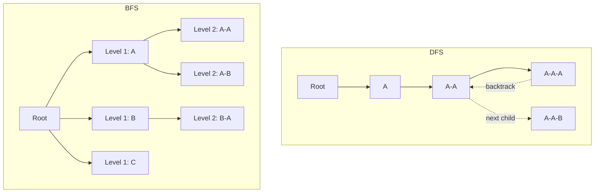
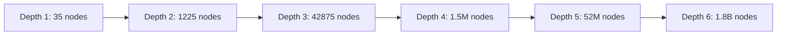
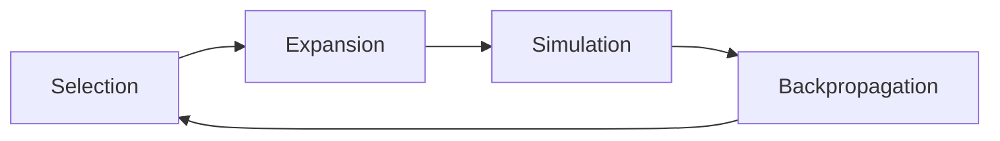
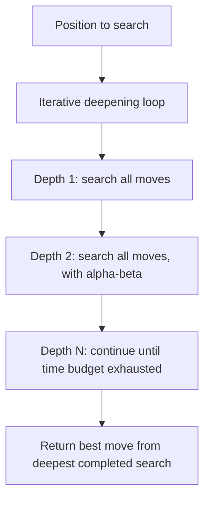
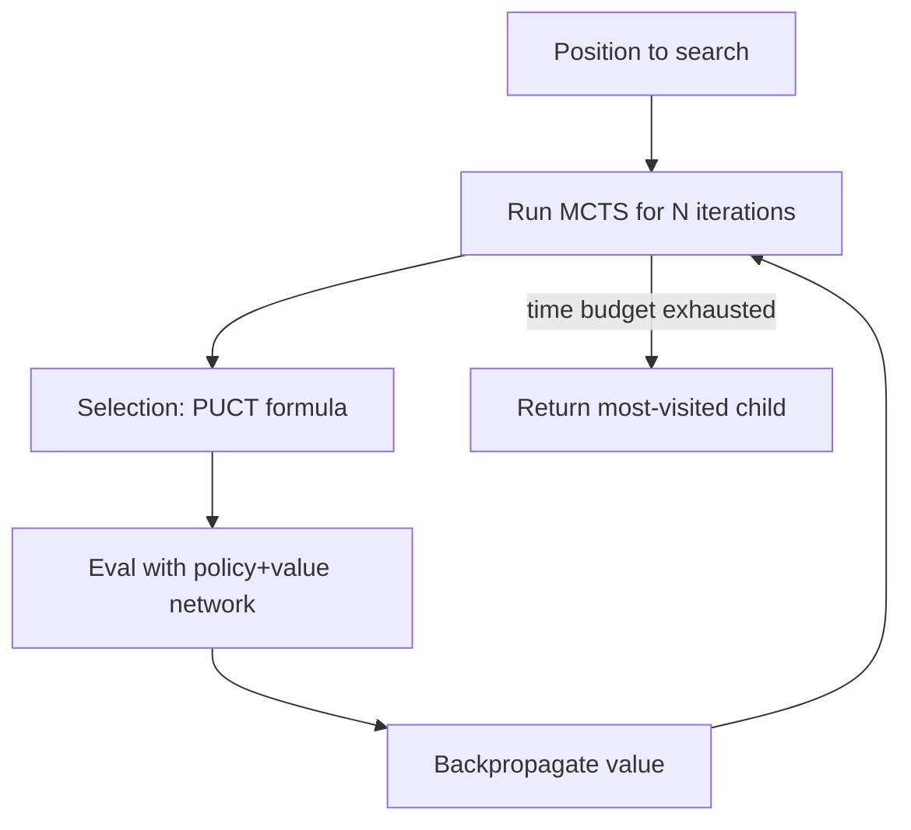
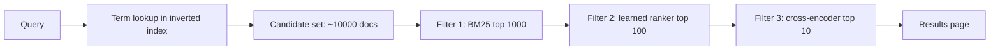
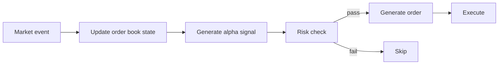
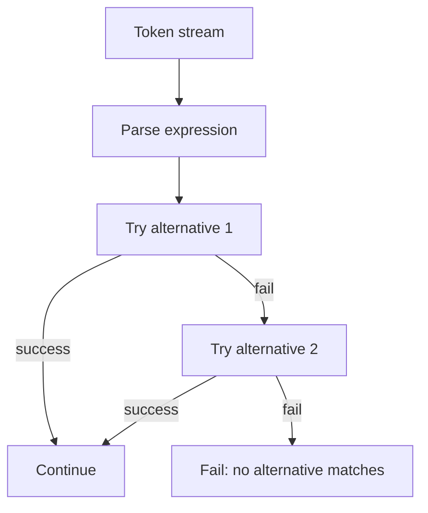

# 5. Layer 5 — Control Logic and Decision Strategy Layer

> "Most 'intelligent behavior' in an engine is just smart search control. The algorithms are well known; the engineering is in deciding *where* to look, *how deep* to look, and *when to stop* looking. Get this layer right and a mediocre evaluator looks brilliant. Get it wrong and a brilliant evaluator looks mediocre."

The Control Logic and Decision Strategy Layer is the fifth of the six layers. Its job is to *orchestrate* the search performed by $F$ — to decide which branches to explore, in what order, to what depth, and with what budget. This layer is what separates a brute-force search (which is too slow to be useful) from an intelligent search (which finds good answers in milliseconds).

This note covers the canonical search algorithms, their trade-offs, and the engineering discipline required to apply them.

---

## 5.1 Strategic Search Path Selection

Every search algorithm makes two fundamental choices:

1. **Greedy vs. global search.** Should the search consider only the immediate best candidate (greedy), or explore multiple candidates to find the globally best one (global)?
2. **Depth vs. breadth.** Should the search go deep into one branch before trying others (depth-first), or examine all candidates at one level before going deeper (breadth-first)?

These two choices define a 2×2 matrix of search strategies, each with its own use case.

### 5.1.1 Greedy vs. Global

**Greedy search** picks the locally best candidate at each step, without considering future consequences. It is fast (O(depth) work) but myopic — it can be led astray by any situation where the locally best choice is globally bad (a "greedy trap").



**When greedy is right:**

- When local optimality implies global optimality (e.g., shortest path in a DAG with non-negative weights, via Dijkstra).
- When the search budget is too small for global search.
- When the cost of a sub-optimal choice is low (e.g., recommendation engines — if you recommend the second-best item, the user is still happy).

**When greedy is wrong:**

- When there are greedy traps (chess: sacrificing a piece for a forced mate).
- When the cost of a sub-optimal choice is high (trading: a bad execution can cost millions).
- When global information is available and cheap (search: the inverted index is already global).

**Global search** explores multiple candidates and selects the best by some criterion. It is slower than greedy but finds globally optimal (or near-optimal) solutions. The challenge is making global search affordable — this is what most of this note is about.

### 5.1.2 Depth vs. Breadth

The choice between depth-first search (DFS) and breadth-first search (BFS) is orthogonal to greedy vs. global.

**Depth-first search (DFS).** Go as deep as possible along one branch, then backtrack. Memory: O(depth). Time: O(branching^depth). Good for: deep searches with limited memory, finding any solution quickly.

**Breadth-first search (BFS).** Explore all nodes at depth 1, then all at depth 2, then depth 3, etc. Memory: O(branching^depth). Time: O(branching^depth). Good for: finding the *shortest* solution, exploring shallow trees.



For engines, **DFS is almost always preferred** because:

- Memory is O(depth), not O(branching^depth). For chess with branching factor 35 and depth 7, BFS would need $35^7 \approx 6 \times 10^{10}$ nodes — terabytes of memory. DFS needs only 7 stack frames — kilobytes.
- DFS supports early termination (alpha-beta pruning) naturally. BFS does not.
- DFS can be made iterative-deepening to find any-time solutions.

The main exception is when you specifically need the shortest solution, in which case BFS (or its weighted cousin, Dijkstra) is the right choice.

---

## 5.2 Classic Graph and Tree Traversal Implementations

We now cover the canonical search algorithms in detail.

### 5.2.1 Depth-First Search (DFS)

```python
def dfs(state, depth):
    if depth == 0 or terminal(state):
        return evaluate(state)
    best = -INF
    for move in generate_moves(state):
        new_state = apply_move(state, move)
        score = -dfs(new_state, depth - 1)  # negamax
        best = max(best, score)
        undo_move(state, move)  # restore state
    return best
```

**Key implementation details:**

- **State is mutated in place, then undone.** This avoids the cost of copying state for each move. `apply_move` and `undo_move` must be perfectly inverse — any bug here corrupts the search.
- **Negamax formulation.** For two-player games, alternating the sign of the score (so each player maximizes from their own perspective) simplifies the code.
- **Depth limit.** Without a depth limit, DFS could run forever (or until stack overflow). The depth limit is the main tuning parameter.

**Cost:** $O(b^d)$ where $b$ is the branching factor and $d$ is the depth. For chess ($b \approx 35$, $d \approx 7$), this is $\sim 6 \times 10^{10}$ nodes — too slow without pruning.

### 5.2.2 Breadth-First Search (BFS)

```python
from collections import deque

def bfs(start):
    queue = deque([start])
    visited = {start}
    while queue:
        state = queue.popleft()
        if terminal(state):
            return state
        for move in generate_moves(state):
            new_state = apply_move(state, move)
            if new_state not in visited:
                visited.add(new_state)
                queue.append(new_state)
    return None  # no solution
```

**Key implementation details:**

- **Queue (FIFO) for the frontier.** Deque gives O(1) append and popleft.
- **Visited set to avoid revisiting.** Without this, BFS would loop forever on graphs with cycles.
- **No depth limit.** BFS explores by level; the depth is implicit in the order of the queue.

**Cost:** $O(V + E)$ where $V$ is the number of vertices and $E$ is the number of edges. For tree search where each node has $b$ children, $V = O(b^d)$ for the smallest $d$ that contains a solution.

### 5.2.3 Beam Search

Beam search is a heuristic version of BFS that keeps only the top-k candidates at each level. It is the workhorse of sequence generation in NLP (machine translation, summarization).

```python
def beam_search(start, beam_width, max_depth):
    beam = [(start, 0)]  # (state, score)
    for depth in range(max_depth):
        candidates = []
        for state, score in beam:
            for move in generate_moves(state):
                new_state = apply_move(state, move)
                new_score = score + score_move(new_state)
                candidates.append((new_state, new_score))
        # Keep top-k
        candidates.sort(key=lambda x: -x[1])
        beam = candidates[:beam_width]
    return beam[0]  # best
```

**Key implementation details:**

- **Beam width k.** The main tuning parameter. k=1 is greedy; k=∞ is BFS. Typical: k=5–10 for NLP.
- **No backtracking.** Once a candidate is pruned, it is gone forever. This means beam search is not complete — it can miss the optimal solution.
- **Score is cumulative.** Each level adds to the previous score. This is how beam search compares candidates of different lengths.

**Cost:** $O(k \cdot b \cdot d)$ — linear in beam width and depth, logarithmic in branching factor (with a heap). Much faster than full BFS.

**When to use:**

- The search space is too large for BFS but not too large for greedy.
- You can score partial solutions meaningfully.
- You are willing to trade completeness for speed.

### 5.2.4 Iterative Deepening

Iterative deepening runs DFS at depth 1, then depth 2, then depth 3, etc., until the time budget is exhausted. It combines the memory efficiency of DFS with the any-time property of BFS.

```python
def iterative_deepening(state, time_budget):
    deadline = now() + time_budget
    depth = 1
    best_move = None
    while now() < deadline:
        result = dfs_with_deadline(state, depth, deadline)
        if result is not None:
            best_move = result
        depth += 1
    return best_move
```

**Why iterative deepening works:**

- Most of the work is at the deepest level. Re-searching at shallower levels is "wasted" but cheap (exponentially smaller).
- The shallower searches provide move ordering hints for the deeper searches, making them faster.
- The engine always has a "best so far" answer, so it can stop at any time.



The vast majority of work is at the deepest level. Re-searching levels 1-5 to start level 6 costs < 4% overhead.

**Cost:** $O(b^d)$ — same as plain DFS to depth $d$, but with the any-time property.

**When to use:** any time you have a hard deadline and want the best answer found so far. This is the dominant pattern in chess engines.

---

## 5.3 Non-Deterministic and Simulation-Guided Search

When the search space is too large for deterministic search, or when the value of a state is hard to compute exactly, non-deterministic search methods come into play.

### 5.3.1 Monte Carlo Tree Search (MCTS)

MCTS estimates the value of a state by simulating many random playouts from that state. It builds a tree incrementally, focusing on the most promising branches.

**The four phases of MCTS:**



1. **Selection.** Starting from the root, recursively select the most promising child (using UCB1: `exploitation + c * sqrt(log(parent_visits) / child_visits)`). Continue until you reach a leaf.
2. **Expansion.** Add one or more children to the leaf.
3. **Simulation.** Run a random (or heuristic-guided) playout from the new child to a terminal state. Record the outcome (win/loss).
4. **Backpropagation.** Update the visit counts and win rates of all ancestors of the new child.

After many iterations, the child of the root with the most visits is selected as the move.

**Why MCTS works:**

- It focuses computation on the most promising branches (selection).
- It does not require an evaluation function — the random playouts provide the value.
- It is anytime — stop at any point and use the current best move.

**Cost:** $O(N \cdot L)$ where $N$ is the number of iterations and $L$ is the average playout length. Typical: 10,000–10,000,000 iterations.

**When to use:**

- The branching factor is high (chess: 35, Go: 250).
- No good evaluation function exists (Go was the canonical example before AlphaGo).
- The engine has substantial compute (MCTS needs many iterations to converge).

**Variants:**

- **AlphaGo-style MCTS.** Replace the random playout with a learned policy network, and the random evaluation with a learned value network. This is what made Go solvable.
- **PUCT.** Use a predictor (typically a neural network) to guide selection. Used in AlphaZero.

### 5.3.2 Rollout-Based Search

A simpler variant of MCTS: at each state, run $k$ random playouts for each candidate move, then pick the move with the best win rate. No tree is built.

```python
def rollout_search(state, k):
    best_move = None
    best_score = -INF
    for move in generate_moves(state):
        wins = 0
        for _ in range(k):
            new_state = apply_move(state, move)
            if random_playout(new_state) == WIN:
                wins += 1
        score = wins / k
        if score > best_score:
            best_score = score
            best_move = move
    return best_move
```

**Cost:** $O(b \cdot k \cdot L)$ where $b$ is the branching factor, $k$ is the number of playouts per move, and $L$ is the average playout length.

**When to use:** when MCTS is overkill (small branching factor, simple evaluation) but pure greedy is too weak.

---

## 5.4 Heuristic-Guided Exploration Algorithms

When you have an evaluation function that estimates the cost-to-go from any state, you can guide the search toward the most promising branches.

### 5.4.1 Best-First Search

Best-first search expands the most promising node first, according to the evaluation function. It is the greedy version of BFS — instead of FIFO, the frontier is a priority queue ordered by evaluation.

```python
import heapq

def best_first_search(start, goal_test, heuristic):
    frontier = [(heuristic(start), start)]
    visited = {start}
    while frontier:
        _, state = heapq.heappop(frontier)
        if goal_test(state):
            return state
        for move in generate_moves(state):
            new_state = apply_move(state, move)
            if new_state not in visited:
                visited.add(new_state)
                heapq.heappush(frontier, (heuristic(new_state), new_state))
    return None
```

**When to use:** when you have a good heuristic and want to find *a* solution quickly (not necessarily the optimal one).

**Cost:** $O(b^d)$ in the worst case, but typically much less because the heuristic guides the search.

### 5.4.2 A* Search

A* is the optimal version of best-first search. It uses the evaluation function $f(n) = g(n) + h(n)$, where:

- $g(n)$ is the cost from the start to $n$ (exact, accumulated).
- $h(n)$ is the estimated cost from $n$ to the goal (heuristic).

A* is **optimal** (finds the shortest path) if $h$ is **admissible** (never overestimates the true cost) and **consistent** (satisfies the triangle inequality).

```python
def a_star(start, goal_test, heuristic, cost):
    frontier = [(heuristic(start), 0, start)]  # (f, g, state)
    g_score = {start: 0}
    while frontier:
        _, g, state = heapq.heappop(frontier)
        if goal_test(state):
            return state
        for move in generate_moves(state):
            new_state = apply_move(state, move)
            new_g = g + cost(state, move)
            if new_state not in g_score or new_g < g_score[new_state]:
                g_score[new_state] = new_g
                f = new_g + heuristic(new_state)
                heapq.heappush(frontier, (f, new_g, new_state))
    return None
```

**When to use:** when you need the optimal solution and have an admissible heuristic. Used in pathfinding (games, maps), scheduling, puzzle solving.

**Cost:** $O(b^d)$ worst case, but typically $O(b^{\epsilon d})$ for a good heuristic (where $\epsilon$ depends on heuristic quality).

**Admissibility and consistency:**

- **Admissible:** $h(n) \leq h^*(n)$ where $h^*$ is the true cost. A* with admissible $h$ finds the optimal solution.
- **Consistent:** $h(n) \leq c(n, n') + h(n')$ for all successors $n'$. A* with consistent $h$ never re-expands a node. (All consistent heuristics are admissible; not all admissible heuristics are consistent.)

**Common admissible heuristics:**

- **Manhattan distance** for grid pathfinding (sum of |x1-x2| + |y1-y2|).
- **Euclidean distance** for grid pathfinding with diagonal moves.
- **Misplaced tiles** for the 8-puzzle (count of tiles not in their goal position).
- **Pattern databases** for puzzles (precomputed exact distances for subsets of the state).

### 5.4.3 Iterative Deepening A* (IDA*)

A* uses exponential memory (it stores all expanded nodes). IDA* combines A*'s optimality with DFS's memory efficiency.

```python
def ida_star(start, goal_test, heuristic, cost):
    bound = heuristic(start)
    while True:
        t = search(start, 0, bound, goal_test, heuristic, cost)
        if t == FOUND:
            return start  # solution found
        if t == INF:
            return None  # no solution
        bound = t  # increase the bound

def search(state, g, bound, goal_test, heuristic, cost):
    f = g + heuristic(state)
    if f > bound:
        return f
    if goal_test(state):
        return FOUND
    min_t = INF
    for move in generate_moves(state):
        new_state = apply_move(state, move)
        t = search(new_state, g + cost(state, move), bound, goal_test, heuristic, cost)
        if t == FOUND:
            return FOUND
        if t < min_t:
            min_t = t
    return min_t
```

**Cost:** $O(b^d)$ time, $O(d)$ memory. Same optimality as A* (given admissible heuristic).

**When to use:** when memory is the bottleneck. Common in puzzle solving (Rubik's cube, sliding puzzles).

---

## 5.5 Search Control in Real Engines

We now map the search algorithms to real engine domains.

### 5.5.1 Chess Engine: Iterative Deepening + Alpha-Beta



The combination of iterative deepening (any-time) with alpha-beta (pruning) and quiescence search (extending tactical positions) is the dominant pattern in chess engines since the 1990s. Stockfish, Komodo, Houdini, and others all use this pattern.

### 5.5.2 Go Engine: MCTS with Neural Network Guidance



Modern Go engines (AlphaGo, KataGo, Leela Chess Zero) use MCTS guided by a neural network that provides both a policy (which moves to consider) and a value (estimated win probability). This is what made Go solvable after decades of failure with traditional alpha-beta approaches.

### 5.5.3 Web Search Engine: Cascaded Retrieval



The "search" in a web search engine is a cascade of filters, not a tree search. Each filter reduces the candidate set; the final filter applies an expensive learned model to the small remaining set. The "control" is in the choice of filter thresholds and the order of filters.

### 5.5.4 Trading Engine: Event-Driven Reactive Loop



Trading engines are not search engines in the traditional sense — they do not explore a tree of possible futures. Instead, they *react* to each event with a single decision. The "search" is in the alpha signal generation, which may consider multiple possible actions and pick the best.

### 5.5.5 Parser Engine: Recursive Descent with Backtracking



Parser engines use a recursive descent search over grammar rules. With memoization (Packrat parsing), the search becomes linear in the input length.

---

## 5.6 Common Pitfalls

### Pitfall 1: Wrong Algorithm for the Problem

Using BFS where DFS is appropriate (memory blowup), or DFS where BFS is appropriate (no shortest-path guarantee). Using A* without an admissible heuristic (sub-optimal solution). Using MCTS without enough iterations (unreliable estimates).

### Pitfall 2: Forgetting Iterative Deepening

Plain DFS to a fixed depth is not any-time — if the deadline hits before the search completes, you have no answer. Always use iterative deepening when you have a hard deadline.

### Pitfall 3: Bad Move Ordering

Alpha-beta pruning is much more effective with good move ordering (best moves first). Without move ordering, alpha-beta provides only a 2× speedup; with perfect ordering, it provides $2^{d/2}$ = ~1000× for $d = 20$. Invest in move ordering heuristics.

### Pitfall 4: Not Pruning Enough

If your search is too slow, you are not pruning enough. Look for: alpha-beta windows that are too wide, no quiescence search, no null-move pruning, no transposition table. Each of these can give 5–10× speedup.

### Pitfall 5: Pruning Too Much

Aggressive pruning can miss important lines. Null-move pruning can fail in zugzwang positions. Forward pruning (futility pruning, late move reductions) can miss tactical resources. Always test pruned search against unpruned search to verify correctness.

### Pitfall 6: Wrong Heuristic for A*

A non-admissible heuristic gives sub-optimal results. A non-consistent heuristic causes node re-expansion, slowing the search. Choose heuristics carefully and verify their properties.

### Pitfall 7: Not Using Any-Time Algorithms

If the engine can be interrupted at any time, it must have a "best so far" answer ready. This requires iterative deepening, MCTS, or similar any-time algorithms. Plain DFS/BFS do not provide this.

---

## 5.7 Important Reminders

- **DFS over BFS for engines.** DFS uses O(depth) memory; BFS uses O(branching^depth).
- **Iterative deepening for any-time.** Always have a best-so-far answer.
- **Move ordering is critical for alpha-beta.** Best-first ordering can give 1000× speedup.
- **MCTS for high branching factors.** When exhaustive search is infeasible.
- **A* requires admissible heuristic.** Verify admissibility for optimality.
- **Heuristic quality dominates algorithm choice.** A good heuristic with a simple algorithm beats a bad heuristic with a sophisticated algorithm.
- **Test pruned search against unpruned.** Verify correctness of all pruning.
- **Any-time is mandatory for real-time engines.** The deadline is not negotiable.

---

## 5.8 Summary

The Control Logic and Decision Strategy Layer orchestrates the search performed by $F$. The fundamental choices are: greedy vs. global, depth-first vs. breadth-first. The canonical algorithms are DFS, BFS, beam search, iterative deepening, MCTS, best-first, A*, and IDA*.

Real engines combine multiple algorithms: chess engines use iterative deepening + alpha-beta; Go engines use MCTS with neural network guidance; web search uses cascaded filtering; trading uses event-driven reactive loops; parsers use recursive descent with memoization.

The art is choosing the right algorithm for the problem, the right heuristic for the algorithm, and the right move ordering for the search. With these choices made well, even a mediocre evaluator can produce brilliant results.

---

**Previous note:** [[4. Layer 4 The Multi-Tier Optimization Layer]]
**Next note:** [[6. Layer 6 The Output Interpretation Layer]]
