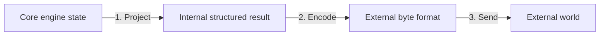
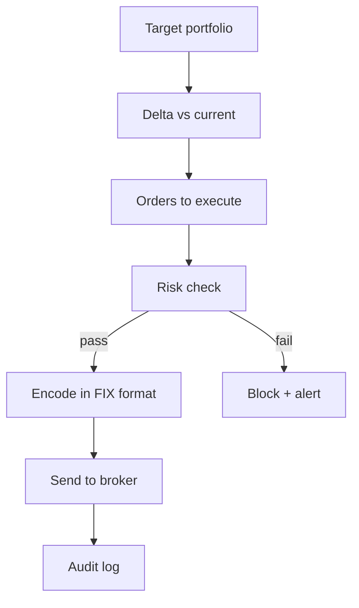
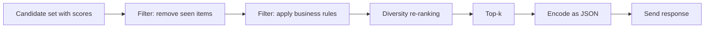
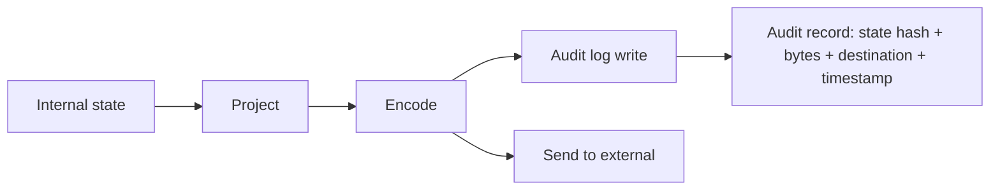

# 6. Layer 6 — The Output Interpretation Layer

> "The engine's internal state is meaningless to the outside world until it is *interpreted*. The output layer is where compressed internal computation becomes actionable external reality — a chess move, a ranked document list, a market order. Get this layer wrong and the engine's internal brilliance never reaches the user."

The Output Interpretation Layer is the sixth and final layer of the engine architecture. It is the mirror image of the Input Layer: where the Input Layer converts external reality into internal state, the Output Layer converts internal state back into external action. Like the Input Layer, it is often underestimated, and like the Input Layer, getting it wrong can be fatal.

This note covers its role, its design patterns, and the pitfalls specific to output.

---

## 6.1 Translating Internal Engine States to Actionable Formats

The output layer has three jobs:

1. **Project internal state into the external representation.** This is the *logical* job — converting bitboards to a chess move, internal scores to a ranked document list, internal signals to a market order.
2. **Do this projection as fast as possible.** This is the *performance* job — minimizing the time between "engine has the answer" and "external world sees the answer."
3. **Do this projection safely.** This is the *correctness* job — ensuring that the external action is exactly what the engine intended, no more and no less.

The third job is more critical here than in the input layer. A malformed input can be rejected; a malformed output is *executed*. A trading engine that sends the wrong order can lose millions of dollars in seconds. A medical engine that outputs the wrong diagnosis can kill a patient. Output safety is not optional.

### 6.1.1 The Three Sub-Stages of Output

A well-designed output layer is itself a three-stage pipeline, mirror-image to the input layer:



**Stage 1: Project.** The internal state is projected into a structured intermediate result. Example: the chess engine's transposition table is queried for the principal variation, which is extracted as a list of moves.

**Stage 2: Encode.** The structured result is encoded into the external byte format. Example: the list of moves is encoded as a PGN string, a binary protocol message, or a JSON object.

**Stage 3: Send.** The encoded bytes are sent to the external world — written to a socket, a file, a display, a hardware DMA buffer.

Each stage has its own concerns, its own optimizations, and its own pitfalls.

### 6.1.2 Why the Output Layer Matters

Engineers often assume that "the engine computed the answer, just print it" is trivial. It is not. The output layer is where:

- **Latency is won or lost in the last few microseconds.** A trading engine that computes an order in 1 μs but takes 50 μs to send it has 50× worse end-to-end latency than its compute time suggests.
- **Safety is enforced.** The output layer is the last chance to validate the engine's decision before it becomes a real-world action. Risk checks, sanity checks, and circuit breakers belong here.
- **Observability is provided.** The output layer is where the engine's internal state is exposed for monitoring, debugging, and auditing.

Treat the output layer with the same engineering rigor as the core loop. Profile it. Optimize it. Test it.

---

## 6.2 Domain-Specific Output Patterns

We now cover the output patterns for each engine domain.

### 6.2.1 Query Evaluation Scores → Ranked Documents (Search)

**Internal state:** A list of (document ID, score) pairs, sorted by score.

**Projection:** Take the top-k documents.

**Encoding:** For each document, fetch the title, URL, and snippet from the document store. Encode as JSON or HTML.

**Sending:** Write to the HTTP response socket.

```mermaid
flowchart LR
    IS[Internal: top-1000 (doc_id, score)] --> P[Project: top-10]
    P --> DS[Fetch doc snippets from store]
    DS --> EN[Encode as JSON]
    EN --> HTTP[Send HTTP response]
```

**Key techniques:**

1. **Snippet generation is expensive.** Generating a snippet (a short excerpt of the document containing the query terms) requires reading the document and finding the relevant passages. Cache snippets; do not regenerate them per query.
2. **Top-k early termination.** If you only need top-10, stop scoring after you have 10 clearly-better-than-the-rest documents. Do not score all candidates.
3. **Pagination.** For results beyond the first page, store the full result set (or a pointer to it) and serve subsequent pages from there. Do not re-search.
4. **Caching.** Cache the full encoded response for frequent queries. The cache key is the query string; the value is the encoded response.

**Common pitfall:** Encoding the response in the same thread that did the search. Encoding is I/O-bound (fetching snippets); search is CPU-bound. Use a separate thread pool for encoding.

### 6.2.2 Path Evaluations → Discrete Game Move (Chess)

**Internal state:** The transposition table entry for the root position, containing the best move and the principal variation.

**Projection:** Extract the best move (the first move of the principal variation).

**Encoding:** Convert the internal move representation (e.g., from-square + to-square + promotion piece) into the external format (e.g., algebraic notation `e2e4`, SAN `e4`, or PGN).

**Sending:** Write to the GUI socket or print to stdout.

```python
def project_output(state, context):
    tt_entry = context.transposition_table[state.zobrist_hash]
    best_move = tt_entry.best_move
    pv = reconstruct_pv(state, context)  # walk TT to get full PV
    return {
        'move': to_uci(best_move),
        'pv': [to_uci(m) for m in pv],
        'score': tt_entry.score,
        'depth': tt_entry.depth,
        'nodes': context.nodes_searched,
    }
```

**Key techniques:**

1. **PV reconstruction.** The principal variation is not stored explicitly; it is reconstructed by walking the transposition table from the root, following best moves until a leaf is reached.
2. **Score interpretation.** The score is internal (centipawns from the perspective of the side to move). Convert to a human-readable form (e.g., `+1.5` for white ahead by 1.5 pawns, or `M3` for mate in 3).
3. **Statistics.** Include nodes searched, time elapsed, search depth — useful for debugging and for the GUI's information display.
4. **Ponder move.** If supported, output the predicted opponent's reply as a "ponder move" so the engine can think during the opponent's time.

**Common pitfall:** Not handling the "no legal moves" case. If the position is checkmate or stalemate, the engine has no move to output. Handle this explicitly with a sentinel value.

### 6.2.3 Risk-Evaluated Strategies → Direct Broker Executions (Trading)

**Internal state:** A target portfolio (desired positions), the current portfolio (actual positions), and risk metrics.

**Projection:** Compute the delta between target and current portfolios. For each instrument with a non-zero delta, generate an order.

**Encoding:** Convert each order into the broker's protocol (FIX, native binary, REST API).

**Sending:** Send to the broker via the lowest-latency channel available.



**Key techniques:**

1. **Risk checks are mandatory.** Before sending any order, verify: position limits, exposure limits, credit limits, market circuit breakers, fat-finger checks (order size sanity). Block any order that fails a check.
2. **Atomic send-and-log.** The audit log must record every order sent, including the exact bytes. Use a write-ahead log so the audit survives crashes.
3. **Idempotency.** Each order has a unique client order ID. If the broker acknowledges twice (network retry), the engine does not double-execute.
4. **Cancel-on-disconnect.** If the connection to the broker drops, automatically cancel all open orders. Prevents "ghost orders" that execute when the engine is offline.
5. **Order state machine.** Track each order through its lifecycle: sent → acknowledged → partially filled → filled / canceled / rejected. Drive the state machine from broker messages.

**Common pitfall:** Sending an order without first checking that the connection to the broker is alive. A queued order sent after a disconnect can execute at a stale price. Always check connection state before sending.

### 6.2.4 Parse Trees → Compiled Bytecode (Parser/Compiler)

**Internal state:** An abstract syntax tree (AST), possibly with type annotations and optimization passes applied.

**Projection:** Walk the AST and emit bytecode (or machine code, or another target representation).

**Encoding:** The bytecode itself is the encoding. Each AST node maps to one or more bytecode instructions.

**Sending:** Write the bytecode to the output file or to the runtime's code cache.

```python
def emit_bytecode(ast, output):
    for node in walk(ast):
        if node.type == 'BinaryOp':
            emit_bytecode(node.left, output)
            emit_bytecode(node.right, output)
            output.emit(OP_FOR_NODE.opcode, node.operator)
        elif node.type == 'Literal':
            output.emit(OP_CONST, node.value)
        # ... etc
```

**Key techniques:**

1. **Code generation is recursive.** Each AST node emits its own bytecode, then the bytecode for its children, then any "combine" instructions. This is the visitor pattern.
2. **Constant folding.** Compute constant expressions at compile time, not runtime. `2 + 3` becomes `5`.
3. **Dead code elimination.** Remove code that can never execute (e.g., code after a `return`).
4. **Peephole optimization.** Look at small windows of bytecode and replace inefficient patterns with efficient ones. Example: `LOAD_CONST 0; ADD` → `NOOP` (adding zero is a no-op).
5. **Register allocation.** For register-based bytecode (or machine code), decide which values live in registers vs. memory. Use a graph-coloring algorithm.

**Common pitfall:** Emitting bytecode without verifying it. Always run a verifier on the output to catch bugs in the code generator.

### 6.2.5 Similarity Scores → Recommendation List (Recommendation)

**Internal state:** A list of (item ID, similarity score) pairs for the active user.

**Projection:** Filter out items the user has already interacted with (do not recommend a video the user just watched). Apply business logic (e.g., diversity, fairness constraints).

**Encoding:** Convert the filtered list into the API response format (typically JSON).

**Sending:** Write to the HTTP response socket.



**Key techniques:**

1. **Diversity.** A list of 10 nearly-identical items is less useful than a list of 10 varied items, even if the latter has slightly lower total score. Re-rank for diversity.
2. **Freshness.** Bias toward recently-added items so the user sees new content.
3. **Exploration vs. exploitation.** Mostly recommend items the model is confident the user will like (exploitation), but include a few uncertain items to learn about the user's preferences (exploration).
4. **Cold-start.** For new users (no history), recommend popular items. For new items (no interaction history), use content-based filtering.

**Common pitfall:** Not filtering already-seen items. Recommending a video the user just watched is the most common user complaint about recommendation engines.

---

## 6.3 General Principles for Output Layer Design

### 6.3.1 Separation of Projection, Encoding, and Sending

Keep the three stages separate. They have different concerns and different optimization targets. Projection is pure computation (no I/O). Encoding is mostly computation with some I/O (fetching snippets, fetching document metadata). Sending is pure I/O. Mixing them leads to performance bugs (e.g., blocking I/O in the projection stage).

### 6.3.2 Asynchronous Sending

The send stage should be asynchronous. The engine's core loop should not wait for the send to complete before continuing. Pattern:

1. Core loop computes the result.
2. Projection stage converts to structured form.
3. Encoding stage converts to bytes.
4. Bytes are pushed onto a send queue.
5. A separate send thread writes the queue to the socket.

This decouples the engine's compute speed from the network's send speed. If the network is slow, the queue grows; if the queue grows too large, the engine can apply backpressure (drop intermediate results, throttle search).

### 6.3.3 Validation Before Sending

Before any byte leaves the engine, validate it. For a trading engine, this means risk checks. For a chess engine, this means verifying the move is legal. For a search engine, this means verifying the result set is non-empty. The cost of validation is small; the cost of sending invalid output is large.

### 6.3.4 Idempotency

If the engine's output may be received multiple times (due to network retries), the output must be idempotent — the receiver must be able to deduplicate. The standard pattern is to include a unique ID in each output and require the receiver to track IDs.

For trading: each order has a unique client order ID; the broker ignores duplicates. For distributed systems: each operation has a unique operation ID; the receiver applies each ID at most once.

### 6.3.5 Audit Logging

Every output should be logged for audit purposes. The log should include:

- The timestamp (with microsecond precision).
- The internal state that produced the output (or a hash of it).
- The encoded bytes that were sent.
- The destination.

The log is invaluable for debugging ("why did the engine send this order?") and for compliance (regulators may require audit trails of all trading decisions).



### 6.3.6 Failure Modes

The output layer must handle three failure modes:

1. **Engine produces no output.** Example: a chess engine in checkmate has no move to make. Handle with an explicit "no output" sentinel.
2. **Engine produces invalid output.** Example: a trading engine that tries to send a negative quantity. Detect and block.
3. **Sending fails.** Example: the socket is closed. Retry with backoff, then alert.

Each failure mode must have a tested code path. Untested failure paths will fail at the worst possible time.

---

## 6.4 Performance Considerations

### 6.4.1 Avoid Copying the Result

The internal state is large; the result is small (typically top-k). When projecting, avoid copying the full state — just reference it. When encoding, write directly to the output buffer; do not build an intermediate string.

### 6.4.2 Use Zero-Copy Serialization

For high-throughput engines (search engines serving thousands of queries per second), serialization is a bottleneck. Use zero-copy serialization formats (FlatBuffers, Cap'n Proto) that allow the receiver to read the data directly from the bytes without deserialization.

### 6.4.3 Pre-Encode Static Parts

If part of the output is the same across many responses (e.g., HTTP headers, JSON wrapper), pre-encode it and append only the dynamic part.

### 6.4.4 Use SIMD for Encoding

For text-based encodings (JSON, XML, CSV), use SIMD to scan for special characters and to escape them. Libraries like `simdjson` provide SIMD-accelerated JSON encoding/decoding at 1+ GB/s.

### 6.4.5 Batch Outputs

If the engine produces many small outputs (e.g., a trading engine sending many order acknowledgements), batch them into larger messages. Reduces per-message overhead and TCP small-packet overhead.

---

## 6.5 Safety Considerations

### 6.5.1 The Last-Chance Validator

The output layer is the last place the engine can catch its own mistakes. Implement a "last-chance validator" that checks every output against a set of invariants:

- Chess: is the move legal? Is it the move the search chose?
- Trading: is the order size reasonable? Is the price within market limits? Does the order violate position limits?
- Search: is the result set non-empty? Are all results valid document IDs?

If the validator fails, the engine should refuse to send and alert.

### 6.5.2 Circuit Breakers

A circuit breaker is an emergency stop. If the engine detects that something is very wrong (e.g., a trading engine losing money faster than a threshold), the circuit breaker fires: stop sending output, cancel all open orders, alert humans.

Circuit breakers must be:

- **Independent of the main engine.** If the engine is buggy, the circuit breaker must still work.
- **Conservative.** Better to trip falsely than to fail to trip.
- **Tested.** Simulate the conditions that should trip the breaker; verify it trips.

### 6.5.3 Kill Switches

A kill switch is a manual emergency stop. A human can press a button that immediately stops the engine, cancels all orders, and freezes state. The kill switch must be:

- **Always accessible.** A dedicated physical button, a hotkey, or a clearly-labeled GUI button.
- **Idempotent.** Pressing it multiple times has the same effect as pressing it once.
- **Logged.** Every kill-switch activation is logged with a timestamp and the identity of the activator.

### 6.5.4 Output Sandboxing

For engines whose output affects the real world (trading, autonomous vehicles, medical devices), sandbox the output. Run the engine in "shadow mode" first: produce outputs but do not send them. Compare the shadow outputs to what would have happened. Only enable real output when shadow mode has been correct for a sustained period.

---

## 6.6 A Concrete Example: Trading Engine Output

To make this concrete, let us sketch the output layer of a trading engine.

```python
def output_layer(target_portfolio, current_portfolio, context):
    # Stage 1: Project
    deltas = compute_deltas(target_portfolio, current_portfolio)
    orders = [Order(inst, delta) for inst, delta in deltas.items() if delta != 0]
    
    # Stage 2: Validate
    for order in orders:
        if not risk_check(order, context):
            alert(f"Risk check failed for {order}")
            return None  # do not send anything
    
    # Stage 3: Encode
    fix_messages = [encode_fix(order) for order in orders]
    
    # Stage 4: Audit log
    for order, msg in zip(orders, fix_messages):
        audit_log(order, msg)
    
    # Stage 5: Send (asynchronous)
    for msg in fix_messages:
        context.send_queue.put(msg)
    
    return orders
```

The structure:

- Stage 1 is projection (compute deltas).
- Stage 2 is validation (risk check). Any failure aborts the entire output.
- Stage 3 is encoding (FIX format).
- Stage 4 is audit logging (never skip).
- Stage 5 is sending (asynchronous, via a queue).

The pattern is: validate everything, log everything, send asynchronously. This is the safest output layer design.

---

## 6.7 Common Pitfalls

### Pitfall 1: Sending Without Validating

The cardinal sin. Always validate before sending. The cost of validation is microseconds; the cost of an invalid output can be millions.

### Pitfall 2: Blocking the Core Loop on Send

If the core loop waits for the send to complete, it cannot process the next event. Use asynchronous sends via a queue.

### Pitfall 3: Not Logging Outputs

Without an audit log, you cannot diagnose post-hoc why the engine sent a particular output. Log every output, with full context.

### Pitfall 4: Sending Duplicate Outputs

If the engine retries a send (due to network failure), the receiver may execute the output twice. Use idempotency IDs.

### Pitfall 5: No Circuit Breaker

Without a circuit breaker, a buggy engine can do unlimited damage before a human notices. Always have an automated stop.

### Pitfall 6: Untested Failure Paths

When the engine has no output (checkmate, empty result set), does it handle that correctly? When sending fails (socket closed), does it retry? Test all failure paths.

### Pitfall 7: Encoding in the Core Thread

Encoding is CPU-bound but not part of the core algorithm. Move it to a separate thread to keep the core thread responsive.

### Pitfall 8: Not Pre-Encoding Static Content

If part of the output is the same across many responses (headers, wrappers), pre-encode it once at startup and reuse. Saves CPU on every output.

---

## 6.8 Important Reminders

- **The output layer is the engine's last line of defense.** Validate before sending.
- **Asynchronous sending is mandatory.** Do not block the core loop.
- **Audit log every output.** You will need it for debugging and compliance.
- **Idempotency IDs prevent duplicate execution.** Use them.
- **Circuit breakers and kill switches are safety-critical.** Test them.
- **Separate projection, encoding, and sending.** They have different concerns.
- **Pre-encode static content.** Save CPU on every output.
- **Use zero-copy serialization for high-throughput engines.** FlatBuffers, Cap'n Proto.

---

## 6.9 Summary

The Output Interpretation Layer converts internal engine state into external action. Its three sub-stages are projection (internal → structured), encoding (structured → bytes), and sending (bytes → external world). The layer must be fast (asynchronous, zero-copy), safe (validated, audited, with circuit breakers and kill switches), and correct (idempotent, with tested failure paths).

The five engine domains have different output patterns: ranked document lists (search), discrete moves (chess), broker executions (trading), compiled bytecode (parsers), recommendation lists (recommendation). But all share the same design principles.

With the output layer complete, we have now covered all six architectural layers of a fast engine. Chapter 3 will map these layers onto five real engine domains, showing how each domain instantiates the pattern.

---

**Previous note:** [[5. Layer 5 Control Logic and Decision Strategy Layer]]
**Next chapter:** [[1. Chess and Adversarial Gaming Engines]]
