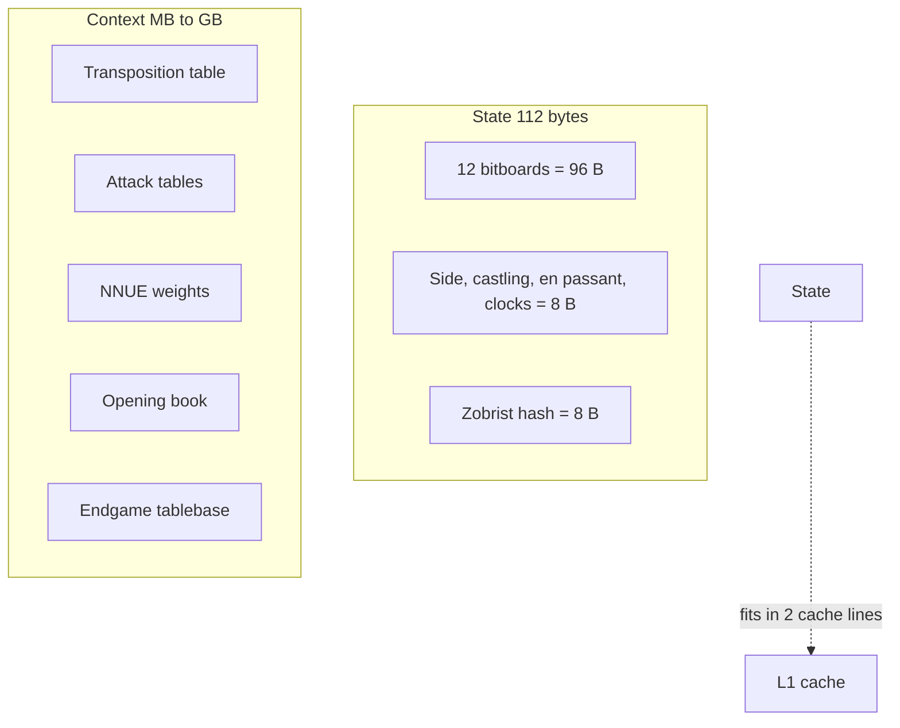
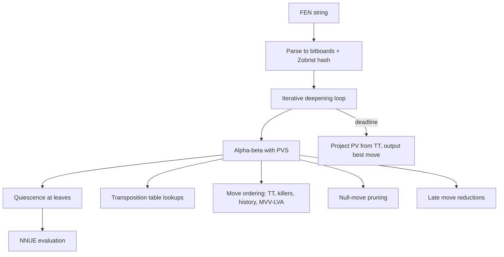

# 1. Chess and Adversarial Gaming Engines

> "Chess engines are the most studied engines in computer science. They are the perfect pedagogical example: small enough to fit in your head, deep enough to require every optimization technique in the book, and competitive enough that every micro-optimization is publicly benchmarked."

Chess engines are the canonical example of an engine. They have been studied for 70+ years, are fully mapped onto the six-layer architecture, and have a vibrant competitive scene (Stockfish, Leela Chess Zero, Komodo, etc.) that publishes results and benchmarks. If you understand chess engines, you understand 80% of what every other engine domain does.

This note covers the full architecture of a modern chess engine, layer by layer, with concrete code sketches and benchmarks.

---

## 1.1 State Representation

The chess engine's state representation is one of the most heavily optimized data structures in computer science. Every byte matters because the state is touched on every node of the search tree, and a chess engine may search billions of nodes per move.

### 1.1.1 Bitboards — The Foundation

A **bitboard** is a 64-bit unsigned integer where each bit represents one square of the chess board. The convention is:

- Bit 0 = square a1 (white's queen rook starting square).
- Bit 1 = square b1.
- ...
- Bit 63 = square h8 (black's king rook starting square).

A chess position is represented by **multiple bitboards**, one per piece type:

| Bitboard | What it represents |
|---|---|
| `white_pawns` | Squares with white pawns |
| `white_knights` | Squares with white knights |
| `white_bishops` | Squares with white bishops |
| `white_rooks` | Squares with white rooks |
| `white_queens` | Squares with white queens |
| `white_king` | Square with the white king |
| `black_pawns` | Squares with black pawns |
| `black_knights` | Squares with black knights |
| ... | (similarly for black) |
| `white_pieces` | All squares with white pieces (derived: OR of white bitboards) |
| `black_pieces` | All squares with black pieces (derived) |
| `occupied` | All occupied squares (derived: OR of all piece bitboards) |

The 12 piece bitboards (6 per side) capture the position; the derived bitboards are computed on demand for move generation. Total memory: 12 × 8 = 96 bytes for the piece bitboards, plus ~16 bytes for game state (side to move, castling rights, en passant square, halfmove clock, fullmove number, Zobrist hash). Total: ~112 bytes — fits in two cache lines.

### 1.1.2 Sliding Piece Attacks — Magic Bitboards

The hard part of chess move generation is **sliding pieces** (bishop, rook, queen). A bishop on d4 attacks along two diagonals, but the attack set depends on which squares are occupied (blocking pieces).

**Naive approach:** For each sliding piece, ray-trace in each direction until hitting a blocker. O(8) per piece per direction. Slow.

**Magic bitboards** are the standard solution. For each square and each direction, precompute a "mask" of squares that could potentially block the piece. Then, for any actual occupancy, hash it down to a small index using a "magic number" multiplication, and look up the attack set in a precomputed table.

```c
// For a rook on square s, with occupancy 'occ':
Bitboard rook_attacks(int s, Bitboard occ) {
    Bitboard mask = rook_masks[s];           // precomputed: relevant squares
    Bitboard index = ((occ & mask) * rook_magics[s]) >> rook_shifts[s];
    return rook_attack_table[s][index];       // precomputed: attack set
}
```

The precomputed tables are ~800 KB total — fit in L2 cache. Lookup is O(1) — a few arithmetic operations plus one cache hit.

### 1.1.3 Zobrist Hashing — Position Identification

A **Zobrist hash** is a 64-bit hash of a chess position, used as the key for the transposition table. It is computed by XOR-ing precomputed random 64-bit numbers:

- For each piece on each square: XOR in `zobrist_piece_square[piece][square]`.
- For side to move: XOR in `zobrist_side` (if black to move).
- For each castling right: XOR in `zobrist_castling[right]`.
- For en passant square: XOR in `zobrist_ep[file]`.

The key property: **the hash is incrementally updatable**. When a move is made, the hash is updated by XOR-ing out the old piece squares and XOR-ing in the new piece squares — a few operations, not a full recomputation.

```c
uint64_t zobrist_hash;
// ... after applying move m:
zobrist_hash ^= zobrist_piece_square[m.piece][m.from];
zobrist_hash ^= zobrist_piece_square[m.piece][m.to];
if (m.captured) zobrist_hash ^= zobrist_piece_square[m.captured][m.to];
zobrist_hash ^= zobrist_side;  // flip side to move
// ... castling and en passant updates
```

### 1.1.4 State Compression Summary



The state fits in 2 cache lines (128 bytes), so reading it from L1 is ~1 ns. The context (transposition table, NNUE weights) is large but accessed less frequently.

---

## 1.2 Transition Function $F$

The chess engine's $F$ is a recursive tree search with alpha-beta pruning. We sketch it here in Python for readability; production engines are in C++.

### 1.2.1 Pseudo-Legal Move Generation

A **pseudo-legal move** is a move that follows the piece's movement rules, but may leave the mover's king in check (which would make it illegal). Generating pseudo-legal moves is fast; filtering for legality (king safety) is slower and done after.

```python
def generate_pseudo_legal_moves(state):
    moves = []
    # Pawn moves (single push, double push, captures, en passant, promotions)
    moves.extend(generate_pawn_moves(state))
    # Knight moves
    moves.extend(generate_knight_moves(state))
    # King moves (including castling)
    moves.extend(generate_king_moves(state))
    # Sliding pieces (bishop, rook, queen) via magic bitboards
    moves.extend(generate_sliding_moves(state))
    return moves
```

Each generator uses bitwise operations on the bitboards:

```python
def generate_knight_moves(state):
    moves = []
    knights = state.bitboards[state.side_to_move]['knight']
    while knights:
        from_sq = bitscan_forward(knights)
        attacks = knight_attack_table[from_sq] & ~state.own_pieces
        while attacks:
            to_sq = bitscan_forward(attacks)
            moves.append(Move(from_sq, to_sq, ...))
            attacks &= attacks - 1  # clear least significant bit
        knights &= knights - 1
    return moves
```

`bitscan_forward` is a single CPU instruction on x86 (`BSF`) and ARM (`CTZ`). The whole knight move generation is ~20 instructions per knight.

### 1.2.2 Legality Filtering

A move is legal if, after making it, the mover's king is not in check. The cheap way to check: make the move, check if the king is attacked, undo the move. This is the standard approach but requires make/undo overhead.

The fast way (used in modern engines): generate moves that are already legal by tracking pinned pieces (pieces whose movement would expose the king to check). This avoids the make/undo overhead for most moves.

### 1.2.3 Static Evaluation Function

The **static evaluation function** assigns a score to a position without searching further. It is used at the leaves of the search tree.

In the pre-NNUE era, evaluation was a weighted sum of features:

```python
def evaluate(state):
    score = 0
    score += material_score(state)         # pawn = 100, knight = 320, etc.
    score += piece_square_score(state)     # piece-square tables
    score += pawn_structure_score(state)   # doubled, isolated, passed pawns
    score += mobility_score(state)         # number of legal moves
    score += king_safety_score(state)      # pawn shield, open files near king
    score += bishop_pair_score(state)      # bonus for having both bishops
    return score if state.side_to_move == WHITE else -score
```

In the NNUE era (post-2020), evaluation is a neural network:

```python
def evaluate_nnue(state):
    # HalfKP input features: 41024 dimensions
    # (own king position × piece type × piece square) for each side
    features = compute_halfkp_features(state)
    # First layer: 41024 → 256, ReLU
    hidden = relu(features @ nnue_weights.w1 + nnue_weights.b1)
    # Second layer: 256 → 32, ReLU
    hidden2 = relu(hidden @ nnue_weights.w2 + nnue_weights.b2)
    # Output layer: 32 → 1
    score = hidden2 @ nnue_weights.w3 + nnue_weights.b3
    return score
```

The NNUE network is small (~50 MB of weights) and is evaluated incrementally — when a move is made, only the changed features are updated, not the entire input vector. This makes NNUE evaluation ~10 ns per position, comparable to the hand-tuned evaluation but with significantly better playing strength.

### 1.2.4 Quiescence Search

The horizon effect: a fixed-depth search stops at arbitrary positions, missing tactics that lie just beyond the horizon. Quiescence search addresses this by extending the search at the leaves until the position is "quiet" (no captures, checks, or promotions available).

```python
def quiescence(state, alpha, beta):
    stand_pat = evaluate(state)
    if stand_pat >= beta:
        return beta
    if alpha < stand_pat:
        alpha = stand_pat
    for move in generate_captures(state):
        make_move(state, move)
        score = -quiescence(state, -beta, -alpha)
        undo_move(state, move)
        if score >= beta:
            return beta
        if score > alpha:
            alpha = score
    return alpha
```

Quiescence search typically doubles the effective search depth for tactical positions. It is essential for chess engine strength.

### 1.2.5 The Full Transition Function

Putting it all together:

```python
def F(state, context, depth, alpha, beta):
    # Check transposition table
    tt_entry = context.tt.lookup(state.zobrist_hash)
    if tt_entry and tt_entry.depth >= depth:
        if tt_entry.flag == EXACT: return tt_entry.score
        if tt_entry.flag == LOWER and tt_entry.score >= beta: return beta
        if tt_entry.flag == UPPER and tt_entry.score <= alpha: return alpha
    
    if depth == 0:
        return quiescence(state, alpha, beta)
    
    moves = generate_legal_moves(state)
    moves.sort(key=lambda m: move_ordering_score(m, state, context), reverse=True)
    
    best_score = -INF
    for move in moves:
        make_move(state, move)
        score = -F(state, context, depth - 1, -beta, -alpha)
        undo_move(state, move)
        if score > best_score:
            best_score = score
            best_move = move
        if best_score > alpha:
            alpha = best_score
        if alpha >= beta:
            # Beta cutoff: update killer moves, history heuristic
            context.update_killers(move, depth)
            context.update_history(move, depth)
            break
    
    context.tt.store(state.zobrist_hash, best_move, best_score, depth, 
                     LOWER if best_score >= beta else UPPER if best_score <= alpha else EXACT)
    return best_score
```

This is the core of a modern chess engine. The actual Stockfish code is more sophisticated (with additional pruning techniques, parallel search, etc.), but the structure is the same.

---

## 1.3 Dominant Optimizations

### 1.3.1 Alpha-Beta Pruning

Already discussed in Chapter 2. Alpha-beta reduces the search from $O(b^d)$ to $O(b^{d/2})$ in the best case, where $b \approx 35$ is the chess branching factor and $d$ is the search depth.

**Without alpha-beta:** depth 6 = $35^6 \approx 1.8$ billion nodes.
**With alpha-beta (perfect ordering):** depth 6 = $35^3 \approx 43,000$ nodes.

A 40,000× speedup. This is why alpha-beta is non-negotiable.

### 1.3.2 Principal Variation Search (PVS)

PVS is a refinement of alpha-beta. For the first move at each node (which is expected to be the best, due to move ordering), search with a full window. For subsequent moves, search with a zero-width window (a "scout" search). Only if the scout search fails high (suggesting the move is better than expected) do we re-search with a full window.

```python
def pvs(state, depth, alpha, beta):
    if depth == 0:
        return quiescence(state, alpha, beta)
    moves = ordered_moves(state)
    first = True
    for move in moves:
        make_move(state, move)
        if first:
            score = -pvs(state, depth - 1, -beta, -alpha)
        else:
            # Zero-width search
            score = -pvs(state, depth - 1, -alpha - 1, -alpha)
            if alpha < score < beta:
                # Re-search with full window
                score = -pvs(state, depth - 1, -beta, -alpha)
        undo_move(state, move)
        if score > alpha:
            alpha = score
        if alpha >= beta:
            break
        first = False
    return alpha
```

PVS saves work when move ordering is good (most non-first moves fail low and need only the cheap scout search).

### 1.3.3 Transposition Tables

The transposition table (TT) is a hash map keyed by Zobrist hash, storing:

- **Best move** found at this position (for move ordering).
- **Score** found.
- **Depth** searched.
- **Flag** (EXACT, LOWER bound, UPPER bound).

When the search encounters a position it has seen before (a "transposition"), it can use the TT entry to either return immediately (if the previous search was deep enough) or improve move ordering (the previous best move is tried first).

**TT size:** typically 1–16 GB. At ~16 bytes per entry, that's 60M–1B entries. With Zobrist hash collisions (~$2^{-64}$ probability per pair), false hits are negligible.

**Replacement policy:** when the TT is full and a new entry must be inserted, replace an entry based on depth (deeper entries are more valuable) and age (entries from previous moves are less valuable).

### 1.3.4 Iterative Deepening

Already discussed in Chapter 2. Iterative deepening is essential for chess engines because:

1. It provides any-time behavior (the engine always has a best-so-far move).
2. The previous iteration's PV is used to order moves in the next iteration, dramatically improving alpha-beta's pruning.
3. The TT entries from previous iterations are reused.

```python
def search(state, time_budget):
    deadline = now() + time_budget
    best_move = None
    for depth in range(1, MAX_DEPTH):
        if now() > deadline:
            break
        try:
            score, move = F_with_deadline(state, depth, deadline)
            best_move = move
        except TimeUp:
            break
    return best_move
```

### 1.3.5 Move Ordering

Move ordering is the single most impactful optimization after alpha-beta itself. The order in which moves are tried determines how quickly alpha-beta finds cutoffs.

**Move ordering priority (typical):**

1. **PV move from transposition table.** The best move from a previous search of this position. Tried first.
2. **Mate killers.** Moves that caused a mate in the previous iteration.
3. **Capture moves, ordered by MVV-LVA** (Most Valuable Victim, Least Valuable Attacker). Capturing a queen with a pawn is tried before capturing a pawn with a queen.
4. **Killer moves.** Quiet (non-capture) moves that caused beta cutoffs at the same depth in sibling nodes. Stored in a small table (typically 2 killers per depth).
5. **History heuristic.** Quiet moves that caused beta cutoffs anywhere in the tree. Stored in a `history[from][to]` table, incremented by $depth^2$ on cutoff.
6. **Other quiet moves.** Ordered by some heuristic (e.g., piece-square table delta).

Good move ordering can give 10× speedup over random ordering.

### 1.3.6 Additional Pruning Techniques

Modern engines add many more pruning techniques on top of alpha-beta:

- **Null-move pruning.** If a "null move" (skipping a turn) still returns a score ≥ beta, the position is so good that we can cut off. Risk: zugzwang (in endgames, skipping a turn can be fatal). Mitigation: disable in endgames.
- **Late move reductions (LMR).** Late moves in the move list (ordered to be unlikely to be good) are searched at reduced depth. If they unexpectedly fail high, re-search at full depth.
- **Futility pruning.** At depth 1, if the static evaluation plus a margin is still less than alpha, prune all non-checking, non-capturing moves.
- **Aspiration windows.** Search the root with a narrow window around the previous iteration's score. If the search fails high or low, re-search with a wider window. Saves work when the score is stable across iterations.

Each pruning technique adds ~10–30% speedup. Together, they make modern chess engines ~100× faster than the raw alpha-beta.

### 1.3.7 Parallel Search

Multi-core CPUs can parallelize the search. The main approaches:

- **Shared-memory parallel alpha-beta.** Multiple threads search different parts of the tree. Tricky because alpha-beta is naturally sequential (cutoffs in one part of the tree affect the rest). Stockfish uses a sophisticated "lazy SMP" approach where threads share the TT and search slightly different trees.
- **Root parallelism.** Each thread searches a different root move, then results are merged. Simple but inefficient for unbalanced trees.
- **Tree parallelism.** Split the tree at internal nodes; different threads search different subtrees. Requires careful synchronization to avoid duplicate work.

Parallel speedup is typically 4–8× on 16 cores (sublinear due to synchronization overhead and search inefficiency).

---

## 1.4 Putting It All Together — A Modern Chess Engine



**Performance of a modern engine (Stockfish on a 16-core machine):**

- ~100 million nodes per second searched.
- ~30–40 ply search depth in middle game.
- ~3500 ELO playing strength (vs. human world champion ~2850).

These numbers represent 70+ years of accumulated optimization. Every layer of the architecture has been tuned to within a few percent of theoretical limits.

---

## 1.5 Common Pitfalls

### Pitfall 1: Make/Undo Bugs

The make/undo pattern is essential for performance, but any bug in `undo_move` corrupts the state and the search. Symptoms: engine plays well for a while then blunders; same position evaluates differently depending on path. Mitigation: comprehensive make/undo tests; verify state hash before and after a make/undo cycle.

### Pitfall 2: Zobrist Hash Collisions

With 64-bit hashes, collisions are rare (~$2^{-64}$ per pair) but not impossible. A collision causes the TT to return a wrong entry, leading to subtle bugs. Mitigation: verify the TT entry's position matches the current position (store a few bits of the position's "key" alongside the hash).

### Pitfall 3: Search Instability

Some pruning techniques (null-move, aspiration windows) can cause the search to return different scores for the same position at different depths. This is "search instability." Mitigation: understand which techniques cause instability; verify that the engine's behavior is still correct (the best move may change, but should remain reasonable).

### Pitfall 4: Not Testing with Perft

**Perft** (performance test) is a test that counts the number of leaf nodes at a given depth, starting from a known position. The numbers are known for many test positions. If your engine's perft count matches the known number, your move generation is correct. Run perft tests after every change to move generation.

### Pitfall 5: Too Much Pruning

Aggressive pruning can miss tactics. Always test the engine's strength against an unpruned version. If pruning makes the engine weaker, dial it back.

### Pitfall 6: Not Handling Draws

Threefold repetition, 50-move rule, insufficient material, stalemate — all must be handled correctly. Bugs here cause the engine to either miss draws (lose winning positions) or claim draws incorrectly (draw winning positions).

### Pitfall 7: Time Management Bugs

The engine must never exceed its time budget. The deadline check must be cheap (a single comparison) and frequent (every ~1000 nodes). If the engine loses on time, every other strength improvement is moot.

---

## 1.6 Important Reminders

- **Bitboards are non-negotiable.** Any other representation is 10× slower.
- **Magic bitboards for sliding pieces.** The standard solution for fast sliding piece move generation.
- **Zobrist hashing for position identification.** Incrementally updatable; ~1 ns to update per move.
- **Alpha-beta + iterative deepening + good move ordering.** The three pillars of search.
- **NNUE for evaluation.** Replaces hand-tuned evaluation with a learned model.
- **Transposition table is the biggest optimization.** Caches results across the search tree.
- **Quiescence search prevents horizon effect.** Essential for tactical accuracy.
- **Perft tests for move generation correctness.** Run after every change.
- **Time management is critical.** Never lose on time.

---

## 1.7 Summary

Chess engines are the most optimized engines in computer science. They use bitboards for state representation, magic bitboards for sliding piece moves, Zobrist hashing for position identification, alpha-beta with PVS for search, NNUE for evaluation, transposition tables for caching, and a host of additional pruning techniques (null-move, LMR, futility) for speed.

The architecture maps cleanly onto the six-layer model:

- **Layer 1 (Input):** FEN parsing → bitboards + Zobrist hash.
- **Layer 2 (State):** Bitboards + game state metadata.
- **Layer 3 ($F$):** Generate moves → order moves → alpha-beta search → evaluate leaves with NNUE → select best.
- **Layer 4 (Optimization):** Alpha-beta pruning, transposition tables, magic bitboards, NNUE.
- **Layer 5 (Control):** Iterative deepening, aspiration windows.
- **Layer 6 (Output):** Extract PV from TT, format as UCI move.

Understanding this architecture is the foundation for understanding every other engine domain.

---

**Previous chapter:** [[6. Layer 6 The Output Interpretation Layer]]
**Next note:** [[2. High-Scale Text and Vector Search Engines]]
